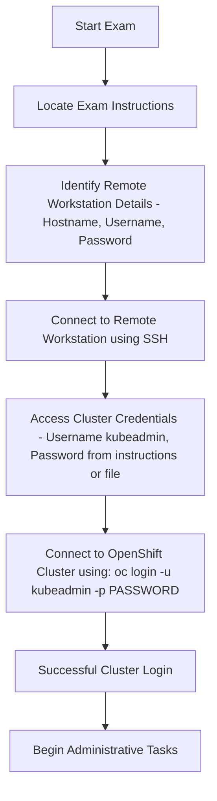

Welcome to the first part of my **EX280 – OpenShift Administrator Tips & Tricks** mini-series!  
In this series, I’ll share short, focused posts that help you sharpen your OpenShift administration skills — the kind of real-world tips that make both the **EX280 exam** and your **day-to-day cluster work** smoother.

The goal of this article is to help you complete both of these tasks — connecting to the cluster and configuring the HTPasswd identity provider — in under 20 minutes. If you can achieve that, you’ve already won half the battle. Mastering these fundamentals early will save valuable time during the exam and allow you to focus on more complex tasks with confidence.

This efficiency only comes with consistent practice. Perform the HTPasswd configuration multiple times until it feels second nature. In fact, I strongly recommend revisiting and practicing this specific task on the morning of your exam — it’s one of those setups that rewards muscle memory and precision.

---

## 🌐 Connecting to the Cluster - understanding the environment instructions

Before configuring anything in OpenShift, make sure you can reliably **connect to your cluster** — it’s the foundation of every administrative task.  
Whether you're using the **web console** or the **`oc` CLI**, always start by ensuring your session and context are correct.

### 🔗 Connecting to the Remote Workstation

When you begin your **EX280 exam**, the OpenShift cluster is not directly accessible from your host machine.  
Instead, access is provided through a **remote workstation server** as described in the exam instructions.

To connect successfully, you’ll need the following details:

1. **Remote workstation hostname**  
2. **Workstation username**  
3. **Workstation password**

Typically, both the hostname and username are clearly listed in the exam environment details.  
The password, however, can sometimes be a point of confusion — in most cases, either:

- A specific password will be mentioned directly in the instructions, or  
- You’ll be asked to use a **generic password** provided elsewhere in the exam documentation.

Read these instructions carefully to avoid login issues — this is a common early pitfall for first-time candidates.

Once you have all the necessary credentials, connect to the workstation using SSH:

```bash
ssh username@workstation-hostname
```

### 🌐 Connecting to Your Cluster

After successfully connecting to your remote workstation, the next step is to access your **OpenShift cluster**.  
To do this, you’ll need valid cluster login credentials — specifically a **username** and **password**.

In most EX280 exam environments:

- The **username** is typically `kubeadmin`.  
- The **password** is provided within the exam instructions. Sometimes it’s displayed directly, and other times it may be stored in a text file on the remote workstation.

If the password is stored in a file, you can view it using:

```bash
cat <filename>
```
Once you have your credentials, connect to your cluster with the following command:
```bash
oc login -u kubeadmin -p <password>
```
The run 
```bash
oc login whoami --show-console
```
command and access the console and start attempting the tasks


---

## 🔐 Configuring the HTPasswd Identity Provider

One of the first tasks every OpenShift admin should master is setting up an **HTPasswd identity provider** — a lightweight, file-based authentication system that’s both exam-relevant and practical in test environments. It can be configured easily by following the 3 simple steps below:

### 🧩 Step 1: Create the HTPasswd File
Use the `htpasswd` command to create a new user file. The `-B` flag ensures secure bcrypt encryption (required in modern OpenShift versions).

```bash
htpasswd -c -B -b users.htpasswd admin redhat123 # Comaand with -c flag to create the file
htpasswd -B -b users.htpasswd user user123 # Command to update the previously creared file
```

### 🧩 Step 2: Create the Secret
Store this file as a secret in the `openshift-config` namespace so OpenShift can access it.

```bash
oc create secret generic htpass-secret   --from-file=htpasswd=users.htpasswd -n openshift-config
```

### 🧩 Step 3: Edit the OAuth Configuration
Now, integrate your secret into the cluster’s OAuth configuration.
```bash
oc edit oauth cluster (CLI)

```
```bash
Console:
Administration->Cluster Settings->Configuration->Oauth
Identity pvoviders->Add->HTPasswd

```
```bash
- htpasswd:
        fileData:
          name: htpass-secret
      mappingMethod: claim
      name: Ex280-htpasswd
      type: HTPasswd
```

### 🧩 Step 4: Verify the Login
Once configured, you can test authentication:

```bash
watch oc get pods -n openshift-authentication
```

Once the pods get restarted , logic with the created users with respective passwords

---

## 💡 Real-World Tips

- Always **backup** your `htpasswd` file and keep it versioned.  
- Avoid overwriting an existing secret — use `oc get secret -n openshift-config` to check first.  
- After configuration, **test login** both via CLI and web console.   
- In real environments, prefer **centralized authentication** (LDAP, SSO) — but `htpasswd` is perfect for labs and exams.

---

## 🚀 Wrap-Up

That’s it for Part 1 of this mini-series! You now know how to connect confidently to your cluster and configure one of the most essential authentication mechanisms — the HTPasswd provider.

In **Part 2**, we’ll explore **Network Policies** — understanding, creating, and debugging them effectively.

Stay tuned, and happy administering! 🎓

---
