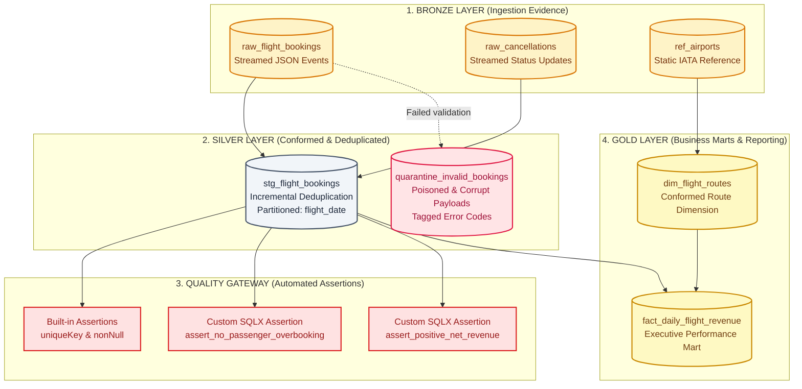
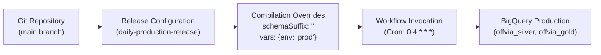

# Data Engineering on GCP (Part 6): Building a Medallion Lakehouse with Dataform (Hands-On Lab)

In [Part 4 of this series](/blog/gcp-data-engineering-streaming-pipeline-lab/), we built Offvia’s real-time streaming ingestion pipeline using Pub/Sub and Dataflow. Flight reservations, cancellations, and seat changes began streaming continuously into BigQuery.

In [Part 5](/blog/gcp-data-engineering-transformations-dataform-dbt/), we stepped back to examine why turning that raw stream into trusted business analytics is so difficult. We saw how uncoordinated nightly stored procedures produced phantom negative revenue, claimed flight `OF-302` carried 400 passengers on a 180-seat aircraft, and burned BigQuery slot quotas on redundant full-table rebuilds.

Now, we build the cure.

In this hands-on lab, we will implement Offvia’s end-to-end **Medallion Lakehouse** using **Google Cloud Dataform**. We will create version-controlled SQLX models, configure incremental deduplication that gracefully absorbs late-arriving events, isolate poisoned payloads into a queryable quarantine dataset, enforce automated data quality assertions, and schedule production release configurations.

---

## What We Are Building



---

## Lab Architecture & Dataform Project Layout

Here is the repository structure we will construct inside Google Cloud Dataform:

```text
offvia-dataform-lakehouse/
├── workflow_settings.yaml          # Project configuration, default datasets & project ID
├── package.json                    # Dataform core dependencies
├── includes/
│   └── flight_helpers.js           # Reusable JavaScript macros (currency conversion & cleaning)
└── definitions/
    ├── sources/
    │   └── declarations.sqlx       # Declarations for raw BigQuery tables (Bronze)
    ├── silver/
    │   ├── stg_flight_bookings.sqlx # Incremental deduplication & event-time watermarking
    │   └── quarantine_bookings.sqlx # Queryable dead-letter table with error codes
    ├── gold/
    │   ├── dim_flight_routes.sqlx  # Conformed route dimension table
    │   └── fact_daily_revenue.sqlx # Aggregated daily route revenue mart
    └── assertions/
        ├── assert_no_overbooking.sqlx # Custom check: passenger count <= aircraft capacity
        └── assert_positive_fares.sqlx # Custom check: ticket fare > 0
```

---

## Prerequisites & Environment Setup

Before creating Dataform resources, configure your Google Cloud project and authenticate your shell.

```bash
gcloud auth login
gcloud auth application-default login

export PROJECT_ID="YOUR_PROJECT_ID"
export REGION="us-central1"

gcloud config set project "${PROJECT_ID}"
```

Enable the required Google Cloud APIs:

```bash
gcloud services enable \
  dataform.googleapis.com \
  bigquery.googleapis.com \
  bigquerystorage.googleapis.com
```

### 1. Create Target BigQuery Datasets

In a production Medallion architecture, separating layers into dedicated datasets enforces clean IAM boundaries and simplifies lifecycle management:

```bash
# Bronze: Raw append-only ingestion sinks
bq --location="${REGION}" mk --dataset "${PROJECT_ID}:offvia_bronze"

# Silver: Cleansed, deduplicated entity models
bq --location="${REGION}" mk --dataset "${PROJECT_ID}:offvia_silver"

# Gold: Business-ready reporting tables & marts
bq --location="${REGION}" mk --dataset "${PROJECT_ID}:offvia_gold"

# Quarantine & Assertions: Audit tables and data quality failures
bq --location="${REGION}" mk --dataset "${PROJECT_ID}:offvia_quarantine"
bq --location="${REGION}" mk --dataset "${PROJECT_ID}:offvia_assertions"
```

### 2. Configure Dataform Service Account Permissions

When Dataform compiles and runs your SQL workflows, it uses its project-level service account:
`service-<PROJECT_NUMBER>@gcp-sa-dataform.iam.gserviceaccount.com`.

This account requires permissions to create jobs and manipulate tables across your datasets:

```bash
export PROJECT_NUMBER=$(gcloud projects describe "${PROJECT_ID}" --format="value(projectNumber)")
export DATAFORM_SA="service-${PROJECT_NUMBER}@gcp-sa-dataform.iam.gserviceaccount.com"

# Grant BigQuery Job User (to run queries and slot allocations)
gcloud projects add-iam-policy-binding "${PROJECT_ID}" \
  --member="serviceAccount:${DATAFORM_SA}" \
  --role="roles/bigquery.jobUser"

# Grant BigQuery Data Editor (to create and write tables in target datasets)
gcloud projects add-iam-policy-binding "${PROJECT_ID}" \
  --member="serviceAccount:${DATAFORM_SA}" \
  --role="roles/bigquery.dataEditor"
```

---

## Step 1: Seed Realistic Bronze Ingestion Data

To make this lab completely runnable without depending on a running Dataflow pipeline from Part 4, let us seed `offvia_bronze.raw_flight_bookings` with real-world scenarios: duplicate web retries, late-arriving events, and a malformed record (a negative fare intended for quarantine).

Execute this query in BigQuery:

```sql
CREATE OR REPLACE TABLE `offvia_bronze.raw_flight_bookings` (
  booking_id STRING,
  customer_id STRING,
  flight_id STRING,
  route_id STRING,
  seat_number STRING,
  aircraft_type STRING,
  booking_status STRING,
  fare_amount NUMERIC,
  currency STRING,
  event_timestamp TIMESTAMP,
  ingestion_timestamp TIMESTAMP
)
PARTITION BY DATE(ingestion_timestamp);

INSERT INTO `offvia_bronze.raw_flight_bookings`
VALUES
  -- 1. Clean valid booking
  ('BK-9001', 'CUST-101', 'OF-101', 'JFK-LHR', '12A', 'B787-9', 'CONFIRMED', 650.00, 'USD', TIMESTAMP '2026-10-10 08:15:00 UTC', TIMESTAMP '2026-10-10 08:15:05 UTC'),
  
  -- 2. Initial booking attempt (fare 420.00)
  ('BK-9002', 'CUST-102', 'OF-202', 'LAX-NRT', '18C', 'A350-900', 'PENDING', 420.00, 'USD', TIMESTAMP '2026-10-10 08:20:00 UTC', TIMESTAMP '2026-10-10 08:20:02 UTC'),
  
  -- 3. Duplicate retry of BK-9002 with later timestamp & CONFIRMED status (simulating network retry)
  ('BK-9002', 'CUST-102', 'OF-202', 'LAX-NRT', '18C', 'A350-900', 'CONFIRMED', 420.00, 'USD', TIMESTAMP '2026-10-10 08:20:15 UTC', TIMESTAMP '2026-10-10 08:20:18 UTC'),
  
  -- 4. Valid booking for short-haul flight
  ('BK-9003', 'CUST-103', 'OF-302', 'SFO-SEA', '04B', 'A320-200', 'CONFIRMED', 180.00, 'USD', TIMESTAMP '2026-10-10 08:30:00 UTC', TIMESTAMP '2026-10-10 08:30:04 UTC'),
  
  -- 5. POISONED PAYLOAD: Corrupted negative fare (should be quarantined)
  ('BK-9004', 'CUST-104', 'OF-302', 'SFO-SEA', '05A', 'A320-200', 'CONFIRMED', -999.00, 'USD', TIMESTAMP '2026-10-10 08:35:00 UTC', TIMESTAMP '2026-10-10 08:35:02 UTC'),

  -- 6. Valid booking with lowercase IATA route requiring normalization
  ('BK-9005', 'CUST-105', 'OF-101', 'jfk-lhr', '14C', 'B787-9', 'CONFIRMED', 680.00, 'USD', TIMESTAMP '2026-10-10 08:40:00 UTC', TIMESTAMP '2026-10-10 08:40:05 UTC');
```

Also seed the static airport lookup reference table:

```sql
CREATE OR REPLACE TABLE `offvia_bronze.ref_airports` (
  iata_code STRING,
  airport_name STRING,
  city STRING,
  country STRING
);

INSERT INTO `offvia_bronze.ref_airports` VALUES
  ('JFK', 'John F. Kennedy International', 'New York', 'USA'),
  ('LHR', 'London Heathrow Airport', 'London', 'UK'),
  ('LAX', 'Los Angeles International', 'Los Angeles', 'USA'),
  ('NRT', 'Narita International Airport', 'Tokyo', 'Japan'),
  ('SFO', 'San Francisco International', 'San Francisco', 'USA'),
  ('SEA', 'Seattle-Tacoma International', 'Seattle', 'USA');
```

---

## Step 2: Initialize Dataform Repository & Workspace

You can manage Dataform through the Google Cloud Console or locally via the `@dataform/cli`.

Create the Dataform repository using `gcloud`:

```bash
gcloud dataform repositories create offvia-lakehouse \
  --location="${REGION}"
```

Create a development workspace for your user:

```bash
gcloud dataform workspaces create dev-workspace \
  --repository=offvia-lakehouse \
  --location="${REGION}"
```

### Install and Initialize Locally (Optional but Recommended)

For fast local compilation and syntax verification, install the Dataform CLI:

```bash
npm install -g @dataform/cli

mkdir offvia-dataform-lakehouse
cd offvia-dataform-lakehouse
dataform init . "${PROJECT_ID}" "${REGION}"
```

### Configure `workflow_settings.yaml`

Dataform uses `workflow_settings.yaml` to specify default project settings, datasets, and compilation targets. Create or update this file in your repository root:

```yaml
defaultProject: YOUR_PROJECT_ID
defaultLocation: us-central1
defaultDataset: offvia_silver
assertionDataset: offvia_assertions
dataformCoreVersion: 3.0.0
```

> **Notice:** We set `defaultDataset: offvia_silver`. This means any model that does not declare an explicit schema will default to our Silver layer, keeping intermediate staging tables safely separated from raw ingestion and Gold reporting.

---

## Step 3: Define Reusable Macros (`includes/flight_helpers.js`)

In Part 5, we noted that transformation logic often suffers from copy-pasted string-formatting and date-truncation snippets. Dataform solves this by supporting standard JavaScript in the `includes/` directory.

Create `includes/flight_helpers.js`:

```javascript
/**
 * Normalizes flight route codes (e.g., 'jfk-lhr' -> 'JFK-LHR')
 */
function normalizeRoute(columnName) {
  return `UPPER(TRIM(${columnName}))`;
}

/**
 * Validates that an amount is strictly positive and non-null
 */
function isValidPositiveAmount(columnName) {
  return `(${columnName} IS NOT NULL AND ${columnName} > 0)`;
}

module.exports = {
  normalizeRoute,
  isValidPositiveAmount
};
```

Any SQLX file across your project can now call these helper functions directly using `${flight_helpers.normalizeRoute("route_id")}`.

---

## Step 4: Bronze Layer — Declare Ingestion Sources

In Dataform, raw tables managed outside Dataform (such as our Pub/Sub and Dataflow sinks) are defined using declarative `declaration` blocks.

Create `definitions/sources/declarations.sqlx`:

```sql
config {
  type: "declaration",
  database: "YOUR_PROJECT_ID",
  schema: "offvia_bronze",
  name: "raw_flight_bookings",
  description: "Raw booking event stream ingested by Dataflow and Pub/Sub BigQuery subscriptions."
}
```

Create `definitions/sources/ref_airports.sqlx`:

```sql
config {
  type: "declaration",
  database: "YOUR_PROJECT_ID",
  schema: "offvia_bronze",
  name: "ref_airports",
  description: "Static airport reference table containing IATA codes, cities, and countries."
}
```

By declaring these sources, Dataform builds an automated dependency graph: downstream models that reference `${ref("raw_flight_bookings")}` will automatically register the raw tables as dependencies.

---

## Step 5: Silver Layer — Incremental Deduplication Model

Now we build the core of our Silver layer: `stg_flight_bookings`.

This model must:
1. Deduplicate records on `booking_id`, retaining the latest event state.
2. Reject corrupted records (sending them to quarantine).
3. Incrementally scan only recent partitions during daily production runs.
4. Enforce partition boundaries on `flight_date` and clustering on `route_id`.

Create `definitions/silver/stg_flight_bookings.sqlx`:

```sql
config {
  type: "incremental",
  schema: "offvia_silver",
  name: "stg_flight_bookings",
  description: "Cleaned, deduplicated flight bookings partitioned by flight date.",
  uniqueKey: ["booking_id"],
  bigquery: {
    partitionBy: "flight_date",
    clusterBy: ["route_id", "booking_status"]
  },
  assertions: {
    uniqueKey: ["booking_id"],
    nonNull: ["booking_id", "customer_id", "flight_date"],
    rowConditions: [
      "fare_amount > 0",
      "booking_status IN ('CONFIRMED', 'PENDING', 'CANCELLED')"
    ]
  }
}

-- Pre-operations: Ensure deterministic timestamp parsing
pre_operations {
  DECLARE lookback_window_days INT64 DEFAULT 3;
}

WITH base_records AS (
  SELECT
    booking_id,
    customer_id,
    flight_id,
    ${flight_helpers.normalizeRoute("route_id")} AS route_id,
    seat_number,
    aircraft_type,
    UPPER(TRIM(booking_status)) AS booking_status,
    fare_amount,
    UPPER(TRIM(currency)) AS currency,
    event_timestamp,
    DATE(event_timestamp) AS flight_date,
    ingestion_timestamp,
    -- Rank records by latest event timestamp per booking_id
    ROW_NUMBER() OVER(
      PARTITION BY booking_id 
      ORDER BY event_timestamp DESC, ingestion_timestamp DESC
    ) AS dedupe_rank
  FROM
    ${ref("raw_flight_bookings")}
  WHERE
    -- Filter out corrupted records (these are handled in quarantine)
    ${flight_helpers.isValidPositiveAmount("fare_amount")}
    ${when(incremental(), `
      -- In incremental mode, only scan partitions modified within the lookback window
      AND ingestion_timestamp >= TIMESTAMP_SUB(CURRENT_TIMESTAMP(), INTERVAL 3 DAY)
    `)}
)

SELECT
  booking_id,
  customer_id,
  flight_id,
  route_id,
  seat_number,
  aircraft_type,
  booking_status,
  fare_amount,
  currency,
  event_timestamp,
  flight_date,
  CURRENT_TIMESTAMP() AS silver_transformed_at
FROM
  base_records
WHERE
  dedupe_rank = 1
```

### Understanding What Dataform Does Under the Hood:

When `type: "incremental"` runs:
- On **first run**: Dataform creates the table using `CREATE TABLE ... AS SELECT`.
- On **subsequent runs**: Dataform detects `uniqueKey: ["booking_id"]` and automatically translates your query into an optimized BigQuery `MERGE` statement:

```sql
-- Conceptual BigQuery DML executed by Dataform
MERGE `offvia_silver.stg_flight_bookings` T
USING (...) S
ON T.booking_id = S.booking_id
WHEN MATCHED THEN UPDATE SET ...
WHEN NOT MATCHED THEN INSERT (...) VALUES (...)
```

Because we added `partitionBy: "flight_date"` and restricted the scan with `when(incremental(), ...)`, BigQuery only reads and updates the affected partitions rather than recalculating the entire history.

---

## Step 6: Silver Layer — The Quarantine Model

In Part 5, we warned against silently dropping bad data with `WHERE fare_amount > 0`. If a ticketing microservice begins emitting invalid refund records, dropping them conceals the incident from operations.

Instead, we route invalid records into an explicit, queryable quarantine table with diagnostic reason codes.

Create `definitions/silver/quarantine_bookings.sqlx`:

```sql
config {
  type: "incremental",
  schema: "offvia_quarantine",
  name: "quarantine_invalid_bookings",
  description: "Dead-letter quarantine table capturing invalid or corrupted booking payloads with diagnostic reasons.",
  bigquery: {
    partitionBy: "DATE(ingestion_timestamp)"
  }
}

SELECT
  booking_id,
  customer_id,
  flight_id,
  route_id,
  fare_amount,
  booking_status,
  event_timestamp,
  ingestion_timestamp,
  ARRAY_CONCAT(
    IF(fare_amount IS NULL OR fare_amount <= 0, ['NEGATIVE_OR_ZERO_FARE'], []),
    IF(booking_id IS NULL OR booking_id = '', ['MISSING_BOOKING_ID'], []),
    IF(event_timestamp IS NULL, ['MISSING_EVENT_TIMESTAMP'], [])
  ) AS quarantine_reasons,
  CURRENT_TIMESTAMP() AS quarantined_at
FROM
  ${ref("raw_flight_bookings")}
WHERE
  (
    fare_amount IS NULL 
    OR fare_amount <= 0 
    OR booking_id IS NULL 
    OR event_timestamp IS NULL
  )
  ${when(incremental(), `
    AND ingestion_timestamp >= TIMESTAMP_SUB(CURRENT_TIMESTAMP(), INTERVAL 3 DAY)
  `)}
```

---

## Step 7: Automated Data Quality Guardrails (Assertions)

Dataform provides two layers of quality checks:

1. **Inline Assertions**: Configured directly in the model's `config` block (as we configured with `uniqueKey` and `nonNull` in Step 5).
2. **Custom SQLX Assertions**: Dedicated test queries that must return **zero rows** to pass. If a query returns even one row, Dataform fails the assertion and stops downstream dependents from publishing.

Let us write the assertion that prevents the infamous *"400 passengers on a 180-seat aircraft"* incident.

### Custom Assertion: `assert_no_overbooking.sqlx`

Create `definitions/assertions/assert_no_overbooking.sqlx`:

```sql
config {
  type: "assertion",
  description: "Ensures total confirmed passengers on any flight do not exceed declared aircraft maximum capacity."
}

WITH flight_passenger_counts AS (
  SELECT
    flight_id,
    flight_date,
    aircraft_type,
    COUNT(DISTINCT booking_id) AS confirmed_passengers
  FROM
    ${ref("stg_flight_bookings")}
  WHERE
    booking_status = 'CONFIRMED'
  GROUP BY
    1, 2, 3
),

aircraft_capacities AS (
  SELECT 'A320-200' AS aircraft_type, 180 AS max_seats UNION ALL
  SELECT 'B787-9', 290 UNION ALL
  SELECT 'A350-900', 325
)

SELECT
  f.flight_id,
  f.flight_date,
  f.aircraft_type,
  f.confirmed_passengers,
  c.max_seats
FROM
  flight_passenger_counts f
JOIN
  aircraft_capacities c USING (aircraft_type)
WHERE
  f.confirmed_passengers > c.max_seats
```

If this query returns a row, Dataform logs an assertion failure in `offvia_assertions.assert_no_overbooking` and halts execution before building the Gold reporting layer.

---

## Step 8: Gold Layer — Conformed Dimensions & Revenue Marts

With validated data guaranteed in Silver, we can build the Gold layer: conformed star schema dimensions and business-ready reporting marts.

### 1. Conformed Dimension: `dim_flight_routes.sqlx`

Create `definitions/gold/dim_flight_routes.sqlx`:

```sql
config {
  type: "table",
  schema: "offvia_gold",
  name: "dim_flight_routes",
  description: "Conformed dimension table modeling airline routes enriched with airport city and country metadata."
}

WITH route_segments AS (
  SELECT DISTINCT
    route_id,
    SPLIT(route_id, '-')[OFFSET(0)] AS origin_iata,
    SPLIT(route_id, '-')[OFFSET(1)] AS destination_iata
  FROM
    ${ref("stg_flight_bookings")}
)

SELECT
  r.route_id,
  r.origin_iata,
  orig.airport_name AS origin_airport_name,
  orig.city AS origin_city,
  orig.country AS origin_country,
  r.destination_iata,
  dest.airport_name AS destination_airport_name,
  dest.city AS destination_city,
  dest.country AS destination_country
FROM
  route_segments r
LEFT JOIN
  ${ref("ref_airports")} orig ON r.origin_iata = orig.iata_code
LEFT JOIN
  ${ref("ref_airports")} dest ON r.destination_iata = dest.iata_code
```

### 2. Executive Fact Mart: `fact_daily_revenue.sqlx`

Create `definitions/gold/fact_daily_revenue.sqlx`:

```sql
config {
  type: "table",
  schema: "offvia_gold",
  name: "fact_daily_flight_revenue",
  description: "Executive Gold reporting mart summarizing daily booking volume, gross revenue, and route performance.",
  bigquery: {
    partitionBy: "flight_date",
    clusterBy: ["route_id"]
  },
  assertions: {
    nonNull: ["flight_date", "route_id"],
    rowConditions: [
      "total_gross_revenue >= 0",
      "total_confirmed_bookings >= 0"
    ]
  }
}

SELECT
  b.flight_date,
  b.route_id,
  r.origin_city,
  r.destination_city,
  COUNT(DISTINCT b.booking_id) AS total_confirmed_bookings,
  SUM(b.fare_amount) AS total_gross_revenue,
  ROUND(AVG(b.fare_amount), 2) AS average_ticket_fare,
  CURRENT_TIMESTAMP() AS gold_updated_at
FROM
  ${ref("stg_flight_bookings")} b
LEFT JOIN
  ${ref("dim_flight_routes")} r USING (route_id)
WHERE
  b.booking_status = 'CONFIRMED'
GROUP BY
  1, 2, 3, 4
```

---

## Step 9: Compiling and Running the Pipeline

Now that our SQLX files and declarations are ready, let us compile the DAG and execute the pipeline.

### 1. Compile the Dataform Project

If working locally with `@dataform/cli`:

```bash
dataform compile
```

You should see:

```text
Compiling Dataform project...
Compiled 6 actions successfully:
  - Table: offvia_silver.stg_flight_bookings
  - Table: offvia_quarantine.quarantine_invalid_bookings
  - Assertion: offvia_assertions.stg_flight_bookings_assertions
  - Assertion: offvia_assertions.assert_no_overbooking
  - Table: offvia_gold.dim_flight_routes
  - Table: offvia_gold.fact_daily_flight_revenue
```

### 2. Execute the Pipeline via CLI

Run the full workflow against BigQuery:

```bash
dataform run
```

Or trigger only Silver models using tags:

```bash
dataform run --tags silver
```

### 3. Executing via Google Cloud Console

1. Navigate to **BigQuery > Dataform** in the Google Cloud Console.
2. Click your repository `offvia-lakehouse` and select your workspace.
3. Click **Start Execution > Execute all actions**.
4. Observe the interactive directed acyclic graph (DAG) execute:

```text
[✓] offvia_bronze.raw_flight_bookings (Source)
 └── [✓] offvia_silver.stg_flight_bookings
      ├── [✓] offvia_assertions.assert_no_overbooking
      ├── [✓] offvia_gold.dim_flight_routes
      └── [✓] offvia_gold.fact_daily_flight_revenue
```

---

## Step 10: Verify the Output and Inspect Quarantine

Let us verify that our Medallion pipeline solved the production failure modes from Part 5.

### 1. Verify Deduplication in the Silver Layer

Query `offvia_silver.stg_flight_bookings`:

```sql
SELECT 
  booking_id, 
  customer_id, 
  route_id, 
  fare_amount, 
  booking_status, 
  flight_date
FROM 
  `offvia_silver.stg_flight_bookings`
ORDER BY 
  booking_id;
```

#### Output:

| booking_id | customer_id | route_id | fare_amount | booking_status | flight_date |
|---|---|---|---|---|---|
| `BK-9001` | CUST-101 | `JFK-LHR` | 650.00 | CONFIRMED | 2026-10-10 |
| `BK-9002` | CUST-102 | `LAX-NRT` | 420.00 | CONFIRMED | 2026-10-10 |
| `BK-9003` | CUST-103 | `SFO-SEA` | 180.00 | CONFIRMED | 2026-10-10 |
| `BK-9005` | CUST-105 | `JFK-LHR` | 680.00 | CONFIRMED | 2026-10-10 |

#### What to look for:
- Notice `BK-9002`: Even though two events were inserted (one `PENDING`, one `CONFIRMED`), only the latest `CONFIRMED` event exists in Silver. Deduplication succeeded.
- Notice `BK-9005`: The lower-case `jfk-lhr` was normalized to `JFK-LHR` by our JavaScript helper.
- Notice `BK-9004`: The corrupted negative fare record is absent from Silver.

### 2. Verify Quarantine Isolation

Query `offvia_quarantine.quarantine_invalid_bookings`:

```sql
SELECT 
  booking_id, 
  fare_amount, 
  quarantine_reasons, 
  quarantined_at
FROM 
  `offvia_quarantine.quarantine_invalid_bookings`;
```

#### Output:

| booking_id | fare_amount | quarantine_reasons | quarantined_at |
|---|---|---|---|
| `BK-9004` | -999.00 | `['NEGATIVE_OR_ZERO_FARE']` | 2026-10-10 12:45:00 UTC |

The invalid record was captured cleanly with its exact diagnostic reason code without crashing the pipeline or leaking into financial metrics.

### 3. Verify Executive Gold Revenue Mart

Query `offvia_gold.fact_daily_flight_revenue`:

```sql
SELECT 
  flight_date,
  route_id,
  origin_city,
  destination_city,
  total_confirmed_bookings,
  total_gross_revenue,
  average_ticket_fare
FROM 
  `offvia_gold.fact_daily_flight_revenue`
ORDER BY 
  total_gross_revenue DESC;
```

#### Output:

| flight_date | route_id | origin_city | destination_city | total_confirmed_bookings | total_gross_revenue | average_ticket_fare |
|---|---|---|---|---|---|---|
| 2026-10-10 | `JFK-LHR` | New York | London | 2 | 1330.00 | 665.00 |
| 2026-10-10 | `LAX-NRT` | Los Angeles | Tokyo | 1 | 420.00 | 420.00 |
| 2026-10-10 | `SFO-SEA` | San Francisco | Seattle | 1 | 180.00 | 180.00 |

Zero negative revenue, zero duplicate counts, and fully enriched origin and destination attributes ready for Looker dashboards.

---

## Step 11: Production Release Configurations & Scheduling

A development workspace should never run against production datasets. In Google Cloud Dataform, you separate environments using **Release Configurations** and **Workflow Invocations**.



### 1. Create a Release Configuration

In `gcloud`:

```bash
gcloud dataform release-configs create prod-daily \
  --repository=offvia-lakehouse \
  --location="${REGION}" \
  --git-commitish=main \
  --cron-schedule="0 4 * * *" \
  --time-zone="UTC"
```

### 2. Configure Compilation Overrides for Development vs. Production

To allow engineers to test against isolated scratch datasets without modifying SQL code:

1. In the Google Cloud Console, open **Release Configurations**.
2. Under **Compilation Overrides**, set:
   - **Schema Suffix**: `_dev` (e.g., `offvia_silver_dev`)
   - **Database / Project ID**: points to your test GCP project.
3. When compiled under this configuration, all `${ref()}` references automatically resolve to the isolated datasets.

---

## Production Gotchas to Keep in Mind

### 1. The Partition Pruning Trap in Incremental Models

In incremental SQLX models, writing:

```sql
WHERE ingestion_timestamp >= (SELECT MAX(ingestion_timestamp) FROM ${self()})
```

causes BigQuery to evaluate a subquery for the partition filter. **BigQuery cannot prune partitions at compile time using dynamic subqueries**, resulting in an accidental full table scan of the target table.

Always use a bounded lookback parameter (such as `TIMESTAMP_SUB(CURRENT_TIMESTAMP(), INTERVAL 3 DAY)`) or pre-computed script variables in a `pre_operations` block to guarantee strict partition pruning.

### 2. Dataform Service Account IAM Scope

If you add a new destination dataset, Dataform will fail with:

```text
Access Denied: Dataset <dataset>: Permission bigquery.tables.create denied on table ...
```

Remember that granting `roles/bigquery.dataEditor` at the project level is often restricted in enterprise environments. If your organization restricts project-level IAM, explicitly grant `roles/bigquery.dataEditor` on each individual dataset (`offvia_silver`, `offvia_gold`, `offvia_quarantine`, `offvia_assertions`).

---

## Cleaning Up Resources

To avoid incurring continuing BigQuery storage charges after completing this lab:

```bash
# Delete created datasets
bq rm -r -f -d "${PROJECT_ID}:offvia_bronze"
bq rm -r -f -d "${PROJECT_ID}:offvia_silver"
bq rm -r -f -d "${PROJECT_ID}:offvia_gold"
bq rm -r -f -d "${PROJECT_ID}:offvia_quarantine"
bq rm -r -f -d "${PROJECT_ID}:offvia_assertions"

# Delete Dataform repository
gcloud dataform repositories delete offvia-lakehouse \
  --location="${REGION}" \
  --quiet
```

---

## Summary and What Comes Next

In this lab, we took the architectural theory from [Part 5](/blog/gcp-data-engineering-transformations-dataform-dbt/) and implemented a functional, production-grade Medallion Lakehouse:

1. **Bronze Layer:** Maintained immutable evidence with declarative source definitions.
2. **Silver Layer:** Built partition-aware incremental models that deduplicate late arrivals and normalize data.
3. **Quarantine Table:** Handled poisoned payloads transparently with diagnostic reason codes.
4. **Assertions:** Implemented hard-stop business rules preventing invalid data from reaching reporting marts.
5. **Gold Layer:** Published aggregated, validated dimensional models ready for analytics.

In **Part 7**, we will step beyond individual transformations to tackle **Enterprise Pipeline Orchestration with Cloud Composer and Workflows**—stitching our Dataflow ingestion, Dataform executions, and downstream alert systems into an enterprise-grade, SLA-monitored orchestration graph.
