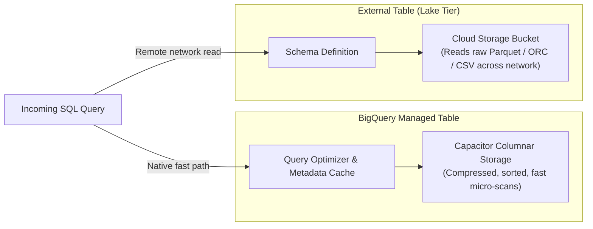
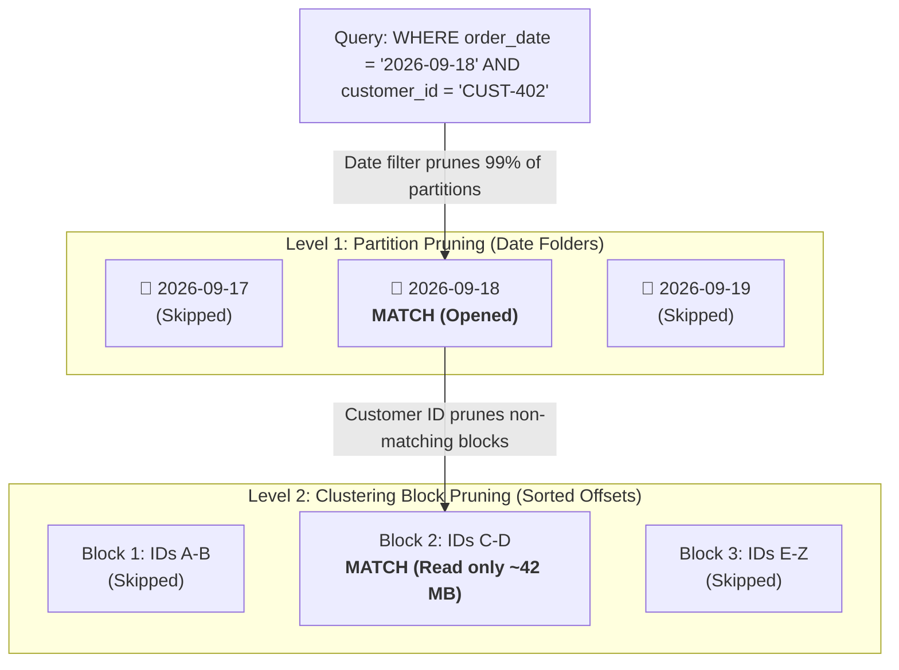
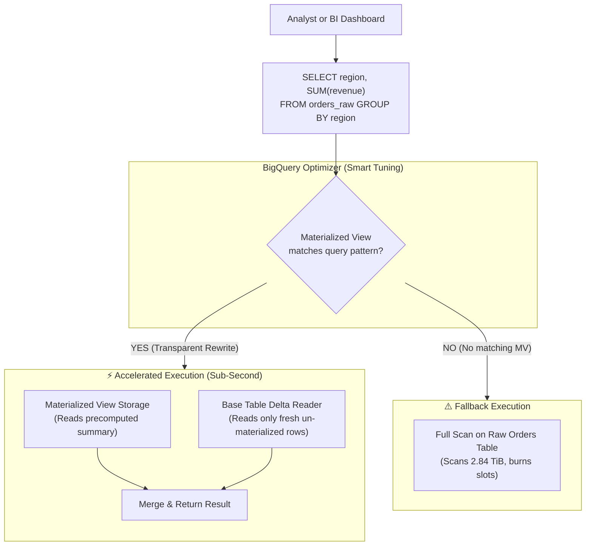
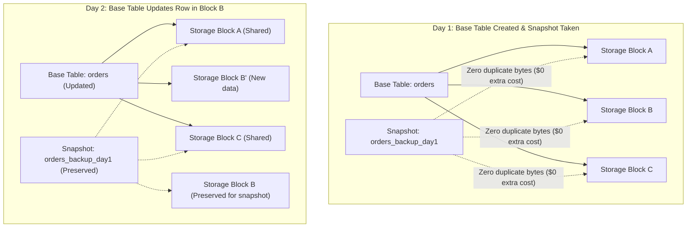
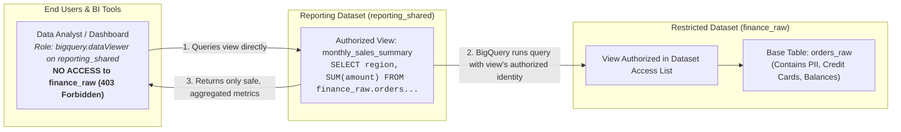
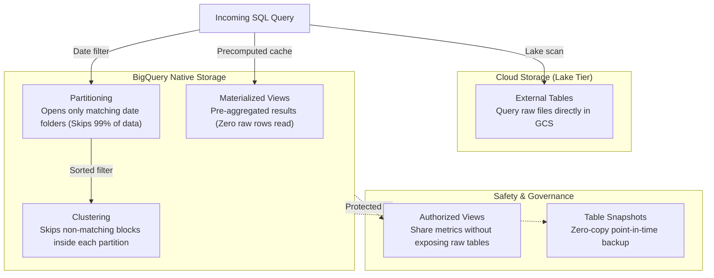

A data analyst opens the BigQuery console and runs a query that looks completely harmless:

```sql
SELECT user_id, order_total 
FROM `company_production.orders` 
WHERE order_date = '2026-09-18';
```

The goal is simple: retrieve one day of sales.

But the query validator shows **2.84 TiB to be processed**.

At an illustrative on-demand rate of $6.25 per TiB, that is roughly **$17.75 for one execution**. Put the same query behind an executive dashboard that refreshes every ten minutes, around the clock, and it can run 1,008 times in a week—close to **$17,900 per week** before accounting for regional pricing, free-tier usage, caching, or a capacity-based pricing model.

The SQL is not the real problem. The table design is.

Because the table is not partitioned by `order_date`, BigQuery cannot jump directly to the rows for September 18. It must scan the referenced columns across the entire table and only then apply the filter. The query asks for one day, but the physical storage layout gives BigQuery no efficient boundary for finding it.

This is why storage design matters. Before building streaming pipelines, Medallion architectures, or orchestration frameworks, it is worth understanding the core BigQuery concepts that influence almost every architectural decision you make later.

In this first part of the **Data Engineering on GCP** series, we will cover seven practical building blocks:

1. Managed tables vs. external tables
2. Partitioning
3. Clustering
4. Time-series data modeling
5. Materialized views
6. Time travel and table snapshots
7. Authorized views (and secure data sharing)

> [!NOTE] 💡 A Quick Architectural Clarification
> These are not all separate BigQuery table types. Partitioning and clustering are physical table-layout properties; time-series is a data-modeling pattern; while authorized views are a dataset access-control mechanism. Grouping them together makes sense because they solve closely related storage, performance, governance, and recovery problems.

---

## The Seven Building Blocks, Without the Buzzwords

Here is the mental model to keep in mind when designing tables in BigQuery.

---

### 1. Managed Tables vs. External Tables

**Analogy:** *Food stored in your home kitchen vs. food stored in a warehouse across the street.*

With a **managed BigQuery table**, data is stored in BigQuery's native columnar format (Capacitor). BigQuery controls the physical file structure and can apply features such as automatic compression, partitioning, clustering, time travel, and metadata optimization.

With an **external table**, data remains in an external system such as Google Cloud Storage (GCS). BigQuery stores the table definition, but reads the underlying files over the network when you execute the query.

External tables are useful when you want to:
- Explore files before deciding whether to ingest them.
- Query lake data without creating another physical copy.
- Keep infrequently accessed data in cheaper object storage tiers.
- Expose Parquet, Avro, ORC, CSV, or JSON files through standard SQL.

**The trade-off:** Repeated external queries can be less predictable and slower than queries over managed BigQuery storage. File format matters significantly: columnar formats like Parquet and ORC are far better suited to analytical queries than large uncompressed CSV or JSON files.

> **Practical Rule:** Use external tables for exploration, interoperability, and colder lakehouse tiers. Use managed tables when the data is queried frequently, powers dashboards, or requires BigQuery's full optimization suite.



---

### 2. Partitioning

**Analogy:** *A filing cabinet with one drawer per day or month.*

Imagine three years of order records stored in one enormous cabinet. Without labels, finding yesterday's receipts means manually searching the entire cabinet.

Partitioning adds physical boundaries. If the table is partitioned by `order_date`, BigQuery can open **only** the partition that matches the date in your filter and skip the rest. This is called **partition pruning**.

Common partitioning choices include:
- A `DATE`, `TIMESTAMP`, or `DATETIME` column.
- **Ingestion time** (automatically partitioned when rows are loaded).
- An **integer range** (e.g., customer IDs in ranges of 10,000).

Partitioning is most valuable when queries consistently filter on the partitioning column. 

*A critical caveat:* A partitioned table does not automatically become cheap. A query that omits an eligible partition filter will still scan the entire table.

---

### 3. Clustering

**Analogy:** *Alphabetized folders inside each filing-cabinet drawer.*

Partitioning helps BigQuery choose the correct drawer. Clustering helps it skip unnecessary storage blocks *inside* that drawer.

Suppose an orders table is partitioned by `order_date` and clustered by `customer_id`. A query for one date and one customer can first prune all other dates, then read only the storage blocks likely to contain that customer.

Clustering works especially well for columns that frequently appear in `WHERE` filters, `JOIN` conditions, or `GROUP BY` aggregations. You can define up to four clustering columns, and **their order matters** because BigQuery sorts data hierarchically according to that sequence.

Unlike a traditional relational database B-tree index, clustering does not create a separate lookup index. Instead, BigQuery physically sorts the data blocks and maintains lightweight min/max metadata that allows the execution engine to skip blocks that cannot possibly match your filter.



---

### 4. Time-Series Data Modeling

**Analogy:** *A flight recorder black box that stores events in chronological order.*

A time-series dataset records how metrics or events evolve over time: application telemetry, IoT sensors, clickstream activity, or financial ledger ticks.

BigQuery does not have a special "time-series table" resource. Time-series is an intentional modeling pattern, usually implemented with:
- An **event timestamp** (when the event occurred in the real world).
- An **ingestion timestamp** (when BigQuery received the record).
- Time-based partitioning (daily or hourly).
- Clustering on dimensions such as `device_id`, `customer_id`, `region`, or `event_type`.
- Window functions for rolling analytical calculations (e.g., 10-minute moving averages).
- Retention and partition-expiration policies.

**The event time vs. ingestion time distinction:** Event time tells you when something happened in the source system. Ingestion time tells you when BigQuery loaded it. Late-arriving events make this distinction essential for building idempotent pipelines.

---

### 5. Materialized Views

**Analogy:** *A summary sheet prepared before the executive meeting.*

Imagine an executive dashboard that repeatedly calculates daily revenue by order status. Recalculating that same aggregation from billions of raw order rows every ten minutes is expensive and wasteful.

A **materialized view** stores precomputed results for a defined query. BigQuery refreshes those results automatically in the background, and through **smart tuning**, the optimizer can route queries to the materialized view automatically—even when an analyst queries the base table directly.

There are two important nuances:
1. **Incremental refresh:** BigQuery updates only the delta changes from base tables. However, incremental refresh depends on the SQL functions used and the nature of changes to the base table.
2. **Freshness guarantees:** When base tables receive new data, queries reading from the materialized view can combine the precomputed view with un-materialized delta rows from the base table, ensuring results remain consistent without waiting for the next refresh.

Materialized views are ideal for stable, frequently queried aggregations—not as a universal replacement for scheduled ELT transformations.



---

### 6. Time Travel and Table Snapshots

**Analogy:** *Rewinding a video vs. creating a named save point.*

- **Time Travel** lets you inspect or recover historical versions of a table within the dataset's configured rolling window. The default is **7 days** (configurable between 2 and 7 days).
- A **Table Snapshot** is an explicit, read-only copy of a table preserved at a specific point in time. It is used when you need to retain historical state beyond the 7-day time-travel window—such as before a major migration, backfill, or schema change.

**The cost model:** When a snapshot is first created, it adds **$0 extra storage charges** because it shares unchanged storage blocks with the base table. Storage charges begin accruing only as data in the base table is modified or deleted while the snapshot preserves the old blocks.

*Simple rule:* Time travel is an automated rolling recovery window. A snapshot is an explicit, named recovery point that you control.



---

### 7. Authorized Views

**Analogy:** *The bank teller or pharmacy drive-through window.*

You are not allowed to walk into a bank vault to grab cash, nor can you enter a pharmacy stockroom where controlled medications sit on open shelves. Instead, you walk up to the teller window. The teller (the **Authorized View**) reaches into the restricted vault, verifies your authorization, and hands you only the specific, permitted funds or prescription. The vault remains locked.

In enterprise data warehouses, analysts frequently need aggregated metrics (such as total sales by region or average salary by department) without seeing raw PII (credit card hashes, customer phone numbers, or individual employee salaries).

Normally, if a user queries a view in BigQuery, they **must also have read permissions on the underlying base tables**. If you revoke table access, standard views fail with `403 Access Denied`.

**Authorized Views solve this completely:**
- You authorize the view inside the source dataset.
- BigQuery grants the *view itself* permission to query the restricted tables.
- End users are granted access **only** to the dataset containing the view. They have zero permissions on the raw source dataset, preventing any direct access to sensitive rows or columns.



---

## BigQuery Storage Architecture: The Useful Version

You do not need to memorize internal Google infrastructure names, but one architectural foundation is essential: **BigQuery completely separates compute from storage.**



### Storage
Data in managed tables is stored in Google's proprietary columnar format (**Capacitor**). Columnar storage is critical for analytics: a query that requests three columns from a 50-column table reads only those three columns from disk, completely ignoring the other 47.

### Compute
BigQuery executes queries using distributed compute clusters. A **slot** is a virtual unit of compute capacity (CPU, memory, and networking) used to process SQL. Slots are allocated dynamically as queries run.

### Why Table Design Still Matters
Separating compute from storage gives BigQuery virtually unlimited scalability, but it does not make inefficient scans free:
- Under **on-demand pricing**, cost is based directly on **bytes processed**.
- Under **capacity pricing** (Editions / Slot commitments), scanning unneeded data burns compute slots, causing concurrent queries to queue.

In both pricing models, partitioning, clustering, column selection, and pre-aggregation directly determine performance and operational cost.

---

## Five Common Misconceptions

<div class="grid grid-cols-1 md:grid-cols-2 gap-4 my-8">

<div class="p-5 rounded-xl bg-slate-50 dark:bg-slate-900/60 border border-slate-200 dark:border-slate-800 space-y-2">
<div class="font-bold text-red-600 dark:text-red-400 text-sm flex items-center gap-2">
<span>❌</span> Misconception 1: "LIMIT 10 Always Makes a Query Cheap"
</div>
<p class="text-xs text-slate-700 dark:text-slate-300 leading-relaxed m-0">
<strong>Reality:</strong> On non-clustered tables, <code>SELECT * FROM table LIMIT 10</code> reads <strong>every single column across the entire table</strong> before trimming output rows. For data exploration, use the <em>Preview</em> tab in the console or <code>bq head</code>, both of which are completely free. <em>(Nuance: On clustered tables, LIMIT can sometimes reduce bytes scanned if BigQuery stops early after finding sufficient blocks, but it should never be relied upon as a cost control).</em>
</p>
</div>

<div class="p-5 rounded-xl bg-slate-50 dark:bg-slate-900/60 border border-slate-200 dark:border-slate-800 space-y-2">
<div class="font-bold text-red-600 dark:text-red-400 text-sm flex items-center gap-2">
<span>❌</span> Misconception 2: "Clustering Makes Partitioning Unnecessary"
</div>
<p class="text-xs text-slate-700 dark:text-slate-300 leading-relaxed m-0">
<strong>Reality:</strong> For large time-based datasets, they work best together. Partitioning creates a coarse, deterministic date or integer boundary; clustering organizes data blocks inside those boundaries. If a table is small or queries rarely filter by date, clustering alone may be the superior design.
</p>
</div>

<div class="p-5 rounded-xl bg-slate-50 dark:bg-slate-900/60 border border-slate-200 dark:border-slate-800 space-y-2">
<div class="font-bold text-red-600 dark:text-red-400 text-sm flex items-center gap-2">
<span>❌</span> Misconception 3: "External Tables are Completely Free"
</div>
<p class="text-xs text-slate-700 dark:text-slate-300 leading-relaxed m-0">
<strong>Reality:</strong> External tables avoid copying data into BigQuery storage, but queries against them still consume standard BigQuery analysis bytes or compute slots. Standard GCS storage and egress charges still apply. <em>(Note: BigQuery does not charge you for Cloud Storage API calls it makes on your behalf, so attributing GCS Class B request fees to BigQuery external queries is inaccurate).</em>
</p>
</div>

<div class="p-5 rounded-xl bg-slate-50 dark:bg-slate-900/60 border border-slate-200 dark:border-slate-800 space-y-2">
<div class="font-bold text-red-600 dark:text-red-400 text-sm flex items-center gap-2">
<span>❌</span> Misconception 4: "Standard Views Protect Sensitive Underlying Data"
</div>
<p class="text-xs text-slate-700 dark:text-slate-300 leading-relaxed m-0">
<strong>Reality:</strong> A standard SQL view requires the querying user to have direct read access to the underlying tables. Without <strong>Authorized Views</strong>, creating a view either causes an access-denied error for restricted users or forces administrators to over-grant access to raw sensitive tables.
</p>
</div>

<div class="p-5 rounded-xl bg-slate-50 dark:bg-slate-900/60 border border-slate-200 dark:border-slate-800 space-y-2 md:col-span-2">
<div class="font-bold text-red-600 dark:text-red-400 text-sm flex items-center gap-2">
<span>❌</span> Misconception 5: "Table Snapshots are Free Permanent Backups"
</div>
<p class="text-xs text-slate-700 dark:text-slate-300 leading-relaxed m-0">
<strong>Reality:</strong> A snapshot is lightweight at creation because it references the base table's unchanged storage blocks. As the base table mutates or deletes rows, BigQuery charges the snapshot for the historical blocks it must continue preserving. Snapshots require clear retention and expiration policies.
</p>
</div>

</div>

---

## 📊 Quick Comparison: The 7 Building Blocks

| Concept | Where the Data Lives | Main Benefit | Main Trade-Off | Best Fit |
| :--- | :--- | :--- | :--- | :--- |
| **Managed Table** | BigQuery managed storage | Full performance, clustering & management features | Data must be loaded into BigQuery | Frequently queried analytical datasets |
| **External Table** | External system (GCS) | Query files in place without copying | Query performance depends on file format and network | Exploration, cold lake data, interoperability |
| **Partitioning** | Layout property of managed table | Prunes entire date, timestamp, or integer ranges | Requires a consistent partition filter key | Large time-based datasets, transaction logs |
| **Clustering** | Layout property of managed table | Prunes storage blocks within a table or partition | Benefit depends on filter patterns and column order | Frequent filters on customer, device, status, or region |
| **Materialized View** | Precomputed managed storage | Eliminates repeated aggregation computation | SQL support and refresh behavior have constraints | Repeated dashboard queries and KPI reporting |
| **Time Travel** | Historical versions in BigQuery | Rewind or inspect recent table states | Limited to the configured 2-7 day window | Short-term operational recovery from bad updates |
| **Table Snapshot** | Read-only BigQuery table pointer | Preserves an explicit named recovery point beyond 7 days | Storage cost grows as base table data changes | Pre-deployment backups, audit milestones |
| **Authorized View** | Query logic in managed view | Shares aggregated data without granting table access | View maintenance and dataset configuration | Cross-team reporting, customer-facing marts, PII masking |

---

## 🛠️ Hands-On Interactive Lab

The examples below use a dataset named `gcloudcafe_demo`. Create that dataset first in the BigQuery console or via `bq mk --location=us-central1 gcloudcafe_demo`, and ensure your Cloud Storage bucket is in a compatible location.

---

### Lab 1: Query Parquet Files in Cloud Storage (External Table)

Assume your bucket contains Parquet files under `gs://my-bucket/sales/*.parquet`.

Create an external table pointing directly to GCS:

```sql
CREATE OR REPLACE EXTERNAL TABLE `gcloudcafe_demo.orders_external`
OPTIONS (
  format = 'PARQUET',
  uris = ['gs://my-bucket/sales/*.parquet']
);
```

Query the files without ingesting them into BigQuery:

```sql
SELECT 
  customer_id, 
  SUM(order_amount) AS total_spend
FROM `gcloudcafe_demo.orders_external`
GROUP BY customer_id
ORDER BY total_spend DESC
LIMIT 10;
```

*This is ideal for exploration. If this dataset becomes part of a frequently refreshed production dashboard, test whether loading it into a managed, partitioned table provides a better cost and performance profile.*

---

### Lab 2: Create a Partitioned and Clustered Table

```sql
CREATE OR REPLACE TABLE `gcloudcafe_demo.orders_optimized` (
  order_id STRING NOT NULL,
  customer_id STRING NOT NULL,
  order_date DATE NOT NULL,
  status STRING,
  order_amount NUMERIC(10, 2)
)
PARTITION BY order_date
CLUSTER BY customer_id, status
OPTIONS (
  require_partition_filter = true,
  description = 'Orders partitioned by date and clustered by customer and status'
);
```

Now query a single customer on a single day:

```sql
SELECT 
  order_id, 
  customer_id, 
  status, 
  order_amount
FROM `gcloudcafe_demo.orders_optimized`
WHERE order_date = '2026-09-18'
  AND customer_id = 'CUST-88341';
```

BigQuery applies two distinct levels of pruning:
1. **Partition Pruning:** Skips dates other than `2026-09-18`.
2. **Block Pruning:** Within the selected partition, skips clustered blocks that cannot contain `CUST-88341`.

If the table contains three years of evenly distributed daily data, selecting one day removes roughly 99.9% of the date range from consideration. Real savings depend on partition sizes, selected columns, data distribution, and the query plan.

---

### Lab 3: Create a Materialized View for Daily Revenue

```sql
CREATE MATERIALIZED VIEW `gcloudcafe_demo.mv_daily_order_summary`
PARTITION BY order_date
CLUSTER BY status
OPTIONS (
  enable_refresh = true,
  refresh_interval_minutes = 30
) AS 
SELECT 
  order_date, 
  status, 
  COUNT(*) AS total_orders, 
  SUM(order_amount) AS daily_revenue
FROM `gcloudcafe_demo.orders_optimized`
GROUP BY order_date, status;
```

A user can still query the base table:

```sql
SELECT SUM(order_amount) AS daily_revenue
FROM `gcloudcafe_demo.orders_optimized`
WHERE order_date = '2026-09-18';
```

When the query and materialized view meet BigQuery's smart-tuning requirements, the optimizer routes to the precomputed materialized data automatically. Use the **Execution Details** tab in BigQuery to confirm whether the materialized view was selected.

---

### Lab 4: Inspect and Preserve a Historical Table State (Time Travel)

Query the table exactly as it existed two hours ago:

```sql
SELECT 
  order_id, 
  customer_id, 
  order_date, 
  status, 
  order_amount
FROM `gcloudcafe_demo.orders_optimized`
FOR SYSTEM_TIME AS OF TIMESTAMP_SUB(CURRENT_TIMESTAMP(), INTERVAL 2 HOUR)
WHERE order_date = '2026-09-18';
```

Before overwriting anything, preserve that historical state as a named snapshot:

```sql
CREATE SNAPSHOT TABLE `gcloudcafe_demo.orders_snapshot_two_hours_ago`
CLONE `gcloudcafe_demo.orders_optimized`
FOR SYSTEM_TIME AS OF TIMESTAMP_SUB(CURRENT_TIMESTAMP(), INTERVAL 2 HOUR);
```

After validating the snapshot, restore it into a separate writable table:

```sql
CREATE OR REPLACE TABLE `gcloudcafe_demo.orders_recovered`
CLONE `gcloudcafe_demo.orders_snapshot_two_hours_ago`;
```

*Restoring into a separate table first is safer than immediately replacing the production table. It gives you a chance to compare row counts, schemas, and totals before redirecting downstream consumers.*

---

### Lab 5: Create a Pre-Deployment Snapshot

Before a large schema change or backfill, create an explicit recovery point with an automatic expiration timestamp:

```sql
CREATE SNAPSHOT TABLE `gcloudcafe_demo.orders_snapshot_pre_deploy`
CLONE `gcloudcafe_demo.orders_optimized`
OPTIONS (
  expiration_timestamp = TIMESTAMP_ADD(CURRENT_TIMESTAMP(), INTERVAL 14 DAY)
);
```

The snapshot is initially lightweight. It begins consuming billable storage only when the base table changes or deletes data that the snapshot must continue preserving.

---

### Lab 6: Create an Authorized View to Secure Sensitive Data

Suppose you have sensitive payroll data in a restricted dataset (`gcloudcafe_finance`) that general business analysts must never see:

```sql
-- Create restricted source table with sensitive PII
CREATE OR REPLACE TABLE `gcloudcafe_finance.payroll_master` (
  employee_id STRING NOT NULL,
  ssn STRING NOT NULL,
  department STRING NOT NULL,
  salary NUMERIC(12, 2) NOT NULL
);

-- In your public analytics dataset, create an aggregated view hiding PII
CREATE OR REPLACE VIEW `gcloudcafe_demo.department_salary_summary` AS
SELECT 
  department,
  COUNT(employee_id) AS employee_count,
  ROUND(AVG(salary), 2) AS average_salary
FROM `gcloudcafe_finance.payroll_master`
GROUP BY department;
```

Now authorize the view to access the source dataset:

```sql
-- Authorize the view inside the restricted finance dataset
GRANT `roles/bigquery.dataViewer` ON SCHEMA `gcloudcafe_finance`
TO (
  VIEW `gcloudcafe_demo.department_salary_summary`
);
```

**The security outcome:**
- Analysts receive `roles/bigquery.dataViewer` **only** on the `gcloudcafe_demo` dataset.
- Analysts have **no permissions** on `gcloudcafe_finance`.
- Analysts can run `SELECT * FROM gcloudcafe_demo.department_salary_summary` smoothly.
- If an analyst attempts to run `SELECT ssn, salary FROM gcloudcafe_finance.payroll_master`, BigQuery immediately denies access with `403 Forbidden`.

---

## Production Guardrails Worth Keeping

### 1. Know the Partition Limits
A BigQuery partitioned table can contain up to **10,000 partitions**. The often-quoted 4,000 limit refers to the number of partitions a single query or load job can modify, not the total number of partitions in the table. 

Choose hourly, daily, monthly, or yearly granularity based on volume. Too many tiny partitions add unnecessary metadata overhead.

### 2. Use `require_partition_filter` Deliberately
For large tables that should almost always be queried by date or range, this option is an essential safety rail:

```sql
OPTIONS (require_partition_filter = true)
```

It prevents queries that do not include an eligible partition filter from running. It does not guarantee that every permitted query is cheap, so combine it with maximum bytes billed limits and proactive monitoring.

### 3. Choose Clustering Columns from Real Queries
Do not select clustering columns merely because they have high cardinality. Base your decision on the filters and aggregations your users run most often.

For a clustering sequence of `(customer_id, status)`, queries filtering by `customer_id`—with or without `status`—benefit far more than queries filtering *only* by `status`.

### 4. Avoid `SELECT *` in Production Analytics
Column selection is the simplest cost optimization in a columnar warehouse. Read only the columns the query requires:

```sql
SELECT order_id, customer_id, order_amount 
FROM `gcloudcafe_demo.orders_optimized` 
WHERE order_date = '2026-09-18';
```

### 5. Put Recovery Policies on a Calendar
Time travel, snapshots, table expiration, and partition expiration solve different retention problems. Decide explicitly:
- How long operational recovery should remain available.
- Which deployments require a snapshot.
- When snapshots should expire.
- Who has permissions to restore or replace production tables.

A recovery feature is valuable only when the engineering team knows how and when to invoke it.

---

## What to Remember

You do not need to memorize every BigQuery internal component. Remember the decisions that govern how much data BigQuery must read and how securely and easily you can recover it:

- **Managed tables** are the default choice for frequently queried analytical data.
- **External tables** let you query files without copying them first.
- **Partitioning** removes entire date or integer ranges from a scan.
- **Clustering** improves pruning inside the selected storage blocks.
- **Time-series modeling** combines timestamps, partitioning, clustering, and retention intentionally.
- **Materialized views** reduce repeated aggregation work when the query shape is eligible.
- **Time travel** handles rolling short-term recovery; **table snapshots** preserve named recovery points for longer.
- **Authorized views** expose curated, aggregated insights without granting access to underlying raw tables or leaking PII.

The overarching lesson is simple: **query performance is not only about writing better SQL. It starts with organizing physical data so that BigQuery can avoid unnecessary work.**

---

### Coming in Part 2
In Part 2, we will combine these building blocks into a production-oriented **Medallion Architecture on Google Cloud**:
- A **Bronze layer** using Cloud Storage and BigLake external tables.
- A **Silver layer** using managed, partitioned, and clustered BigQuery tables with in-flight deduplication.
- A **Gold layer** using curated aggregates and materialized views.
- End-to-end orchestration and data-quality checks with **Cloud Composer (Apache Airflow)**.

That is where these individual concepts stop being isolated features and become a complete, resilient data platform.

---

## Official References
- [Estimate and control BigQuery query costs](https://cloud.google.com/bigquery/docs/best-practices-costs)
- [Introduction to partitioned tables](https://cloud.google.com/bigquery/docs/partitioned-tables)
- [Introduction to clustered tables](https://cloud.google.com/bigquery/docs/clustered-tables)
- [Introduction to external tables](https://cloud.google.com/bigquery/docs/external-tables)
- [Introduction to materialized views](https://cloud.google.com/bigquery/docs/materialized-views-intro)
- [BigQuery time travel](https://cloud.google.com/bigquery/docs/time-travel)
- [Introduction to table snapshots](https://cloud.google.com/bigquery/docs/table-snapshots-intro)
- [Creating authorized views](https://cloud.google.com/bigquery/docs/authorized-views)
- [BigQuery quotas and limits](https://cloud.google.com/bigquery/quotas)
