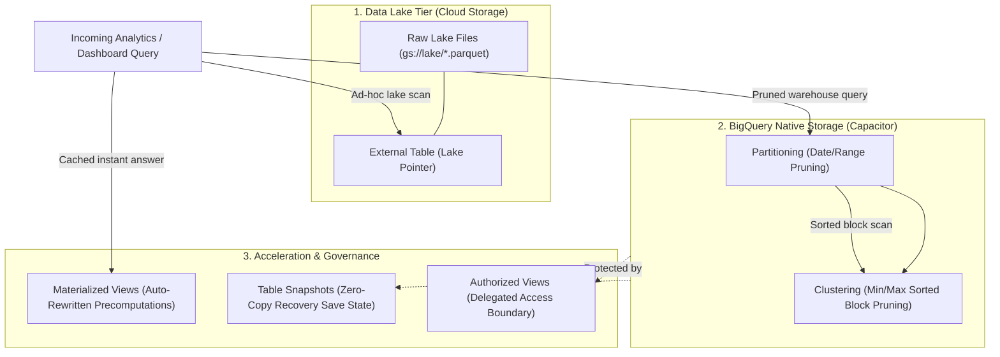

A data analyst opens the BigQuery console and runs a query that looks completely harmless:

```sql
SELECT user_id, order_total 
FROM `company_production.orders` 
WHERE order_date = '2026-09-18';
```

The goal is simple: retrieve yesterday's sales.

The query validator indicates **2.84 TiB to be scanned**.

At standard on-demand pricing ($6.25 per TiB), that single run costs roughly **$17.75**. Put that same query behind an executive dashboard that refreshes every ten minutes around the clock, and it runs 1,008 times in a week—racking up close to **$17,900 weekly** before anyone catches the invoice.

The SQL is not the problem. Storage layout is.

Because the table has no physical boundary for dates, BigQuery cannot jump directly to September 18. It must scan referenced columns across the entire multi-year dataset and apply the filter only after reading every byte. The query asks for one day, but the storage layout gives BigQuery no mechanism to isolate it.

This is why storage architecture comes first. Before wiring up Pub/Sub topics, deploying Dataflow streaming jobs, or scheduling Airflow DAGs, you have to understand the storage primitives that dictate your query speed, cloud bill, and security posture.

Rather than reading an abstract dictionary of features, let's walk through the evolution of a real production data platform—from a scrappy Day 1 startup dumping files into a bucket to an enterprise handling billions of events with strict compliance requirements.

---

## The Evolution of a GCP Data Pipeline

Here is how seven core storage primitives naturally enter your architecture as system requirements scale:

```
[Act 1: Day 1]    Raw transaction files land in GCS       ──▶ 1. External Tables (Lake Tier)
[Act 2: Day 30]   Queries become sluggish over network     ──▶ 2. Managed Tables (Native Columnar)
[Act 3: Day 90]   The $17,900 weekly bill shock           ──▶ 3. Partitioning (Drawer Pruning)
[Act 4: Scale]    High-cardinality customer lookups       ──▶ 4. Clustering (Sorted Block Pruning)
[Act 5: Reality]  Late-arriving sensor & mobile events    ──▶ 5. Time-Series Modeling (Event vs Ingestion)
[Act 6: Traffic]  1,000 executive dashboard refreshes/hr  ──▶ 6. Materialized Views (Smart Tuning Cache)
[Act 7: Incident] 2:00 AM rogue UPDATE corrupts rows      ──▶ 7. Time Travel & Table Snapshots
[Act 8: Security] Compliance audit & PII masking mandate  ──▶ 8. Authorized Views (Secure Boundary)
```

---

## Act 1 (Day 1): Landing Files in the Lake with External Tables

Your company launches its product. Every hour, microservices export order logs as Parquet and JSON files into a Google Cloud Storage (GCS) bucket:

`gs://production-lake-storage/raw_orders/year=2026/month=09/day=18/orders.parquet`

The data team needs immediate visibility. Building ingestion pipelines, schema registries, and scheduled loaders takes engineering days you don't have yet. 

You need to query these raw files immediately using standard SQL.

### The Mechanism: External Tables

You define an **External Table** in BigQuery pointing directly at the GCS URI:

```sql
CREATE EXTERNAL TABLE `company_lake.orders_external`
OPTIONS (
  format = 'PARQUET',
  uris = ['gs://production-lake-storage/raw_orders/*.parquet']
);
```

BigQuery stores **only the table schema definition and the GCS path**. Not a single byte of order data is copied or moved into BigQuery storage. When an analyst runs a query, BigQuery reads the raw files directly out of Cloud Storage over Google's internal network.

<div class="my-8 p-6 rounded-2xl border border-slate-200 dark:border-slate-800 bg-slate-50/60 dark:bg-slate-900/40 space-y-6">

  <div class="flex items-center justify-between border-b border-slate-200 dark:border-slate-800 pb-4">
    <div class="flex items-center gap-3">
      <div class="p-2 bg-amber-100 dark:bg-amber-900/50 rounded-xl">
        
      </div>
      <div>
        <h4 class="text-base font-bold text-slate-900 dark:text-slate-100 m-0">The Data Lake Tier: External Tables</h4>
        <p class="text-xs text-slate-500 dark:text-slate-400 m-0">Querying object storage in-place without loading data into the warehouse</p>
      </div>
    </div>
  </div>

  <div class="p-5 rounded-xl border-2 border-amber-500/40 bg-amber-50/40 dark:bg-amber-950/20 space-y-4">
    <div class="flex items-center justify-between">
      <div class="flex items-center gap-2.5">
        
        <span class="font-bold text-amber-900 dark:text-amber-200 text-sm">External Table Architecture</span>
      </div>
      <span class="text-xs px-2.5 py-1 rounded-full bg-amber-600 text-white font-semibold">Data Lives in GCS</span>
    </div>

    <div class="p-3.5 bg-white dark:bg-slate-900 rounded-lg border border-amber-200 dark:border-amber-900 space-y-2 text-xs">
      <div class="flex items-center gap-2 text-slate-700 dark:text-slate-300">
        <span class="px-2 py-0.5 rounded bg-slate-100 dark:bg-slate-800 font-mono font-bold text-amber-600">1</span>
        <span>Analyst queries table ➔ BigQuery fetches schema definition and URI pointer.</span>
      </div>
      <div class="flex items-center gap-2 text-slate-700 dark:text-slate-300">
        <span class="px-2 py-0.5 rounded bg-slate-100 dark:bg-slate-800 font-mono font-bold text-amber-600">2</span>
        <span>Compute slots read files over the network from <code>gs://production-lake-storage/...</code></span>
      </div>
      <div class="flex items-center gap-2 text-amber-600 dark:text-amber-400 font-semibold">
        <span class="px-2 py-0.5 rounded bg-amber-100 dark:bg-amber-950 font-mono font-bold">3</span>
        <span>Data is parsed on the fly ➔ <strong>Zero ingestion delay, but network-bound performance</strong></span>
      </div>
    </div>

    <ul class="text-xs text-slate-700 dark:text-slate-300 space-y-2 list-none p-0 m-0">
      <li class="flex items-start gap-2">
        <span class="text-amber-500 font-bold">✔</span>
        <span><strong>The Big Advantage:</strong> Instant access to lake files. No compute or storage spent loading records.</span>
      </li>
      <li class="flex items-start gap-2">
        <span class="text-red-500 font-bold">✘</span>
        <span><strong>The Trade-Off:</strong> No metadata caching, no clustering benefits, and variable network latency on every query.</span>
      </li>
    </ul>
  </div>

</div>

### The Analogy
*Reading a book through a museum display case using binoculars.* 

You can read the text without checking the book out or relocating it to your desk. But every time you want to review page 40, you have to peer through the glass again. It works for quick reference; it's painful for daily reading.

---

## Act 2 (Day 30): The Need for Speed with Native Managed Tables

Thirty days in, your query volume jumps from 10 queries a day to 2,000. Data analysts complain that dashboards take 15 seconds to load, and external queries over large directories of CSV and Parquet files are costing too much in query compute.

You need sub-second query performance and warehouse-grade optimizations.

### The Mechanism: Native Managed Tables

You load the data directly into BigQuery storage:

```sql
CREATE OR REPLACE TABLE `company_warehouse.orders_managed` AS
SELECT * FROM `company_lake.orders_external`;
```

When data enters a **Managed Table**, BigQuery takes ownership of the physical storage. It reorganizes rows into Google's proprietary columnar format (**Capacitor**), compresses the data aggressively, and computes column-level metadata.

<div class="my-8 p-6 rounded-2xl border border-slate-200 dark:border-slate-800 bg-slate-50/60 dark:bg-slate-900/40 space-y-6">

  <div class="flex items-center justify-between border-b border-slate-200 dark:border-slate-800 pb-4">
    <div class="flex items-center gap-3">
      <div class="p-2 bg-blue-100 dark:bg-blue-900/50 rounded-xl">
        
      </div>
      <div>
        <h4 class="text-base font-bold text-slate-900 dark:text-slate-100 m-0">The Warehouse Tier: Native Managed Tables</h4>
        <p class="text-xs text-slate-500 dark:text-slate-400 m-0">Colossus-backed columnar storage with automated metadata optimization</p>
      </div>
    </div>
  </div>

  <div class="p-5 rounded-xl border-2 border-blue-500/40 bg-blue-50/40 dark:bg-blue-950/20 space-y-4">
    <div class="flex items-center justify-between">
      <div class="flex items-center gap-2.5">
        
        <span class="font-bold text-blue-900 dark:text-blue-200 text-sm">Managed Table Architecture</span>
      </div>
      <span class="text-xs px-2.5 py-1 rounded-full bg-blue-600 text-white font-semibold">Data Lives Inside BigQuery</span>
    </div>

    <div class="p-3.5 bg-white dark:bg-slate-900 rounded-lg border border-blue-200 dark:border-blue-900 space-y-2 text-xs">
      <div class="flex items-center gap-2 text-slate-700 dark:text-slate-300">
        <span class="px-2 py-0.5 rounded bg-slate-100 dark:bg-slate-800 font-mono font-bold text-blue-600">1</span>
        <span>Analyst queries managed table ➔ BigQuery checks local NVMe metadata cache.</span>
      </div>
      <div class="flex items-center gap-2 text-slate-700 dark:text-slate-300">
        <span class="px-2 py-0.5 rounded bg-slate-100 dark:bg-slate-800 font-mono font-bold text-blue-600">2</span>
        <span>Columnar engine reads <strong>only the columns requested</strong> from disk.</span>
      </div>
      <div class="flex items-center gap-2 text-emerald-600 dark:text-emerald-400 font-semibold">
        <span class="px-2 py-0.5 rounded bg-emerald-100 dark:bg-emerald-950 font-mono font-bold">3</span>
        <span>Local high-throughput bus delivery ➔ <strong>⚡ Sub-second response time</strong></span>
      </div>
    </div>

    <ul class="text-xs text-slate-700 dark:text-slate-300 space-y-2 list-none p-0 m-0">
      <li class="flex items-start gap-2">
        <span class="text-blue-500 font-bold">✔</span>
        <span><strong>Columnar Pruning:</strong> If a table has 60 columns and your SQL asks for 3, BigQuery reads only 5% of the bytes on disk.</span>
      </li>
      <li class="flex items-start gap-2">
        <span class="text-blue-500 font-bold">✔</span>
        <span><strong>Warehouse Features:</strong> Enables table snapshots, time travel, row-level security, and clustering.</span>
      </li>
    </ul>
  </div>

</div>

### The Architecture Comparison: Where Does Data Live?

<div class="grid grid-cols-1 md:grid-cols-2 gap-4 my-6">

<div class="p-5 rounded-xl bg-blue-50/70 dark:bg-blue-950/30 border border-blue-200 dark:border-blue-900 space-y-2">
<span class="font-bold text-blue-700 dark:text-blue-300 text-sm">📦 Managed Table (Capacitor)</span>
<ul class="text-xs text-slate-700 dark:text-slate-300 space-y-1.5 list-disc list-inside m-0">
  <li><strong>Storage Cost:</strong> $0.020 / GB (active), drops to $0.010 / GB after 90 days unmodified.</li>
  <li><strong>Query Speed:</strong> Fast (optimized columnar layout, local metadata).</li>
  <li><strong>Maintenance:</strong> Fully managed background compression and defragmentation.</li>
</ul>
</div>

<div class="p-5 rounded-xl bg-amber-50/70 dark:bg-amber-950/30 border border-amber-200 dark:border-amber-900 space-y-2">
<span class="font-bold text-amber-700 dark:text-amber-300 text-sm">🔗 External Table (Cloud Storage)</span>
<ul class="text-xs text-slate-700 dark:text-slate-300 space-y-1.5 list-disc list-inside m-0">
  <li><strong>Storage Cost:</strong> Standard GCS pricing ($0.010 - $0.026 / GB depending on tier).</li>
  <li><strong>Query Speed:</strong> Slower (network overhead, parsing on the fly).</li>
  <li><strong>Maintenance:</strong> You manage file layout, compaction, and formats in the bucket.</li>
</ul>
</div>

</div>

---

## Act 3 (Day 90): The $17,900 Weekly Bill Shock & Partitioning

Three months in, business is booming. The managed `orders` table now holds three years of historical data totaling **2.84 TiB**.

Finance calls you into a meeting. The BigQuery invoice just surged by **$17,900 in a single week**.

What happened? A BI developer built an executive dashboard with 10 visual cards that refreshes every 10 minutes. Each card runs a query like this:

```sql
SELECT order_id, customer_id, order_total 
FROM `company_warehouse.orders` 
WHERE order_date = '2026-09-18';
```

Even though the analyst wrote `WHERE order_date = '2026-09-18'`, BigQuery has to scan **all 2.84 TiB** of those three columns across the entire 3-year history. Multiply 2.84 TiB by 1,008 executions a week, and you are scanning nearly **2.8 Petabytes** for simple daily reports.

### The Mechanism: Partitioning

You rebuild the table with a physical date partition:

```sql
CREATE OR REPLACE TABLE `company_warehouse.orders_partitioned`
PARTITION BY order_date
AS SELECT * FROM `company_warehouse.orders`;
```

Partitioning divides the table into distinct physical boundaries based on a date, timestamp, or integer range. 

When a query includes a filter on `order_date`, BigQuery reads **only the storage blocks belonging to that specific partition** and skips the rest. This is called **partition pruning**.

<div class="my-6 p-4 rounded-xl bg-slate-100 dark:bg-slate-800/60 border border-slate-200 dark:border-slate-700 space-y-3">
  <div class="font-bold text-slate-800 dark:text-slate-200 text-sm">📁 How Partition Pruning Slashes the Bill:</div>
  <div class="grid grid-cols-1 md:grid-cols-3 gap-3 text-xs">
    <div class="p-3 rounded-lg bg-red-100/60 dark:bg-red-950/40 border border-red-300 dark:border-red-900">
      <div class="font-bold text-red-700 dark:text-red-300">2026-09-16 (Skipped)</div>
      <p class="text-slate-600 dark:text-slate-400 m-0 mt-1">0 bytes read from disk</p>
    </div>
    <div class="p-3 rounded-lg bg-emerald-100 dark:bg-emerald-950/60 border-2 border-emerald-500">
      <div class="font-bold text-emerald-800 dark:text-emerald-300">2026-09-18 (Target Partition)</div>
      <p class="text-slate-700 dark:text-slate-300 m-0 mt-1"><strong>Reads only 2.8 GiB</strong> ($0.017)</p>
    </div>
    <div class="p-3 rounded-lg bg-red-100/60 dark:bg-red-950/40 border border-red-300 dark:border-red-900">
      <div class="font-bold text-red-700 dark:text-red-300">2026-09-20 (Skipped)</div>
      <p class="text-slate-600 dark:text-slate-400 m-0 mt-1">0 bytes read from disk</p>
    </div>
  </div>
</div>

### The Analogy
*A filing cabinet with one dedicated drawer per day.* 

Instead of opening the cabinet and flipping through every folder from 2023 to 2026, the clerk walks up, pulls only the drawer labeled **September 18, 2026**, and leaves the other 1,000 drawers shut.

### Hard Production Traps
- **The Missing Filter Trap:** A partitioned table does not automatically make careless queries cheap. If an analyst forgets the `WHERE order_date = ...` filter, BigQuery will still read all partitions. *(Production fix: set `require_partition_filter = true` in table options).*
- **The Partition Ceiling:** BigQuery enforces a hard limit of **10,000 partitions per table**. If you partition by hour, you will hit this limit in roughly 1.1 years. Reserve hourly partitioning for high-velocity tables with aggressive retention expiration policies.

---

## Act 4 (Scale): Finding the Needle in a Haystack with Clustering

Partitioning solved your daily scan problem. Your query now reads only **2.8 GiB** per execution instead of 2.84 TiB.

Then your Customer Success team connects an embedded portal. When enterprise client `CUST-402` opens their portal, it queries orders for their account over the past 30 days:

```sql
SELECT order_id, order_total, status 
FROM `company_warehouse.orders_partitioned` 
WHERE order_date BETWEEN '2026-08-20' AND '2026-09-18'
  AND customer_id = 'CUST-402';
```

Partitioning prunes the scan to 30 days of data (~84 GiB). But `CUST-402` accounts for only **50 rows out of 200 million rows** in that 30-day window.

You are reading 84 Gigabytes of data just to return 50 rows. 

Why can't BigQuery just look up `CUST-402` directly? Because within each daily drawer, the rows were written in random arrival order. BigQuery has to scan every block in those 30 drawers to make sure it didn't miss any rows for that customer.

### The Mechanism: Clustering

You rebuild the table with both **Partitioning** and **Clustering**:

```sql
CREATE OR REPLACE TABLE `company_warehouse.orders_clustered`
PARTITION BY order_date
CLUSTER BY customer_id, status
AS SELECT * FROM `company_warehouse.orders_partitioned`;
```

Clustering sorts the physical data blocks **inside each partition** based on the contents of the clustered columns. 

BigQuery maintains lightweight min/max metadata for each storage block (e.g., *Block 1 holds Customer IDs AAAA through BZZZ; Block 2 holds CAAA through DZZZ*). 

When your query filters for `customer_id = 'CUST-402'`, BigQuery checks the metadata, realizes Block 1 and Block 3 cannot possibly contain that customer, and **skips them entirely without reading them from disk**.

<div class="my-6 p-5 rounded-xl border border-slate-200 dark:border-slate-800 bg-slate-50/60 dark:bg-slate-900/40 space-y-4">
  <div class="font-bold text-slate-900 dark:text-slate-100 text-sm">
    🎯 The 2-Level Pruning Pipeline: How 2.84 TiB Becomes 42 MB
  </div>

  <div class="grid grid-cols-1 md:grid-cols-2 gap-4 text-xs">
    <div class="p-4 rounded-lg bg-blue-50/50 dark:bg-blue-950/30 border border-blue-200 dark:border-blue-900 space-y-1">
      <div class="font-bold text-blue-700 dark:text-blue-300">Level 1: Partition Pruning (Order Date)</div>
      <p class="text-slate-600 dark:text-slate-400 m-0">
        Prunes 99% of historical dates. Isolates the search to the requested 30-day drawers (shrinks 2.84 TiB down to 84 GiB).
      </p>
    </div>

    <div class="p-4 rounded-lg bg-emerald-50/50 dark:bg-emerald-950/30 border border-emerald-200 dark:border-emerald-900 space-y-1">
      <div class="font-bold text-emerald-700 dark:text-emerald-300">Level 2: Clustering Pruning (Customer ID)</div>
      <p class="text-slate-600 dark:text-slate-400 m-0">
        Inside those 30 drawers, reads only the blocks whose min/max range matches <code>CUST-402</code>. <strong>Shrinks scan from 84 GiB to ~42 MB.</strong>
      </p>
    </div>
  </div>
</div>

### The Analogy
*Alphabetized folders inside each filing cabinet drawer.*

The partition opens the September 18 drawer. Inside the drawer, invoices are sorted alphabetically by customer name. The clerk flips directly to the "C" tab, grabs the three invoices for `CUST-402`, and ignores every other folder in the drawer.

### Hard Production Traps
- **Column Order Matters:** If you cluster by `(customer_id, status)`, queries filtering on `customer_id` prune effectively. Queries filtering **only** on `status` without `customer_id` get significantly less pruning benefit because data is sorted hierarchically.
- **Literal Value Requirement:** Clustering pruning works when filters use constant literals (e.g., `WHERE customer_id = 'CUST-402'`). It does not prune effectively if the filter relies on a dynamic subquery evaluation.

---

## Act 5 (Reality): Real-World Time Dynamics & Late Arrivals

Your platform expands internationally. You ingest mobile app telemetry and IoT warehouse scanner data.

Suddenly, daily reconciliation reports don't balance. Financial totals for September 18 change on September 19, and change again on September 22.

Why? Devices in offline retail warehouses sync hours or days after transactions occur. An order swiped at 11:58 PM on September 18 in Tokyo arrives at your ingestion pipeline at 3:15 AM UTC on September 19.

If your pipeline blindly partitions by **ingestion time** (the time BigQuery received the packet), that transaction gets filed under September 19. Financial auditors calculating September 18 revenue get the wrong number.

### The Mechanism: Event Time vs. Ingestion Time

Time-series modeling in BigQuery is an architectural discipline, not a checkbox table setting. High-integrity pipelines decouple two concepts of time:

1. **Event Time (`event_timestamp`):** The exact moment the user pressed "Pay" on their mobile device or the sensor emitted a temperature tick.
2. **Ingestion Time (`ingested_at`):** The timestamp when BigQuery inserted the record into storage.

```sql
CREATE OR REPLACE TABLE `company_warehouse.sensor_events` (
  device_id STRING,
  event_timestamp TIMESTAMP,  -- When it happened in the real world
  ingested_at TIMESTAMP,      -- When BigQuery received it
  metric_value NUMERIC
)
PARTITION BY DATE(event_timestamp)
CLUSTER BY device_id;
```

<div class="my-6 p-5 rounded-xl border border-slate-200 dark:border-slate-800 bg-slate-50/60 dark:bg-slate-900/40 space-y-3">
  <div class="font-bold text-slate-900 dark:text-slate-100 text-sm">
    ⏱️ The Dual-Timestamp Rule for Idempotent Pipelines:
  </div>
  <ul class="text-xs text-slate-700 dark:text-slate-300 space-y-2 list-disc list-inside m-0">
    <li><strong>Business Analytics:</strong> Always filter and group by <code>event_timestamp</code> to maintain historical truth.</li>
    <li><strong>Pipeline Watermarking & Incremental ETL:</strong> Always pull deltas using <code>ingested_at > LAST_RUN_WATERMARK</code> so late-arriving events are never missed during scheduled runs.</li>
  </ul>
</div>

---

## Act 6 (Traffic): The Executive Dashboard Meltdown & Materialized Views

Your company prepares for an earnings announcement. 200 executives, regional directors, and finance managers open their Looker dashboards simultaneously. 

The dashboard runs this identical aggregation across all departments:

```sql
SELECT 
  region,
  DATE_TRUNC(order_date, MONTH) AS sales_month,
  SUM(order_total) AS total_revenue,
  COUNT(order_id) AS total_orders
FROM `company_warehouse.orders_clustered`
GROUP BY 1, 2;
```

Even though the base table is partitioned and clustered, this query aggregates **every single row across all regions and months**.

200 people refreshing this dashboard every 5 minutes causes severe compute congestion. Slot capacity exhausts, query queues back up, and queries that usually take 1 second start timing out after 60 seconds.

You could schedule an hourly batch job with Airflow or dbt to pre-aggregate the data into a reporting table. But then data is stale by up to an hour, and someone has to maintain the ETL pipeline and handle backfill logic.

### The Mechanism: Materialized Views with Smart Tuning

You create a **Materialized View**:

```sql
CREATE MATERIALIZED VIEW `company_warehouse.mv_monthly_regional_sales` AS
SELECT 
  region,
  DATE_TRUNC(order_date, MONTH) AS sales_month,
  SUM(order_total) AS total_revenue,
  COUNT(order_id) AS total_orders
FROM `company_warehouse.orders_clustered`
GROUP BY 1, 2;
```

A Materialized View precomputes and stores the query result. But unlike a standard static table, BigQuery does two magical things behind the scenes:

1. **Smart Tuning (Transparent Auto-Rewrite):** Analysts and dashboards do not need to know the view exists! When an executive queries the large raw table `orders_clustered`, BigQuery's optimizer intercepts the SQL, realizes the precomputed MV satisfies the request, and **transparently reroutes the execution to the tiny MV**.
2. **Freshness Guarantee with Delta Reader:** If new rows were loaded into the base table 5 seconds ago, BigQuery reads the pre-aggregated summary from the MV and combines it with **only the un-materialized delta rows** from the base table. You get sub-second cached speed with zero staleness.

<div class="my-8 p-6 rounded-2xl border border-slate-200 dark:border-slate-800 bg-slate-50/60 dark:bg-slate-900/40 space-y-6">

  <div class="flex items-center justify-between border-b border-slate-200 dark:border-slate-800 pb-4">
    <div class="flex items-center gap-3">
      <div class="p-2 bg-purple-100 dark:bg-purple-900/50 rounded-xl">
        
      </div>
      <div>
        <h4 class="text-base font-bold text-slate-900 dark:text-slate-100 m-0">Materialized Views: Transparent Smart Tuning</h4>
        <p class="text-xs text-slate-500 dark:text-slate-400 m-0">Accelerating repeated aggregations without changing user SQL queries</p>
      </div>
    </div>
  </div>

  <div class="grid grid-cols-1 lg:grid-cols-2 gap-6">

    <!-- Path 1: Accelerated with Materialized View -->
    <div class="rounded-xl border-2 border-emerald-500/40 bg-emerald-50/30 dark:bg-emerald-950/20 p-5 space-y-3">
      <div class="flex items-center justify-between">
        <span class="font-bold text-emerald-800 dark:text-emerald-200 text-sm">⚡ Accelerated Path (With Materialized View)</span>
        <span class="text-xs px-2.5 py-0.5 rounded-full bg-emerald-600 text-white font-semibold">Sub-Second</span>
      </div>

      <div class="p-3.5 bg-white dark:bg-slate-900 rounded-lg border border-emerald-200 dark:border-emerald-900 space-y-2 text-xs">
        <div class="flex items-center gap-2 text-slate-700 dark:text-slate-300">
          <span class="font-bold text-emerald-600">1.</span>
          <span>Dashboard queries raw table: <code>SELECT region, SUM(order_total)...</code></span>
        </div>
        <div class="flex items-center gap-2 text-slate-700 dark:text-slate-300">
          <span class="font-bold text-emerald-600">2.</span>
          <span>Optimizer intercepts query ➔ <strong>Transparently rewrites SQL</strong> to use MV.</span>
        </div>
        <div class="flex items-center gap-2 text-emerald-700 dark:text-emerald-300 font-semibold">
          <span class="font-bold">3.</span>
          <span>Reads precomputed summary + tiny delta ➔ <strong>0 bytes raw table scan</strong></span>
        </div>
      </div>

      <p class="text-xs text-slate-600 dark:text-slate-300 m-0 leading-relaxed">
        <strong>Cost & Capacity:</strong> Bypasses billions of base rows. 200 concurrent dashboards execute in milliseconds without consuming compute slots.
      </p>
    </div>

    <!-- Path 2: Fallback without Materialized View -->
    <div class="rounded-xl border-2 border-red-500/30 bg-red-50/30 dark:bg-red-950/20 p-5 space-y-3">
      <div class="flex items-center justify-between">
        <span class="font-bold text-red-800 dark:text-red-200 text-sm">⚠️ Uncached Path (Without Materialized View)</span>
        <span class="text-xs px-2.5 py-0.5 rounded-full bg-red-600 text-white font-semibold">High Scan</span>
      </div>

      <div class="p-3.5 bg-white dark:bg-slate-900 rounded-lg border border-red-200 dark:border-red-900 space-y-2 text-xs">
        <div class="flex items-center gap-2 text-slate-700 dark:text-slate-300">
          <span class="font-bold text-red-600">1.</span>
          <span>Dashboard queries raw table: <code>SELECT region, SUM(order_total)...</code></span>
        </div>
        <div class="flex items-center gap-2 text-slate-700 dark:text-slate-300">
          <span class="font-bold text-red-600">2.</span>
          <span>No precomputed summary available in optimizer.</span>
        </div>
        <div class="flex items-center gap-2 text-red-700 dark:text-red-300 font-semibold">
          <span class="font-bold">3.</span>
          <span>Scans full multi-year history ➔ <strong>Scans 2.84 TiB ($17.75 per run)</strong></span>
        </div>
      </div>

      <p class="text-xs text-slate-600 dark:text-slate-300 m-0 leading-relaxed">
        <strong>Cost & Capacity:</strong> Recalculates identical aggregations every 5 minutes from scratch, exhausting query slots and spiking weekly costs.
      </p>
    </div>

  </div>

</div>

---

## Act 7 (Incident): The 2:00 AM Production Disaster & Table Snapshots

It is 2:15 AM on a Sunday. A junior engineer runs a backfill script intended to flag unpaid accounts. 

A typo in the script turns:
`WHERE payment_status = 'OVERDUE'`
into:
`WHERE 1 = 1`

The script executes:
```sql
UPDATE `company_warehouse.orders_clustered` 
SET status = 'CANCELLED' 
WHERE 1 = 1;
```

Two years of production orders have just been marked as cancelled. Customer support phones light up. Production services are returning bad data.

### The Immediate Lifeline: Time Travel

BigQuery automatically records historical changes for all managed tables within a rolling window (default **7 days**). 

You don't need to restore a tape backup. You query the table as it existed 30 minutes ago before the rogue script ran:

```sql
-- Query the exact state of the table 30 minutes in the past
CREATE OR REPLACE TABLE `company_warehouse.orders_restored` AS
SELECT * 
FROM `company_warehouse.orders_clustered`
FOR SYSTEM_TIME AS OF TIMESTAMP_SUB(CURRENT_TIMESTAMP(), INTERVAL 30 MINUTE);
```

Within 90 seconds, the table is restored to its exact pre-incident state.

### The Long-Term Safety Net: Table Snapshots

Time travel saved you, but its protection expires after **7 days**. What if your team is about to execute a major 48-hour database migration, schema refactor, or complex ETL pipeline where errors might take two weeks to surface?

You create a **Table Snapshot**:

```sql
CREATE SNAPSHOT TABLE `company_warehouse.orders_snapshot_pre_migration`
CLONE `company_warehouse.orders_clustered`;
```

A Table Snapshot is an immutable, read-only capture of a table at a specific point in time.

<div class="my-6 p-5 rounded-xl border border-slate-200 dark:border-slate-800 bg-slate-50/60 dark:bg-slate-900/40 space-y-4">
  <div class="font-bold text-slate-900 dark:text-slate-100 text-sm">
    📸 The Zero-Copy Storage Magic of Snapshots:
  </div>

  <div class="grid grid-cols-1 md:grid-cols-2 gap-4 text-xs">
    <div class="p-4 rounded-lg bg-emerald-50/50 dark:bg-emerald-950/30 border border-emerald-200 dark:border-emerald-900 space-y-2">
      <div class="font-bold text-emerald-700 dark:text-emerald-300">Day 1: Snapshot Created ($0 Extra Storage)</div>
      <p class="text-slate-600 dark:text-slate-400 m-0">
        BigQuery freezes metadata pointers to existing Capacitor storage blocks. <strong>Zero duplicate bytes are written. You pay $0 in extra storage fees.</strong>
      </p>
    </div>

    <div class="p-4 rounded-lg bg-blue-50/50 dark:bg-blue-950/30 border border-blue-200 dark:border-blue-900 space-y-2">
      <div class="font-bold text-blue-700 dark:text-blue-300">Day 14: Base Table Modifies Rows (Delta Billed)</div>
      <p class="text-slate-600 dark:text-slate-400 m-0">
        When the base table updates or deletes rows, BigQuery writes new blocks for the base table while retaining the original blocks for the snapshot. You are billed <strong>only for the diverging delta blocks</strong>.
      </p>
    </div>
  </div>
</div>

### The Analogy
*A video game save point.* 

Time travel is rewinding the gameplay 10 seconds to avoid falling off a cliff. A table snapshot is creating a dedicated named save slot before entering the boss room.

---

## Act 8 (Security): The Compliance Audit & Authorized Views

Your company enters talks to acquire another business. An external accounting firm needs to audit your monthly revenue metrics by product category and region for the past 36 months.

You cannot hand them direct access to `company_warehouse.orders_clustered`. That table contains:
- Plaintext customer credit card last-4 digits
- Customer billing addresses and tax IDs
- Internal profit margin ratios and supplier costs

In a standard database, if you create a view with `SELECT region, SUM(order_total)...` and grant the auditors read access to the view, **the query will fail with `403 Access Denied`** unless you also give the auditors read permissions on the underlying raw orders table.

If you give them read permissions on the raw table, they can bypass the view and read every customer's PII.

### The Mechanism: Authorized Views

BigQuery solves this privilege-escalation problem cleanly with **Authorized Views**:

1. You create a view inside a separate, public or partner-facing reporting dataset (`partner_reporting`):

```sql
CREATE VIEW `partner_reporting.monthly_revenue_audit` AS
SELECT 
  region,
  order_date,
  SUM(order_total) AS total_revenue
FROM `finance_restricted.orders_raw`
GROUP BY 1, 2;
```

2. You **authorize the view** inside the restricted source dataset (`finance_restricted`). This tells BigQuery: *"When this specific view runs, allow it to query tables inside `finance_restricted` using the view's authorized credentials."*
3. You grant the auditors `bigquery.dataViewer` **only on the `partner_reporting` dataset**.

The auditors have **zero permissions** on the sensitive raw dataset. If they attempt to run `SELECT * FROM finance_restricted.orders_raw`, BigQuery immediately blocks them. But when they query the Authorized View, BigQuery executes with delegated authority and hands them back only the scrubbed, aggregated revenue metrics.

<div class="my-8 p-6 rounded-2xl border border-slate-200 dark:border-slate-800 bg-slate-50/60 dark:bg-slate-900/40 space-y-6">

  <div class="flex items-center justify-between border-b border-slate-200 dark:border-slate-800 pb-4">
    <div class="flex items-center gap-3">
      <div class="p-2 bg-indigo-100 dark:bg-indigo-900/50 rounded-xl">
        
      </div>
      <div>
        <h4 class="text-base font-bold text-slate-900 dark:text-slate-100 m-0">Authorized Views: The Secure Data Sharing Pipeline</h4>
        <p class="text-xs text-slate-500 dark:text-slate-400 m-0">How third parties query metrics without having read access to underlying PII tables</p>
      </div>
    </div>
  </div>

  <div class="grid grid-cols-1 lg:grid-cols-3 gap-5 items-stretch">

    <!-- Column 1: The End User -->
    <div class="rounded-xl border border-slate-200 dark:border-slate-800 bg-white dark:bg-slate-900 p-5 flex flex-col justify-between space-y-4">
      <div>
        <div class="flex items-center justify-between mb-3">
          <span class="text-xs font-bold uppercase tracking-wider text-slate-500 dark:text-slate-400">Step 1: The Consumer</span>
          <span class="px-2 py-0.5 text-xs font-semibold rounded bg-slate-100 dark:bg-slate-800 text-slate-700 dark:text-slate-300">Auditor / Analyst</span>
        </div>
        <div class="font-bold text-slate-900 dark:text-slate-100 text-sm mb-1">External Auditor Account</div>
        <p class="text-xs text-slate-500 dark:text-slate-400 m-0 leading-relaxed">Needs 36-month aggregated sales metrics for compliance verification.</p>
      </div>

      <div class="p-3 rounded-lg bg-red-50 dark:bg-red-950/40 border border-red-200 dark:border-red-900 text-xs space-y-1">
        <div class="font-bold text-red-700 dark:text-red-300 flex items-center gap-1.5">
          <span>🚫</span> Access Denied on Raw Tables
        </div>
        <p class="text-red-600/90 dark:text-red-400 text-xs m-0 leading-relaxed">
          Zero permissions on <code>finance_restricted</code> dataset. Direct table access returns <strong>403 Forbidden</strong>.
        </p>
      </div>

      <div class="pt-2 border-t border-slate-100 dark:border-slate-800 text-xs text-blue-600 dark:text-blue-400 font-semibold flex items-center justify-between">
        <span>Queries View Directly</span>
        <span>➔</span>
      </div>
    </div>

    <!-- Column 2: The Authorized View -->
    <div class="rounded-xl border-2 border-indigo-500/50 bg-indigo-50/40 dark:bg-indigo-950/30 p-5 flex flex-col justify-between space-y-4 shadow-sm">
      <div>
        <div class="flex items-center justify-between mb-3">
          <span class="text-xs font-bold uppercase tracking-wider text-indigo-600 dark:text-indigo-400">Step 2: The Security Window</span>
          <span class="px-2 py-0.5 text-xs font-semibold rounded bg-indigo-600 text-white">Authorized View</span>
        </div>
        <div class="flex items-center gap-2 font-bold text-slate-900 dark:text-slate-100 text-sm mb-1">
          
          <span>partner_reporting.revenue_audit</span>
        </div>
        <p class="text-xs text-slate-600 dark:text-slate-300 m-0 leading-relaxed">
          Auditor is granted <code>bigquery.dataViewer</code> <strong>only</strong> on this view's public reporting dataset.
        </p>
      </div>

      <div class="p-3 rounded-lg bg-white dark:bg-slate-900 border border-indigo-200 dark:border-indigo-900 text-xs space-y-1 font-mono text-slate-700 dark:text-slate-300 leading-tight">
        <div class="text-[11px] text-slate-400">-- Masked Aggregation</div>
        <div>SELECT region,</div>
        <div>&nbsp;&nbsp;SUM(order_total) AS rev</div>
        <div>FROM finance_restricted.orders</div>
        <div>GROUP BY region;</div>
      </div>

      <div class="pt-2 border-t border-indigo-200 dark:border-indigo-900 text-xs text-indigo-700 dark:text-indigo-300 font-semibold flex items-center justify-between">
        <span>Authorized in Source ACL</span>
        <span>➔</span>
      </div>
    </div>

    <!-- Column 3: The Restricted Vault -->
    <div class="rounded-xl border border-slate-200 dark:border-slate-800 bg-white dark:bg-slate-900 p-5 flex flex-col justify-between space-y-4">
      <div>
        <div class="flex items-center justify-between mb-3">
          <span class="text-xs font-bold uppercase tracking-wider text-slate-500 dark:text-slate-400">Step 3: The Vault</span>
          <span class="px-2 py-0.5 text-xs font-semibold rounded bg-amber-100 dark:bg-amber-900 text-amber-800 dark:text-amber-200">Restricted Dataset</span>
        </div>
        <div class="flex items-center gap-2 font-bold text-slate-900 dark:text-slate-100 text-sm mb-1">
          
          <span>finance_restricted.orders_raw</span>
        </div>
        <p class="text-xs text-slate-500 dark:text-slate-400 m-0 leading-relaxed">Contains customer credit cards, tax IDs, and confidential margin data.</p>
      </div>

      <div class="p-3 rounded-lg bg-emerald-50 dark:bg-emerald-950/40 border border-emerald-200 dark:border-emerald-900 text-xs space-y-1">
        <div class="font-bold text-emerald-700 dark:text-emerald-300 flex items-center gap-1.5">
          <span>🔒</span> Delegated Query Execution
        </div>
        <p class="text-emerald-700/90 dark:text-emerald-400 text-xs m-0 leading-relaxed">
          BigQuery checks dataset ACL: The <strong>View itself</strong> is authorized. BigQuery runs SQL and hands back only safe metrics.
        </p>
      </div>

      <div class="pt-2 border-t border-slate-100 dark:border-slate-800 text-xs text-emerald-600 dark:text-emerald-400 font-semibold">
        ✔ Zero Sensitive PII Exposure
      </div>
    </div>

  </div>

</div>

### The Analogy
*The bank teller window.*

You are not permitted to walk into the bank vault to count money. You walk up to the teller window. The teller (the Authorized View) reaches into the locked vault, counts out the exact funds you requested, and hands it through the glass. The vault remains locked, and you never touch other customers' deposit boxes.

---

## The Complete Architecture Blueprint: How It All Interlocks

Now that you've seen each building block emerge from an operational necessity, step back and look at how they fit together in an enterprise lakehouse:



---

## Architectural Decision Matrix: What to Use When

When designing your next table or data model, use this decision framework:

| Scenario / Requirement | Recommended Building Block | Why It Is The Right Tool |
| :--- | :--- | :--- |
| Exploring raw files in GCS before loading | **External Table** | Zero ingestion compute; queries files in-place without moving bytes. |
| Production analytical tables queried repeatedly | **Native Managed Table** | Sub-second Capacitor columnar layout, compression, and slot efficiency. |
| Queries consistently filter on dates or timestamps | **Partitioned Table** | Prunes 99% of bytes by opening only the relevant date drawer. |
| High-cardinality filters (`customer_id`, `status`) | **Clustered Table** | Skips blocks inside partitions using sorted min/max metadata. |
| Out-of-order records, late syncs, sensor ticks | **Dual-Timestamp Modeling** | Preserves business event time while using ingestion watermarks. |
| 100s of dashboards repeating identical `GROUP BY` | **Materialized View** | Transparent auto-rewrite with fresh delta readers; saves thousands in slot burn. |
| Major database schema refactor or migration | **Table Snapshot** | Zero-copy immutable recovery point that costs $0 extra on Day 1. |
| Third-party access without exposing raw PII | **Authorized View** | Grants access to aggregated queries without granting access to raw source datasets. |

---

## What's Next in the Series?

In this first part, we established the foundational mental models, trade-offs, and physical architectures of BigQuery storage.

In **Part 1.1 (Hands-On Implementation Lab)**, we will get our hands dirty in the terminal. We will take this exact e-commerce scenario and build it from scratch using:
- Google Cloud CLI (`bq` commands)
- Real SQL scripts implementing partitioned and clustered tables
- Live Materialized Views with query execution plan analysis
- Step-by-step Authorized View configuration across multi-project datasets

Stay tuned, and build with physical storage boundaries in mind!
