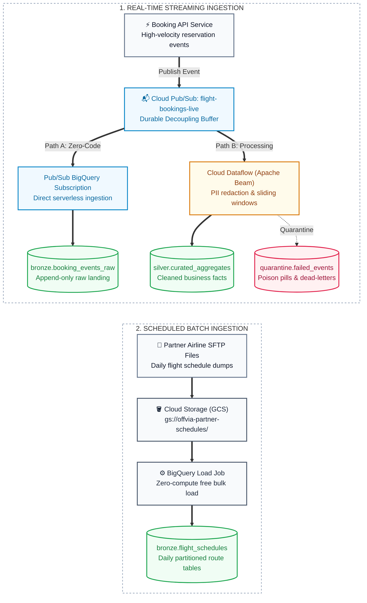

In [Part 1](/blog/gcp-data-engineering-storage-building-blocks/), we designed Offvia’s analytical storage foundation. In [Part 2](/blog/gcp-data-engineering-hands-on-storage-pipeline-lab/), we built it with Cloud Storage, BigLake, and BigQuery.

Now we arrive at the chapter that dictates whether your platform stays calm during a massive traffic spike, or generates a Sev-1 incident report: **how exactly should data get into BigQuery?**

Picture this: It’s 2:15 AM during Offvia’s Summer Flash Sale. The booking service is handling a massive burst of searches, reservations, and payments. The core checkout path is scaling fine. But suddenly, the application threads start locking up, and transactions fail. 

Why? Because someone wired the checkout service to synchronously call BigQuery’s legacy streaming endpoint for analytics. BigQuery was experiencing a minor hiccup, retries piled up, and suddenly, an analytical dependency was blocking the customer payment path.

The problem wasn't that BigQuery is slow. The problem was that we violated a core engineering principle:

> **A producer’s only job is to publish an event fast.** A separate, decoupled ingestion path should absorb, validate, transform, and persist that event at its own pace.

For Offvia, that means choosing deliberately among four tools: Pub/Sub, Pub/Sub BigQuery subscriptions, Dataflow, and the BigQuery Storage Write API. They overlap, but they are not interchangeable. 

## The Mental Model

Think of an airport baggage system:

- **Pub/Sub is the conveyor belt.** The check-in desk drops a bag on it and immediately turns to the next passenger. The belt provides a highly durable buffer between producers and consumers.
- **Dataflow is the sorting facility.** It validates the bag, assigns it to a flight, isolates the ones with missing tags, and groups them up. This is where your complex, event-time logic belongs.
- **The Storage Write API is the cargo-door interface.** It’s the highly efficient protocol used to physically load bags onto the plane (BigQuery). It is not a general stream-processing engine.
- **BigQuery is the destination warehouse.** It is where raw events, curated facts, and aggregates actually become useful for reporting.

**The takeaway:** A Pub/Sub BigQuery subscription already uses the Storage Write API under the hood. You don't need to build a custom microservice for it. Likewise, a Dataflow pipeline can write directly to BigQuery using a native sink. 

## Pick the Smallest Correct Path

Start with the business requirement, not the shiny GCP product name. Stop over-engineering.

| The Business Need | Best Starting Point | Why It Works |
|---|---|---|
| Land validated raw events with zero ops | **Pub/Sub BigQuery subscription** | Serverless export straight from a topic to a BQ table. Perfect for your bronze/raw layer. |
| Enrich data, redact PII, windowing, or complex routing | **Dataflow / Apache Beam** | Provides state, timers, event-time windows, and scales effortlessly. |
| Custom app writing direct to BigQuery at low latency | **BigQuery Storage Write API** | Persistent gRPC writes, efficient batching, and exactly-once semantic choices. |
| Bulk file loads, backfills, or historical data | **Cloud Storage + BigQuery Load Jobs** | Cheap, simple, and virtually impossible to break when batch latency is acceptable. |

For Offvia, a realistic, battle-tested architecture looks like this:



Use the BigQuery subscription branch to safely land the original raw event. Use the Dataflow branch *only* when there is actual processing to do: masking credit card fields, windowing aggregates, or enriching payloads. **Do not spin up Dataflow merely because the data is streaming.**

## Delivery is Not Deduplication

This distinction ruins more reporting dashboards than anything else.

Pub/Sub is at-least-once delivery by default. That means **you will get duplicates**. Every production event must carry a stable business identifier (e.g., `event_id`), alongside domain identifiers like `booking_id`, `event_type`, and `event_timestamp`.

Because a Pub/Sub BigQuery subscription is also at-least-once, your destination table must tolerate duplicates. The standard pattern? Land everything in a raw bronze table, then build a silver view/table that deduplicates using `ROW_NUMBER() OVER (PARTITION BY event_id ORDER BY event_timestamp DESC)`.

If you write custom code using the BigQuery Storage Write API, you get more choices:
- **Default Stream:** Immediately queryable, at-least-once. Great if downstream SQL handles the deduplication.
- **Committed Stream:** Exactly-once writes, provided your client perfectly manages and persists the offsets. 

Just remember: **No infrastructure transport guarantee will save you from a lack of business idempotency.** If a payment gateway times out and your app generates a brand-new event with a new ID, the infrastructure sees two valid events. 

### A Practical Raw-Event Contract

```json
{
  "event_id": "01J9...",
  "event_type": "booking.reserved",
  "event_version": 1,
  "booking_id": "BK-9042",
  "passenger_id": "PAX-88219",
  "carrier_code": "BA",
  "fare_amount_cents": 64500,
  "event_timestamp": "2026-10-04T14:02:15Z",
  "published_at": "2026-10-04T14:02:16Z"
}
```

*Architectural tip:* Keep money as integer minor units (cents), never floating-point. Keep `event_timestamp` (when it happened) and `published_at` (when it hit the pipe) separate. This is how you debug network lag versus business logic.

## Ordering: Use It Only When Necessary

Pub/Sub does not provide global FIFO ordering. Even with ordering enabled, it only preserves order for messages sharing an ordering key, within a specific region. It comes at a cost: one bad message can choke the pipeline for that entire key.

For our booking example, `booking_id` is a solid ordering key. But don't rely on Pub/Sub ordering as your *only* defense. Persist a version number in the payload and reject stale state transitions downstream. 

Also, avoid relying on Pub/Sub ordering inside a Dataflow pipeline. Beam doesn't guarantee that transforms preserve input order. Model your state explicitly instead.

## Event Time is a Data Contract

A booking created at 14:02 might arrive at 14:18 because a mobile client lost signal, or a pod restarted. If your hourly revenue dashboard groups by *server arrival time* (`published_at`), you are measuring network behavior, not actual sales. 

Dataflow forces you to care about the difference:
- **Event time:** When the customer actually clicked "Book".
- **Processing time:** When your worker CPU finally chewed on the payload.
- **Watermark:** The pipeline’s best guess at how "complete" a time window is.
- **Allowed lateness:** How long you keep the window open for late-arriving data.

Crucially, just having `event_timestamp` in your JSON isn't enough. You have to tell Beam to use it. 

```python
import json
import apache_beam as beam
from apache_beam.transforms.window import SlidingWindows
from apache_beam.transforms.trigger import AfterWatermark, AccumulationMode
from apache_beam.utils.timestamp import Timestamp

def to_timestamped_booking(payload: bytes):
    event = json.loads(payload)
    event_time = Timestamp.from_rfc3339(event["event_timestamp"])
    # Tell Beam this is the official time the event occurred
    return beam.window.TimestampedValue(event, event_time)

windowed = (
    events
    | "AssignEventTime" >> beam.Map(to_timestamped_booking)
    | "FiveMinuteWindows" >> beam.WindowInto(
        SlidingWindows(size=5 * 60, period=60),
        # Emit when we think we have all the data
        trigger=AfterWatermark(),
        # But wait 15 minutes for mobile users driving through tunnels
        allowed_lateness=15 * 60,
        # Update the existing totals, don't throw them away
        accumulation_mode=AccumulationMode.ACCUMULATING,
    )
)
```

## Failure Paths (Because Things Will Break)

A Dead-Letter Queue (DLQ) is great, but it is not a trash can for bad application code. 

**For a BigQuery subscription:** Give the Pub/Sub service account the correct IAM permissions and monitor the DLQ topic. Schema-compatibility failures will land here.

**For Dataflow:** Do not attach a generic Pub/Sub DLQ and assume it will magically catch your Python exceptions. Instead, write an explicit quarantine path in your pipeline code. Catch parsing errors, wrap the raw payload alongside the error message, pipeline version, and timestamp, and write it to a partitioned `quarantine` BigQuery table. 

Fix the parser, then replay the bounded set of quarantined rows.

## BigQuery Writes Without the Retry Storm

If you are using the BigQuery Storage Write API directly from a custom service, follow these rules:

1. **Reuse connections:** Reuse your `BigQueryWriteClient` for the life of the worker. Do not spin up a gRPC client per HTTP request.
2. **Backpressure:** Batch modestly and apply bounded in-flight requests. 
3. **Smart Retries:** Retry transient network failures with exponential backoff and jitter. Do *not* retry schema failures—route them to quarantine instantly.
4. **Outbox Pattern:** Never put a direct BigQuery write in the critical path of a user request. Publish transactionally to your local database/message queue first.

## The Pre-Flight Checklist

Before you call an ingestion pipeline "production-ready," answer these:

1. What is the canonical event ID, and how exactly are duplicates neutralized?
2. Which timestamp represents reality, and which represents the network?
3. What happens to malformed JSON? Who owns the replay runbook?
4. Are you trying to do raw archival, transformations, and serving all in one single pipeline? (Hint: don't).

## What We're Building Next

For the hands-on lab in **Part 4**, we will build a bulletproof slice of this architecture:

1. Publish versioned booking events with stable IDs.
2. Create a raw Pub/Sub BigQuery subscription for the bronze layer.
3. Run a Dataflow pipeline that handles event-time watermarking, quarantines bad records, and writes to silver.
4. Inject duplicate and delayed events to watch the deduplication and late-triggering in action.

The goal isn't to build the most complicated pipeline possible. The goal is to build a system that lets you sleep through the next Flash Sale.

***

**References:**
- [Pub/Sub BigQuery subscriptions](https://cloud.google.com/pubsub/docs/bigquery)
- [Pub/Sub ordering](https://cloud.google.com/pubsub/docs/ordering)
- [Dataflow: read from Pub/Sub](https://cloud.google.com/dataflow/docs/concepts/streaming-with-cloud-pubsub)
- [BigQuery Storage Write API streaming](https://cloud.google.com/bigquery/docs/write-api-streaming)
- [Apache Beam programming guide](https://beam.apache.org/documentation/programming-guide/)