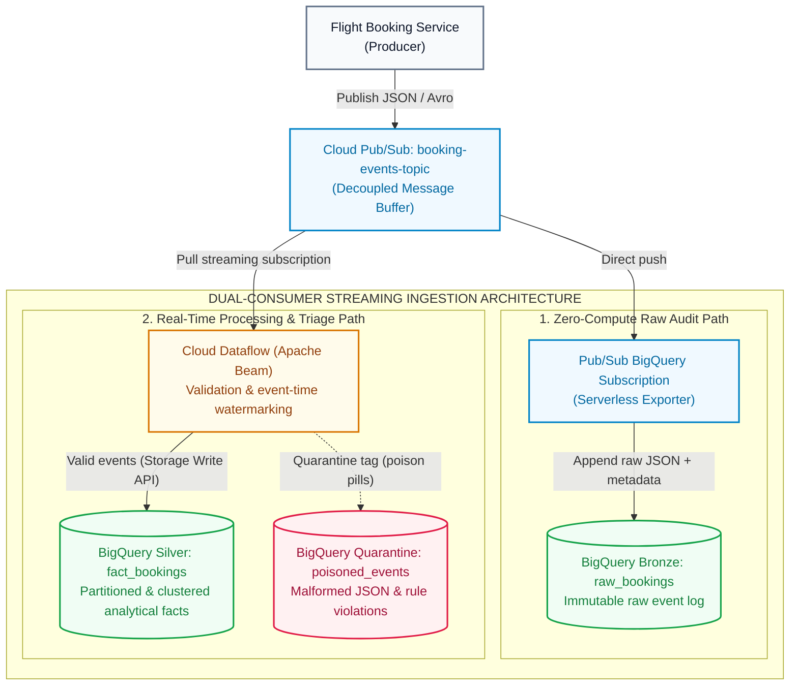

# Data Engineering on GCP (Part 4): Building a Production-Ready Real-Time Streaming Pipeline

In [Part 3 of this series](/blog/gcp-data-engineering-streaming-batch-ingestion-pubsub-dataflow/), we compared the main approaches to real-time ingestion. This lab turns that architecture into a working pipeline for **Offvia**, a regional airline-booking platform.

The goal is practical: keep checkout independent from analytics, retain an immutable raw copy of every event, validate records safely, quarantine bad payloads, and stream clean data into BigQuery.

## What We Are Building



This is a **dual-consumer** design.

The bronze subscription gives operations and data teams an independent raw record of every published event. Dataflow is responsible for business validation, event-time handling, and writing the cleaned analytical representation.

## Why the Separation Matters

A booking request should finish after its operational transaction and event publication succeed. It should not wait for an analytical warehouse write.

Pub/Sub absorbs traffic bursts and lets each downstream consumer scale independently. This design prevents three common incidents:

- **Operational database contention:** reporting workloads do not share the booking database connection pool.
- **Synchronous analytics dependencies:** temporary BigQuery latency does not block customer checkout threads.
- **Poison-pill restart loops:** malformed records go to quarantine instead of repeatedly crashing workers.

## Before You Start

Set the target project and region. Keep BigQuery datasets, Dataflow, and Cloud Storage staging resources in compatible locations.

```bash
gcloud auth login
gcloud auth application-default login

export PROJECT_ID="YOUR_PROJECT_ID"
export REGION="us-central1"

gcloud config set project "${PROJECT_ID}"

gcloud services enable \
  pubsub.googleapis.com \
  dataflow.googleapis.com \
  bigquery.googleapis.com \
  bigquerystorage.googleapis.com \
  storage.googleapis.com
```

Install Apache Beam with its Google Cloud dependencies:

```bash
python3 -m pip install --upgrade "apache-beam[gcp]"
```

## Create Datasets and Tables

Separate bronze, silver, and quarantine datasets make retention, ownership, and access policies easier to manage.

```bash
bq --location="${REGION}" mk --dataset "${PROJECT_ID}:offvia_bronze"
bq --location="${REGION}" mk --dataset "${PROJECT_ID}:offvia_silver"
bq --location="${REGION}" mk --dataset "${PROJECT_ID}:offvia_quarantine"
```

Create the destination tables. The silver table is partitioned by business event date and clustered by the fields most commonly used in route-based filters.

```sql
CREATE TABLE IF NOT EXISTS `YOUR_PROJECT_ID.offvia_silver.fact_bookings` (
  booking_id STRING NOT NULL,
  passenger_id STRING NOT NULL,
  flight_number STRING NOT NULL,
  origin_airport STRING NOT NULL,
  destination_airport STRING NOT NULL,
  fare_amount NUMERIC NOT NULL,
  currency STRING NOT NULL,
  booking_status STRING NOT NULL,
  event_timestamp TIMESTAMP NOT NULL,
  ingestion_timestamp TIMESTAMP NOT NULL,
  source_message_id STRING NOT NULL
)
PARTITION BY DATE(event_timestamp)
CLUSTER BY origin_airport, destination_airport
OPTIONS (
  description = "Validated real-time booking events"
);

CREATE TABLE IF NOT EXISTS `YOUR_PROJECT_ID.offvia_quarantine.poisoned_events` (
  raw_payload STRING NOT NULL,
  error_reason STRING NOT NULL,
  error_stage STRING NOT NULL,
  received_timestamp TIMESTAMP NOT NULL,
  source_message_id STRING
)
PARTITION BY DATE(received_timestamp)
OPTIONS (
  description = "Events rejected by parsing or validation"
);

CREATE TABLE IF NOT EXISTS `YOUR_PROJECT_ID.offvia_bronze.raw_bookings` (
  subscription_name STRING,
  message_id STRING,
  publish_time TIMESTAMP,
  data STRING,
  attributes JSON
)
OPTIONS (
  description = "Immutable raw Pub/Sub event landing table"
);
```

Replace `YOUR_PROJECT_ID` before executing the SQL.

## Create Pub/Sub Routes

Create one topic and two subscriptions. Each subscription has its own delivery cursor, so the bronze and Dataflow consumers do not compete for messages.

```bash
gcloud pubsub topics create booking-events-topic

gcloud pubsub subscriptions create booking-events-dataflow-sub \
  --topic=booking-events-topic \
  --ack-deadline=60
```

For the bronze sink, grant the Pub/Sub service agent write access to the bronze dataset.

```bash
export PROJECT_NUMBER="$(gcloud projects describe "${PROJECT_ID}" --format='value(projectNumber)')"
export PUBSUB_SERVICE_AGENT="service-${PROJECT_NUMBER}@gcp-sa-pubsub.iam.gserviceaccount.com"

bq add-iam-policy-binding \
  --member="serviceAccount:${PUBSUB_SERVICE_AGENT}" \
  --role="roles/bigquery.dataEditor" \
  "${PROJECT_ID}:offvia_bronze"
```

Now create the direct BigQuery subscription:

```bash
gcloud pubsub subscriptions create booking-events-bronze-sub \
  --topic=booking-events-topic \
  --bigquery-table="${PROJECT_ID}.offvia_bronze.raw_bookings" \
  --write-metadata
```

`--write-metadata` preserves the subscription name, message ID, publish time, and attributes alongside the original payload. This makes reconciliation and incident investigation much easier.

## The Beam Pipeline

Save the following file as `stream_bookings_pipeline.py`.

The pipeline treats expected invalid input as data rather than as an unhandled exception. It also stores the Pub/Sub message ID in silver and quarantine records, which makes debugging and replay safer.

```python
import argparse
import json
import logging
from datetime import datetime, timezone
from decimal import Decimal, InvalidOperation

import apache_beam as beam
from apache_beam import pvalue
from apache_beam.options.pipeline_options import PipelineOptions, StandardOptions
from apache_beam.transforms.window import FixedWindows


class ValidateAndEnrichBookingFn(beam.DoFn):
    QUARANTINE = "quarantine"

    def process(self, message):
        raw_payload = message.data.decode("utf-8", errors="replace")
        received_at = datetime.now(timezone.utc).isoformat()
        message_id = message.message_id

        def reject(stage, reason):
            return pvalue.TaggedOutput(
                self.QUARANTINE,
                {
                    "raw_payload": raw_payload,
                    "error_reason": reason,
                    "error_stage": stage,
                    "received_timestamp": received_at,
                    "source_message_id": message_id,
                },
            )

        try:
            payload = json.loads(raw_payload)
        except json.JSONDecodeError as exc:
            yield reject("PARSE_JSON", str(exc))
            return

        required = {
            "booking_id",
            "passenger_id",
            "flight_number",
            "origin",
            "destination",
            "fare",
            "event_time",
        }

        missing = sorted(required - payload.keys())

        if missing:
            yield reject(
                "SCHEMA_VALIDATION",
                f"Missing required fields: {', '.join(missing)}",
            )
            return

        try:
            fare = Decimal(str(payload["fare"]))

            if fare <= Decimal("0"):
                raise ValueError("fare must be greater than zero")

        except (InvalidOperation, ValueError, TypeError) as exc:
            yield reject(
                "BUSINESS_RULE_VALIDATION",
                f"Invalid fare: {exc}",
            )
            return

        try:
            event_time = datetime.fromisoformat(
                str(payload["event_time"]).replace("Z", "+00:00")
            )

            if event_time.tzinfo is None:
                raise ValueError("event_time must include an offset or Z")

        except (ValueError, TypeError) as exc:
            yield reject(
                "EVENT_TIME_VALIDATION",
                f"Invalid event_time: {exc}",
            )
            return

        record = {
            "booking_id": str(payload["booking_id"]),
            "passenger_id": str(payload["passenger_id"]),
            "flight_number": str(payload["flight_number"]),
            "origin_airport": str(payload["origin"]),
            "destination_airport": str(payload["destination"]),
            "fare_amount": str(fare),
            "currency": str(payload.get("currency", "USD")),
            "booking_status": str(payload.get("status", "CONFIRMED")),
            "event_timestamp": event_time.isoformat(),
            "ingestion_timestamp": received_at,
            "source_message_id": message_id,
        }

        yield beam.window.TimestampedValue(
            record,
            event_time.timestamp(),
        )


def run():
    parser = argparse.ArgumentParser()

    parser.add_argument("--subscription", required=True)
    parser.add_argument("--silver_table", required=True)
    parser.add_argument("--quarantine_table", required=True)

    known_args, pipeline_args = parser.parse_known_args()

    options = PipelineOptions(pipeline_args)
    options.view_as(StandardOptions).streaming = True

    with beam.Pipeline(options=options) as pipeline:
        messages = (
            pipeline
            | "Read Pub/Sub"
            >> beam.io.ReadFromPubSub(
                subscription=known_args.subscription,
                with_attributes=True,
            )
        )

        outputs = (
            messages
            | "Validate booking"
            >> beam.ParDo(
                ValidateAndEnrichBookingFn()
            ).with_outputs(
                ValidateAndEnrichBookingFn.QUARANTINE,
                main="valid",
            )
        )

        windowed = (
            outputs.valid
            | "One-minute event-time windows"
            >> beam.WindowInto(
                FixedWindows(60),
                allowed_lateness=300,
            )
        )

        windowed | "Write silver" >> beam.io.WriteToBigQuery(
            table=known_args.silver_table,
            method=beam.io.WriteToBigQuery.Method.STORAGE_WRITE_API,
            create_disposition=beam.io.BigQueryDisposition.CREATE_NEVER,
            write_disposition=beam.io.BigQueryDisposition.WRITE_APPEND,
            triggering_frequency=5,
        )

        outputs.quarantine | "Write quarantine" >> beam.io.WriteToBigQuery(
            table=known_args.quarantine_table,
            method=beam.io.WriteToBigQuery.Method.STORAGE_WRITE_API,
            create_disposition=beam.io.BigQueryDisposition.CREATE_NEVER,
            write_disposition=beam.io.BigQueryDisposition.WRITE_APPEND,
            triggering_frequency=5,
        )


if __name__ == "__main__":
    logging.getLogger().setLevel(logging.INFO)
    run()
```

## A Note on Event-Time Windows

The `WindowInto` transform above assigns event-time window metadata to records. It does not change the individual rows written to BigQuery by itself.

Windows become meaningful when a later transform aggregates, joins, or emits results based on event time. The five-minute allowed lateness setting means that an event can still be accepted for up to five minutes after the watermark has passed the end of its window.

That threshold should be based on observed producer delay, mobile network behavior, and the cost of correcting late analytical results.

## Submit the Dataflow Job

Create a staging bucket:

```bash
gcloud storage buckets create "gs://${PROJECT_ID}-dataflow-staging" \
  --location="${REGION}"
```

Submit the streaming pipeline:

```bash
python3 stream_bookings_pipeline.py \
  --runner=DataflowRunner \
  --project="${PROJECT_ID}" \
  --region="${REGION}" \
  --temp_location="gs://${PROJECT_ID}-dataflow-staging/temp" \
  --staging_location="gs://${PROJECT_ID}-dataflow-staging/staging" \
  --subscription="projects/${PROJECT_ID}/subscriptions/booking-events-dataflow-sub" \
  --silver_table="${PROJECT_ID}:offvia_silver.fact_bookings" \
  --quarantine_table="${PROJECT_ID}:offvia_quarantine.poisoned_events" \
  --job_name="offvia-streaming-ingestion-v1" \
  --max_num_workers=3 \
  --enable_streaming_engine
```

Streaming Engine moves parts of streaming execution from worker VMs into the managed Dataflow backend. It can reduce worker resource pressure, but it is not an automatic cost-saving guarantee. Test with representative traffic and inspect cost metrics before making a production assumption.

## Test Good and Bad Events

Publish one valid booking, one business-rule violation, and one malformed JSON payload.

```bash
gcloud pubsub topics publish booking-events-topic --message='{
  "booking_id": "BK-90210",
  "passenger_id": "PAX-4821",
  "flight_number": "OF-104",
  "origin": "JFK",
  "destination": "LHR",
  "fare": "749.50",
  "currency": "USD",
  "status": "CONFIRMED",
  "event_time": "2026-10-07T14:10:00Z"
}'
```

```bash
gcloud pubsub topics publish booking-events-topic --message='{
  "booking_id": "BK-90211",
  "passenger_id": "PAX-7712",
  "flight_number": "OF-208",
  "origin": "SFO",
  "destination": "HND",
  "fare": "-50.00",
  "event_time": "2026-10-07T14:10:05Z"
}'
```

```bash
gcloud pubsub topics publish booking-events-topic \
  --message='{"booking_id":"BK-90212", "unclosed_json...'
```

## Verify Each Tier

```sql
SELECT
  message_id,
  publish_time,
  SUBSTR(data, 1, 100) AS raw_preview
FROM `YOUR_PROJECT_ID.offvia_bronze.raw_bookings`
ORDER BY publish_time DESC
LIMIT 10;
```

```sql
SELECT
  booking_id,
  flight_number,
  origin_airport,
  destination_airport,
  fare_amount,
  event_timestamp,
  source_message_id
FROM `YOUR_PROJECT_ID.offvia_silver.fact_bookings`
WHERE booking_id = 'BK-90210';
```

```sql
SELECT
  error_stage,
  error_reason,
  raw_payload,
  received_timestamp,
  source_message_id
FROM `YOUR_PROJECT_ID.offvia_quarantine.poisoned_events`
ORDER BY received_timestamp DESC
LIMIT 10;
```

Expected behavior:

- Bronze receives all three messages.
- Silver contains only `BK-90210`.
- Quarantine contains the negative-fare record and malformed JSON.
- The Dataflow job remains healthy because expected data errors are isolated instead of thrown as worker failures.

Allow for normal propagation delays across asynchronous services before treating a test as failed.

## Production Decisions to Make Explicit

- **Delivery semantics:** Pub/Sub and streaming pipelines are commonly at-least-once at system boundaries. Design downstream tables and consumers to tolerate duplicate events.
- **Storage Write API semantics:** The API supports exactly-once writes when committed streams and explicit offsets are used. Do not describe the entire architecture as end-to-end exactly-once solely because a Beam sink uses Storage Write API.
- **Replay strategy:** Retain bronze data long enough for backfills. Define whether replayed silver events are deduplicated, merged, or written to a separate recovery flow.
- **Schema evolution:** Version event contracts. Adding optional fields is safer than changing a field type or changing its business meaning.
- **Quarantine ownership:** Alert on quarantine rate and classify failures by `error_stage`. A quarantine table only adds value when a team owns investigation, correction, and replay.
- **Least privilege:** Use a dedicated Dataflow worker service account in production. Prefer dataset- or table-level permissions over broad project-wide roles.
- **Observability:** Monitor Pub/Sub oldest unacknowledged message age, Dataflow system lag, watermark movement, BigQuery write failures, and quarantine volume.

## Common Misconceptions

### “Pub/Sub guarantees global FIFO order”

Pub/Sub does not provide global ordering across all messages. Ordering keys provide ordered delivery only for messages sharing the same key and ordering configuration.

### “A Pub/Sub dead-letter topic catches validation errors”

A Pub/Sub dead-letter topic helps with delivery failures. Parsing and domain validation failures should be handled inside the Beam pipeline and routed to a deliberate quarantine sink.

### “Adding windows makes a sink event-time correct”

Windows alone do not alter the records written to BigQuery. Event-time correctness for aggregates depends on timestamps, watermarks, allowed lateness, triggers, and an explicit late-data policy.

### “Storage Write API always means exactly-once”

Exactly-once behavior requires a suitable committed-stream and offset design. End-to-end deduplication is still an architectural responsibility.

## Official References

- [Create BigQuery subscriptions](https://cloud.google.com/pubsub/docs/create-bigquery-subscription)
- [Pub/Sub message ordering](https://cloud.google.com/pubsub/docs/ordering)
- [Pub/Sub dead-letter topics](https://cloud.google.com/pubsub/docs/dead-letter-topics)
- [Apache Beam windowing and triggers](https://beam.apache.org/documentation/programming-guide/#windowing)
- [Apache Beam BigQuery I/O](https://beam.apache.org/documentation/io/built-in/google-bigquery/)
- [BigQuery Storage Write API](https://cloud.google.com/bigquery/docs/write-api)
- [Dataflow Streaming Engine](https://cloud.google.com/dataflow/docs/streaming-engine)