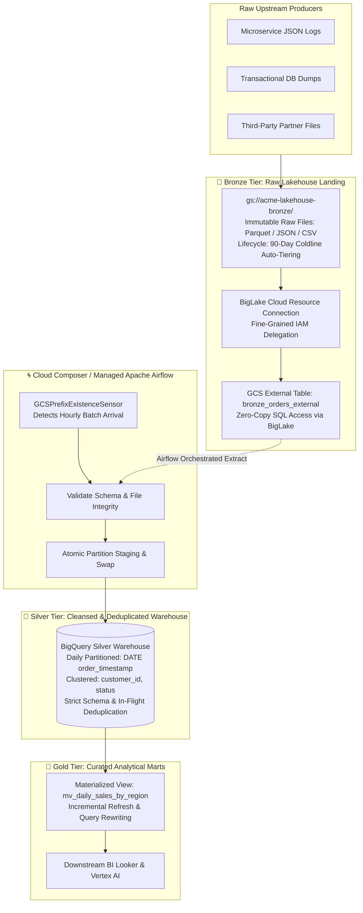

It is 2:45 AM. 

Your analytics cluster just throttled because a nightly batch ETL job attempted to load 40 million uncompressed JSON files from Google Cloud Storage into an unpartitioned warehouse table. The ingestion job exceeded your BigQuery concurrent slot allocation, the downstream Looker executive dashboard threw a timeout error, and your cloud bill for the hour surged by triple digits.

Every data team eventually reaches this crossroads. In the early days of a startup or new initiative, dumping raw data into Cloud Storage and writing ad-hoc SQL queries works fine. But as operational volume scales to terabytes and petabytes, treating your cloud warehouse as a giant flat filing cabinet creates three fatal bottlenecks:

1. **Runaway Query Costs:** Scanning entire multi-terabyte datasets just to fetch yesterday's active users.
2. **Schema Drift & Data Corruption:** Downstream dashboards silently ingesting malformed payloads without schema validation.
3. **Storage Duplication & Inefficiency:** Paying for duplicate copies of data across raw buckets, staging tables, and reporting layers.

To solve this sustainably, modern enterprise platforms implement the **Medallion Lakehouse Architecture**. 

In this multi-part **Data Engineering on Google Cloud** series, we will build a production-grade, end-to-end data platform from the ground up. In this first installment, we examine the core lakehouse foundation: **how Google Cloud Storage (GCS), BigLake External Tables, and Cloud Composer (Managed Apache Airflow) work in unison to establish a clean, multi-tiered Medallion pipeline.**

---

## 🚰 The Water Filtration Analogy

Before touching the Google Cloud CLI, let us establish an intuitive mental model for how data transforms through a lakehouse.

<div class="p-6 rounded-2xl bg-sky-50 dark:bg-sky-950/60 border-2 border-sky-300 dark:border-sky-600/70 text-sky-950 dark:text-sky-100 my-8 shadow-sm space-y-3">
<div class="flex items-center gap-2 font-bold text-base">
<span>🌊</span> The Municipal Water Filtration & Bottling Facility
</div>
<p class="text-sm leading-relaxed m-0">
Think of enterprise data like a city's municipal water supply system. You do not pipe raw mountain runoff directly into consumer drinking glasses:
</p>
<ul class="text-sm space-y-2 m-0 pl-4 list-disc">
<li><strong>Bronze Layer (The Raw Reservoir):</strong> Rain and river water collected in open reservoirs. It contains leaves, sediment, and unpredictable organic matter. In GCP, this is <strong>Cloud Storage (GCS)</strong> holding raw JSON, CSV, and Avro logs exactly as emitted by upstream systems.</li>
<li><strong>Silver Layer (The Treatment Plant):</strong> The water passes through sedimentation filters, UV sterilization, and chlorination. Contaminants are removed, minerals are balanced, and quality standards are enforced. In GCP, this is <strong>BigQuery</strong> holding cleansed, typed, and deduplicated partitioned tables.</li>
<li><strong>Gold Layer (The Bottling Plant):</strong> Clean water enriched with specific minerals, sealed into sterile bottles, and labeled for specific consumer use cases. In GCP, this is <strong>Materialized Views and aggregated reporting marts</strong> optimized for business intelligence, ML models, and executive dashboards.</li>
</ul>
</div>

---

## 🏛️ Modern GCP Multi-Engine Lakehouse Architecture

The traditional approach forced architects to choose between an object-store **Data Lake** (cheap, open-format, but slow and lacking ACID transactions) and a proprietary **Data Warehouse** (lightning-fast, but expensive and locked into vendor storage).

On Google Cloud, **BigLake** unifies these worlds. It allows BigQuery's query execution engine to run directly over open Parquet, ORC, and Iceberg formats in Cloud Storage with fine-grained column-level access control—**without moving or duplicating a single byte of data.**



---

## 🚨 5 Fatal Misconceptions Every Data Engineer Must Unlearn

<div class="grid grid-cols-1 md:grid-cols-2 gap-4 my-8">

<div class="p-5 rounded-xl bg-slate-50 dark:bg-slate-900/60 border border-slate-200 dark:border-slate-800 space-y-2">
<div class="font-bold text-red-600 dark:text-red-400 text-sm flex items-center gap-2">
<span>❌</span> Misconception 1: "External Tables are as Fast as Native BigQuery"
</div>
<p class="text-xs text-slate-700 dark:text-slate-300 leading-relaxed m-0">
<strong>Reality:</strong> External tables on GCS incur file enumeration overhead, network read latencies, and lack BigQuery's Capacitor columnar metadata indexing. External tables are ideal for cold exploratory querying or staging, but high-concurrency analytical queries should always live in native BigQuery storage.
</p>
</div>

<div class="p-5 rounded-xl bg-slate-50 dark:bg-slate-900/60 border border-slate-200 dark:border-slate-800 space-y-2">
<div class="font-bold text-red-600 dark:text-red-400 text-sm flex items-center gap-2">
<span>❌</span> Misconception 2: "BigLake is Just a Fancy Name for External Tables"
</div>
<p class="text-xs text-slate-700 dark:text-slate-300 leading-relaxed m-0">
<strong>Reality:</strong> Standard external tables require granting end-users direct read access to underlying GCS buckets. BigLake delegates storage permissions to a dedicated GCP Service Agent, enforcing column-level security, row-level masking, and cached metadata acceleration over open-format files.
</p>
</div>

<div class="p-5 rounded-xl bg-slate-50 dark:bg-slate-900/60 border border-slate-200 dark:border-slate-800 space-y-2">
<div class="font-bold text-red-600 dark:text-red-400 text-sm flex items-center gap-2">
<span>❌</span> Misconception 3: "Airflow Should Execute Heavy Data Transformations"
</div>
<p class="text-xs text-slate-700 dark:text-slate-300 leading-relaxed m-0">
<strong>Reality:</strong> Running pandas or PySpark transforms inside an Airflow worker pod quickly causes Out-Of-Memory (OOM) evictions. Cloud Composer is an <em>orchestrator</em>, not an execution engine. Always push data processing down to BigQuery SQL, Dataflow, or Dataproc, using Airflow strictly for task coordination.
</p>
</div>

<div class="p-5 rounded-xl bg-slate-50 dark:bg-slate-900/60 border border-slate-200 dark:border-slate-800 space-y-2">
<div class="font-bold text-red-600 dark:text-red-400 text-sm flex items-center gap-2">
<span>❌</span> Misconception 4: "Hive Partitioning on GCS Eliminates Table Scans Automatically"
</div>
<p class="text-xs text-slate-700 dark:text-slate-300 leading-relaxed m-0">
<strong>Reality:</strong> Storing files in <code>gs://bucket/year=2026/month=09/</code> only prunes queries if you configure <code>hive_partition_uri_prefix</code> and explicitly define the partition schema in the DDL. Without this, BigQuery still scans all directory objects recursively.
</p>
</div>

</div>

---

## 📊 Quick Comparison: Storage Tiers & Query Engines

| Feature / Metric | GCS Standard (Bronze) | BigLake External Table | BigQuery Native Table (Silver) | BigQuery Materialized View (Gold) |
| :--- | :--- | :--- | :--- | :--- |
| **Storage Cost** | ~$0.020 / GB / month | GCS storage rates | ~$0.020 / GB / month (Active) | ~$0.020 / GB / month (Active) |
| **Query Latency** | N/A (Object store) | Moderate (1.5s - 5s) | Sub-second (200ms - 800ms) | Instantaneous (<100ms) |
| **Data Mutability** | Append-only / Replace | Append-only files | Full ACID (INSERT/UPDATE/MERGE) | Auto-refreshed from base table |
| **Clustering Support** | No | Hive directory partition | Yes (Up to 4 columns) | Yes (Automatic pruning) |
| **Column-Level IAM** | Bucket-level only | Yes (via BigLake connection) | Yes (Policy tags & Taxonomies) | Yes (Inherited & scoped) |
| **Best For** | Raw ingestion & audits | Exploratory / Cold data | Cleansed single source of truth | Executive dashboards & BI |

---

## 🛠️ Hands-On Engineering Lab: Building the Medallion Pipeline

In this hands-on lab, we will build an automated pipeline that:
1. Provisions a Bronze Cloud Storage bucket with automated lifecycle management.
2. Establishes a zero-trust BigLake Cloud Resource connection.
3. Deploys a GCS External Table supporting zero-copy SQL analytics over Parquet files.
4. Implements an idempotent Cloud Composer (Airflow) DAG to stage and load cleansed data into a Daily-Partitioned, Clustered Silver table.

### Step 1: Provision the Bronze GCS Bucket & Lifecycle Policy

We enforce an automated lifecycle policy so that raw files in the Bronze layer transition to **Nearline** storage after 30 days and **Coldline** after 90 days, reducing raw retention costs by up to 70%.

```bash
# Set your project environment variables
export PROJECT_ID="gcloudcafe-production"
export REGION="us-central1"
export BRONZE_BUCKET="gs://${PROJECT_ID}-lakehouse-bronze"

# Create the Bronze GCS bucket
gcloud storage buckets create ${BRONZE_BUCKET} \
    --project=${PROJECT_ID} \
    --location=${REGION} \
    --uniform-bucket-level-access

# Apply automated lifecycle rule (JSON configuration)
cat <<EOF > lifecycle.json
{
  "rule": [
    {
      "action": {"type": "SetStorageClass", "storageClass": "NEARLINE"},
      "condition": {"age": 30}
    },
    {
      "action": {"type": "SetStorageClass", "storageClass": "COLDLINE"},
      "condition": {"age": 90}
    }
  ]
}
EOF

gcloud storage buckets update ${BRONZE_BUCKET} --lifecycle-file=lifecycle.json
```

---

### Step 2: Establish BigLake Delegation & Connection

Rather than giving analysts raw storage permissions on GCS, we create a secure **BigQuery Cloud Resource Connection**.

```bash
# Enable the required Google Cloud APIs
gcloud services enable bigqueryconnection.googleapis.com \
    bigquerystorage.googleapis.com \
    composer.googleapis.com \
    --project=${PROJECT_ID}

# Create the BigLake Connection
bq mk --connection \
    --location=${REGION} \
    --project_id=${PROJECT_ID} \
    --connection_type=CLOUD_RESOURCE \
    biglake-bronze-conn

# Extract the unique Service Agent identity created by GCP
export SERVICE_AGENT=$(bq show --connection --format=json ${PROJECT_ID}.${REGION}.biglake-bronze-conn | jq -r '.cloudResource.serviceAccountId')
echo "BigLake Service Account: ${SERVICE_AGENT}"

# Grant the BigLake Service Agent Read access to our Bronze Bucket
gcloud storage buckets add-iam-policy-binding ${BRONZE_BUCKET} \
    --member="serviceAccount:${SERVICE_AGENT}" \
    --role="roles/storage.objectViewer"
```

---

### Step 3: Create the GCS External Table (Zero-Copy Querying)

Now we define a BigLake external table over our Bronze Parquet directory. BigQuery can now query files sitting inside GCS using standard SQL without ingesting them.

```sql
-- Create our Lakehouse Dataset
CREATE SCHEMA IF NOT EXISTS `gcloudcafe_lakehouse`
OPTIONS (location = 'us-central1');

-- Create BigLake External Table with Hive Partitioning
CREATE OR REPLACE EXTERNAL TABLE `gcloudcafe_lakehouse.bronze_orders_external`
WITH CONNECTION `us-central1.biglake-bronze-conn`
OPTIONS (
  format = 'PARQUET',
  uris = ['gs://gcloudcafe-production-lakehouse-bronze/orders/*.parquet'],
  hive_partition_uri_prefix = 'gs://gcloudcafe-production-lakehouse-bronze/orders/',
  require_hive_partition_filter = false
);

-- Test querying raw files directly from Cloud Storage
SELECT 
  COUNT(*) as total_raw_records,
  MIN(order_timestamp) as earliest_event,
  MAX(order_timestamp) as latest_event
FROM `gcloudcafe_lakehouse.bronze_orders_external`;
```

---

### Step 4: Create the Silver Tier (Partitioned & Clustered Table)

For production analytics, we need sub-second query performance and deterministic costs. We build the Silver table with **Daily Date Partitioning** and **Multi-Column Clustering**:

```sql
-- Production Silver Tier Table
CREATE TABLE IF NOT EXISTS `gcloudcafe_lakehouse.silver_orders` (
  order_id STRING NOT NULL,
  customer_id STRING NOT NULL,
  order_timestamp TIMESTAMP NOT NULL,
  currency STRING,
  gross_amount NUMERIC(12, 2),
  discount_amount NUMERIC(12, 2),
  net_amount NUMERIC(12, 2),
  order_status STRING,
  ingested_at TIMESTAMP DEFAULT CURRENT_TIMESTAMP()
)
PARTITION BY DATE(order_timestamp)
CLUSTER BY customer_id, order_status
OPTIONS (
  require_partition_filter = true,
  description = "Enterprise Silver orders table partitioned by order date and clustered by customer and status"
);
```

> [!TIP] 💡 Why `require_partition_filter = true`?
> Setting this option blocks any query that does not include a `WHERE DATE(order_timestamp) BETWEEN ...` clause. This single line of DDL prevents runaway full-table scans across millions of rows, guaranteeing that ad-hoc queries only scan the exact partitions they need.

---

### Step 5: Orchestrate the Pipeline with Cloud Composer (Airflow)

Now, let us write the production Airflow DAG. The DAG enforces **idempotency**: if a network blip occurs midway through execution, re-running the DAG will safely overwrite only the target partition without producing duplicate records.

```python
# Gcloudcafe Production Medallion Lakehouse Ingestion DAG
# Orchestrates Bronze GCS detection -> Silver Partition Staging & Merge

from datetime import datetime, timedelta
from airflow import DAG
from airflow.providers.google.cloud.sensors.gcs import GCSObjectsWithPrefixExistenceSensor
from airflow.providers.google.cloud.transfers.gcs_to_bigquery import GCSToBigQueryOperator
from airflow.providers.google.cloud.operators.bigquery import BigQueryInsertJobOperator

PROJECT_ID = "gcloudcafe-production"
DATASET_ID = "gcloudcafe_lakehouse"
BRONZE_BUCKET = f"{PROJECT_ID}-lakehouse-bronze"

default_args = {
    "owner": "data-engineering",
    "depends_on_past": False,
    "email_on_failure": True,
    "email": ["alerts@gcloudcafe.com"],
    "retries": 3,
    "retry_delay": timedelta(minutes=5),
}

with DAG(
    dag_id="gcp_medallion_bronze_to_silver_pipeline",
    default_args=default_args,
    description="Automated hourly ingestion from GCS Bronze into BigQuery Silver",
    schedule_interval="0 * * * *",  # Hourly schedule
    start_date=datetime(2026, 1, 1),
    catchup=False,
    max_active_runs=1,
    tags=["gcp", "lakehouse", "medallion", "bigquery"],
) as dag:

    # 1. Detect incoming raw files in GCS
    wait_for_bronze_files = GCSObjectsWithPrefixExistenceSensor(
        task_id="wait_for_bronze_files",
        bucket=BRONZE_BUCKET,
        prefix="orders/{{ ds }}/",
        mode="reschedule",
        poke_interval=120,
        timeout=3600,
    )

    # 2. Stage raw data into temporary BigQuery table with schema validation
    stage_to_silver_temp = GCSToBigQueryOperator(
        task_id="stage_to_silver_temp",
        bucket=BRONZE_BUCKET,
        source_objects=["orders/{{ ds }}/*.parquet"],
        destination_project_dataset_table=f"{PROJECT_ID}.{DATASET_ID}.stg_orders_{{{{ ds_nodash }}}}",
        source_format="PARQUET",
        write_disposition="WRITE_TRUNCATE",
        autodetect=False,
        create_disposition="CREATE_IF_NEEDED",
    )

    # 3. Idempotent Deduplication and Atomic Merge into Silver Partitioned Table
    merge_into_silver = BigQueryInsertJobOperator(
        task_id="merge_into_silver_partitioned",
        configuration={
            "query": {
                "query": f"""
                MERGE `{PROJECT_ID}.{DATASET_ID}.silver_orders` T
                USING (
                  SELECT 
                    order_id,
                    customer_id,
                    order_timestamp,
                    currency,
                    gross_amount,
                    discount_amount,
                    (gross_amount - discount_amount) AS net_amount,
                    order_status,
                    CURRENT_TIMESTAMP() AS ingested_at
                  FROM `{PROJECT_ID}.{DATASET_ID}.stg_orders_{{{{ ds_nodash }}}}`
                  QUALIFY ROW_NUMBER() OVER (
                    PARTITION BY order_id 
                    ORDER BY order_timestamp DESC
                  ) = 1
                ) S
                ON T.order_id = S.order_id 
                AND DATE(T.order_timestamp) = DATE(S.order_timestamp)
                WHEN MATCHED THEN
                  UPDATE SET
                    customer_id = S.customer_id,
                    currency = S.currency,
                    gross_amount = S.gross_amount,
                    discount_amount = S.discount_amount,
                    net_amount = S.net_amount,
                    order_status = S.order_status,
                    ingested_at = S.ingested_at
                WHEN NOT MATCHED THEN
                  INSERT (order_id, customer_id, order_timestamp, currency, gross_amount, discount_amount, net_amount, order_status, ingested_at)
                  VALUES (S.order_id, S.customer_id, S.order_timestamp, S.currency, S.gross_amount, S.discount_amount, S.net_amount, S.order_status, S.ingested_at);
                """,
                "useLegacySql": False,
            }
        },
    )

    # Pipeline Flow
    wait_for_bronze_files >> stage_to_silver_temp >> merge_into_silver
```

---

## ⚠️ Critical Production Gotchas to Avoid

<div class="p-6 rounded-2xl bg-amber-50 dark:bg-amber-950/60 border-2 border-amber-300 dark:border-amber-600/70 text-amber-950 dark:text-amber-100 my-8 shadow-sm space-y-3">
<div class="flex items-center gap-2 font-bold text-base">
<span>⚠️</span> The "Small Files" Trap on Cloud Storage
</div>
<p class="text-sm leading-relaxed m-0">
If your streaming or batch producers dump thousands of tiny 5KB files into GCS every minute, you will trigger severe query degradation in BigQuery and BigLake. Every individual file incurs HTTP metadata round-trips and file header checks. 
</p>
<ul class="text-sm space-y-1.5 m-0 pl-4 list-disc">
<li><strong>Target File Size:</strong> Keep Parquet files in GCS between <strong>128 MB and 512 MB</strong>.</li>
<li><strong>Compaction:</strong> If micro-batches generate small files, run a scheduled Dataflow or Cloud Run compaction job to coalesce them before BigLake queries them.</li>
<li><strong>Sensor Deadlocks:</strong> Always set <code>mode="reschedule"</code> on Airflow GCS sensors rather than <code>mode="poke"</code>. A "poke" sensor consumes a dedicated Airflow worker slot for its entire timeout duration, starving your cluster of active execution threads!</li>
</ul>
</div>

---

## 🏁 Executive Summary & What's Coming Next

By implementing the **Medallion Lakehouse Architecture on Google Cloud**:
- **Storage is Decoupled & Optimized:** Raw immutable audit logs sit in cost-effective Cloud Storage buckets with automated Coldline archiving.
- **Security is Delegated:** BigLake resource connections enforce fine-grained access without exposing raw storage buckets to query consumers.
- **Analytics are Blazing Fast:** Cleansed data lands in partitioned and clustered BigQuery Silver tables, protected against full-table scans with mandatory partition filters.
- **Pipelines are Idempotent:** Cloud Composer coordinates hourly ingestion with atomic SQL merges, ensuring zero duplicate records regardless of network retries.

---

### Coming Up in Part 2:
In **Part 2: Real-Time Streaming Ingestion with Pub/Sub & Dataflow Deduplication**, we transition from scheduled batch workflows to **sub-second streaming ingestion**:
- Architecture of **Cloud Pub/Sub** with Exactly-Once Delivery and Dead-Letter topics (DLQ).
- **Cloud Dataflow (Apache Beam)** windowing strategies (Fixed, Sliding, and Session windows).
- Real-time in-flight deduplication across streaming windows before writing to BigQuery.

*Subscribe to the Gcloudcafe newsletter below to be notified the moment Part 2 drops!*
