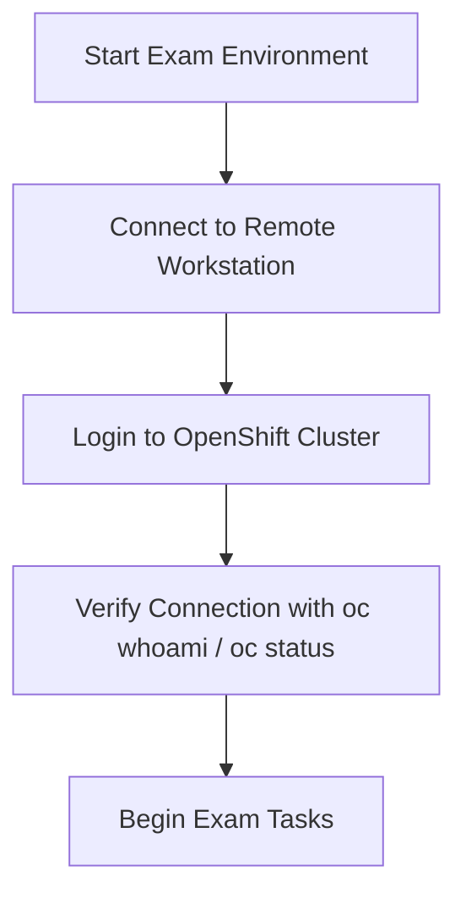

## Introduction
In [Part 1](/blog/passing-ex280-exam-part-1-non-technical-side/), I covered the *non-technical* aspects of the Red Hat OpenShift Administrator (EX280) exam — setting up the remote environment, managing testing conditions, and handling pre-exam prep.

This second part focuses on the **technical side** — the hands-on components you’ll work on within the OpenShift cluster. If Part 1 was about *preparing your environment*, this one’s about *executing with precision*.

Before diving in, make sure you’ve completed these two key Red Hat courses:

- [DO180 – OpenShift I: Containers, Kubernetes, and Red Hat OpenShift](https://www.redhat.com/en/services/training/red-hat-openshift-administration-i-operating-a-production-cluster)
- [DO280 – OpenShift Administration II: Configuring a Production Cluster](https://www.redhat.com/it/services/training/red-hat-openshift-administration-ii-configuring-a-production-cluster)

**DO180** teaches container fundamentals, storage, and health probes — topics that appear subtly in EX280.  
**DO280** dives deeper into cluster admin, networking, and troubleshooting — the exam’s core.

---

## Understanding the Exam Setup
The **EX280** exam runs for **3 hours**, scores up to **300 points**, and requires **70 %** to pass.  
Expect **21 – 23 real-world tasks** executed directly on the OpenShift cluster.

### Grading areas
- Manage OpenShift Container Platform  
- Deploy Applications  
- Manage Storage for Application Configuration and Data  
- Configure Applications for Reliability  
- Manage Authentication and Authorization  
- Configure Network Security  
- Enable Developer Self-Service  
- Manage OpenShift Operators  
- Configure Application Security  

Although the exam centers on **DO280**, don’t ignore **DO180** concepts such as *storage* and *probes* — they often reappear.

---

## Smart Time Management
Three hours sounds plenty until you start typing.  

- Around **21–23 questions** ⇒ **7–8 per hour**.  
- Aim to finish **90 % within 2 hours**, leaving an hour for verification.

### My personal strategy
1. **Prioritize identity provider setup (`htpasswd`)** — time-consuming and error-prone.  
2. **Do Project Templates last** — they can break project creation.  
3. **Skip & return** to tricky questions later.  
4. **Use the console for visibility**, CLI for accuracy.

---

## Using the Open Book Advantage
EX280 is **open book** — you have access to Red Hat docs. But it’s not about *reading*; it’s about *knowing where to look.*

The two most useful pages:
1. **Manage Authentication and Authorization** — for configuring `htpasswd`.  
2. **Building Applications** — for Project Template commands.

> 💡 **Tip:** Use `Ctrl + F` and minimal tabs. Practice navigation — speed comes from familiarity, not searching.

---

## Connecting to the Cluster
At the start of the exam, connect to your OpenShift cluster using credentials shown on the **Exam Environment Details** page.  
Once connected, verify with simple `oc` commands:

```bash
oc whoami
oc status
```



---

## The Five Macro Areas of the Exam
Breaking the exam into **five macro areas** keeps preparation organized.

### 1. Authentication, Authorization & RBAC
Critical — and often time-consuming.

**You should be able to:**
- Configure `htpasswd` identity provider  
- Create users, groups, roles  
- Assign cluster/project permissions  
- Use `oc adm policy` for RBAC  

Example:
```bash
oc create secret generic htpasswd-secret --from-file=htpasswd=/root/users.htpasswd -n openshift-config
oc patch oauth cluster --type=merge -p '{"spec":{"identityProviders":[{"name":"local","mappingMethod":"claim","type":"HTPasswd","htpasswd":{"fileData":{"name":"htpasswd-secret"}}}]}}'
oc adm groups new dev-team
oc adm groups add-users dev-team user1
```

💡 **Note:** For further in depth information on this topic please visit: [EX280 Exam tips - Part 1] (/blog/ex280-tips-part1-htpasswd/)

> 🧩 **Pro Tip:** Practice `oc adm policy` before exam day — syntax familiarity saves time.

---

### 2. Network Security & Policies
Security is central to OpenShift admin.

**Focus areas**
- Create **NetworkPolicies** for pod-to-pod control  
- Secure routes (`edge`, `reencrypt`, `passthrough`)  
- Limit exposure with namespace + label selectors  

Example:
```yaml
apiVersion: networking.k8s.io/v1
kind: NetworkPolicy
metadata:
  name: allow-web
  namespace: frontend
spec:
  podSelector:
    matchLabels:
      role: web
  ingress:
    - from:
        - podSelector:
            matchLabels:
              role: backend
```
> 🔐 **Pro Tip:** Validate behavior with `oc exec` or console’s network graph.

---

### 3. Storage, ConfigMaps & Secrets
Essential crossover of DO180 + DO280.

**Tasks**
- Create and bind PVs/PVCs  
- Mount volumes in deployments  
- Use ConfigMaps & Secrets  
- Work with StorageClasses  

Example:
```yaml
apiVersion: v1
kind: PersistentVolumeClaim
metadata:
  name: app-data
spec:
  accessModes:
  - ReadWriteOnce
  resources:
    requests:
      storage: 1Gi
  storageClassName: gp2
```
> 🗂️ **Pro Tip:** After mounting, `oc rsh` into the pod and check the mount point — that’s how graders confirm it works.

---

### 4. Deployments & Reliability
Expect to spend most of your time here.

**Tasks**
- Deploy via Helm or `oc new-app`  
- Configure probes (liveness, readiness, startup)  
- Set resource limits & autoscaling  
- Use Service Accounts and SCCs  

Example probe:
```yaml
livenessProbe:
  httpGet:
    path: /health
    port: 8080
  initialDelaySeconds: 10
  periodSeconds: 5
```
> ⚙️ **Pro Tip:** Use DO180 defaults for probes unless told otherwise.

---

### 5. Advanced Configuration & Developer Self-Service
**Focus**
- Create CronJobs  
- Configure quotas and limit ranges  
- Manage Project Templates  
- Work with Operators  

Example CronJob:
```yaml
apiVersion: batch/v1
kind: CronJob
metadata:
  name: cleanup
spec:
  schedule: "*/10 * * * *"
  jobTemplate:
    spec:
      template:
        spec:
          containers:
          - name: cleanup
            image: busybox
            command: ["sh","-c","echo Cleaning up..."]
          restartPolicy: OnFailure
```
> 🚨 **Pro Tip:** Prioritize Project Templates task at the last — misconfigurations can affect everything.

---

## Managing OpenShift Operators
Operators simplify lifecycle management.

**Tasks**
- Install from OperatorHub  
- Verify installation:
```bash
oc get csv -n openshift-operators
```
- Deploy resources via CRDs  

> 📦 **Pro Tip:** Know namespace scope and CSV phases (`Succeeded` vs `Installing`).

---

## Recommended Workflow
1. Connect and verify cluster access  
2. Configure auth & RBAC  
3. Set up storage and mounts  
4. Deploy and scale apps  
5. Apply network security  
6. Manage Operators & CronJobs  
7. Finish with Project Templates  
8. Validate everything before submission  

---

## Quick Recap
✅ Know DO180 and DO280 concepts  
✅ Connect to cluster cleanly  
✅ Set up `htpasswd` & RBAC  
✅ Create PVs/PVCs, ConfigMaps, Secrets  
✅ Deploy apps + probes  
✅ Apply NetworkPolicies and routes  
✅ Manage quotas, limits, CronJobs  
✅ Install Operators  
✅ Leave Project Template for last  

---

## Final Thoughts
The EX280 exam validates how effectively you can run OpenShift under real conditions.

- It’s open book — but mastery > search.  
- Stick to clean commands, verify results.  
- Stay calm and methodical.

You’ve practiced — now execute.  

If you haven’t yet, revisit [Part 1: The Non-Technical Side](/blog/passing-openshift-administartor-exam-part-1/) to ensure your exam setup is solid before the big day.

---

*Authored by Tharun Vempati*  
*Red Hat Certified OpenShift Administrator | DevOps Engineer*
