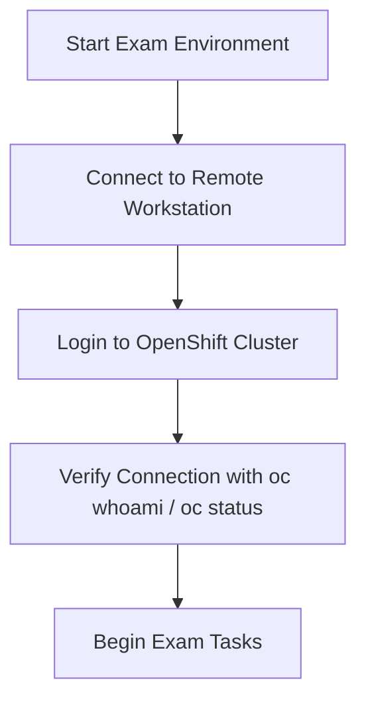

## Introduction
In [Part 1](/blog/passing-openshift-administartor-exam-part-1/), I covered the *non-technical* aspects of the Red Hat OpenShift Administrator (EX280) exam — setting up the remote environment, managing testing conditions, and handling pre-exam prep.

This second part focuses on the **technical side** — the hands-on components you’ll work on within the OpenShift cluster. If Part 1 was about *preparing your environment*, this one’s about *executing with precision*.

Before diving in, make sure you’ve completed these two key Red Hat courses:

- [DO180 – OpenShift I: Containers, Kubernetes, and Red Hat OpenShift](https://www.redhat.com/en/services/training/red-hat-openshift-administration-i-operating-a-production-cluster)
- [DO280 – OpenShift Administration II: Configuring a Production Cluster](https://www.redhat.com/it/services/training/red-hat-openshift-administration-ii-configuring-a-production-cluster)

**DO180** teaches container fundamentals, storage, and health probes — topics that appear subtly in EX280.  
**DO280** dives deeper into cluster admin, networking, and troubleshooting — the exam’s core.

---

## Understanding the Exam Setup
The **EX280** exam runs for **3 hours**, scores up to **300 points**, and requires **70 %** to pass.  
Expect **21 – 23 real-world tasks** executed directly on the OpenShift cluster.

### Grading areas
- Manage OpenShift Container Platform  
- Deploy Applications  
- Manage Storage for Application Configuration and Data  
- Configure Applications for Reliability  
- Manage Authentication and Authorization  
- Configure Network Security  
- Enable Developer Self-Service  
- Manage OpenShift Operators  
- Configure Application Security  

Although the exam centers on **DO280**, don’t ignore **DO180** concepts such as *storage* and *probes* — they often reappear.

---

## Smart Time Management
Three hours sounds plenty until you start typing.  

- Around **21–23 questions** ⇒ **7–8 per hour**.  
- Aim to finish **90 % within 2 hours**, leaving an hour for verification.

### My personal strategy
1. **Prioritize identity provider setup (`htpasswd`)** — time-consuming and error-prone.  
2. **Do Project Templates last** — they can break project creation.  
3. **Skip & return** to tricky questions later.  
4. **Use the console for visibility**, CLI for accuracy.

---

## Using the Open Book Advantage
EX280 is **open book** — you have access to Red Hat docs. But it’s not about *reading*; it’s about *knowing where to look.*

The two most useful pages:
1. **Manage Authentication and Authorization** — for configuring `htpasswd`.  
2. **Building Applications** — for Project Template commands.

> 💡 **Tip:** Use `Ctrl + F` and minimal tabs. Practice navigation — speed comes from familiarity, not searching.

---

## Connecting to the Cluster
At the start of the exam, connect to your OpenShift cluster using credentials shown on the **Exam Environment Details** page.  
Once connected, verify with simple `oc` commands:

```bash
oc whoami
oc status
```


```mermaid
flowchart TD
    A[Start Exam Environment] --> B[Connect to Remote Workstation]
    B --> C[Login to OpenShift Cluster]
    C --> D[Verify Connection with oc whoami / oc status]
    D --> E[Begin Exam Tasks]
```

---

## The Five Macro Areas of the Exam
Breaking the exam into **five macro areas** keeps preparation organized.

### 1. Authentication, Authorization & RBAC
Critical — and often time-consuming.

**You should be able to:**
- Configure `htpasswd` identity provider  
- Create users, groups, roles  
- Assign cluster/project permissions  
- Use `oc adm policy` for RBAC  

Example:
```bash
oc create secret generic htpasswd-secret --from-file=htpasswd=/root/users.htpasswd -n openshift-config
oc patch oauth cluster --type=merge -p '{"spec":{"identityProviders":[{"name":"local","mappingMethod":"claim","type":"HTPasswd","htpasswd":{"fileData":{"name":"htpasswd-secret"}}}]}}'
oc adm groups new dev-team
oc adm groups add-users dev-team user1
```

> 🧩 **Pro Tip:** Practice `oc adm policy` before exam day — syntax familiarity saves time.

💡💡 **Note:** For further in depth information and tips on this topic please visit: [EX280 Exam tips - Part 1](/blog/ex280-tips-part1-htpasswd/)

---

### 2. Network Security & Policies
Security is central to OpenShift admin.

**Focus areas**
- Create **NetworkPolicies** for pod-to-pod control  
- Secure routes (`edge`, `reencrypt`, `passthrough`)  
- Limit exposure with namespace + label selectors  

Example:
```yaml
apiVersion: networking.k8s.io/v1
kind: NetworkPolicy
metadata:
  name: allow-web
  namespace: frontend
spec:
  podSelector:
    matchLabels:
      role: web
  ingress:
    - from:
        - podSelector:
            matchLabels:
              role: backend
```
> 🔐 **Pro Tip:** Validate behavior with `oc exec` or console’s network graph.

💡💡 **Note:** For further in depth information and tips on this topic please visit: [EX280 Exam tips - Part 2](/blog/ex280-tips-part2/)

---

### 3. Storage, ConfigMaps & Secrets
Essential crossover of DO180 + DO280.

**Tasks**
- Create and bind PVs/PVCs  
- Mount volumes in deployments  
- Use ConfigMaps & Secrets  
- Work with StorageClasses  

Example:
```yaml
apiVersion: v1
kind: PersistentVolumeClaim
metadata:
  name: app-data
spec:
  accessModes:
  - ReadWriteOnce
  resources:
    requests:
      storage: 1Gi
  storageClassName: gp2
```
> 🗂️ **Pro Tip:** After mounting, `oc rsh` into the pod and check the mount point — that’s how graders confirm it works.

💡💡 **Note:** For further in depth information and tips on this topic please visit: [EX280 Exam tips - Part 3](/blog/ex280-tips-part3/)

---

### 4. Deployments & Reliability
Expect to spend most of your time here.

**Tasks**
- Deploy via Helm or `oc new-app`  
- Configure probes (liveness, readiness, startup)  
- Set resource limits & autoscaling  
- Use Service Accounts and SCCs  

Example probe:
```yaml
livenessProbe:
  httpGet:
    path: /health
    port: 8080
  initialDelaySeconds: 10
  periodSeconds: 5
```
> ⚙️ **Pro Tip:** Use DO180 defaults for probes unless told otherwise.

💡💡 **Note:** For further in depth information and tips on this topic please visit: [EX280 Exam tips - Part 4](/blog/ex280-tips-part4/)

---

### 5. Advanced Configuration & Developer Self-Service
**Focus**
- Create CronJobs  
- Configure quotas and limit ranges  
- Manage Project Templates  
- Work with Operators  

Example CronJob:
```yaml
apiVersion: batch/v1
kind: CronJob
metadata:
  name: cleanup
spec:
  schedule: "*/10 * * * *"
  jobTemplate:
    spec:
      template:
        spec:
          containers:
          - name: cleanup
            image: busybox
            command: ["sh","-c","echo Cleaning up..."]
          restartPolicy: OnFailure
```
> 🚨 **Pro Tip:** Prioritize Project Templates task at the last — misconfigurations can affect everything.

💡💡 **Note:** For further in depth information and tips on this topic please visit: [EX280 Exam tips - Part 5](/blog/ex280-tips-part5/)

---

## Managing OpenShift Operators
Operators simplify lifecycle management.

**Tasks**
- Install from OperatorHub  
- Verify installation:
```bash
oc get csv -n openshift-operators
```
- Deploy resources via CRDs  

> 📦 **Pro Tip:** You cannot (and should not) manually create a new namespace (Project) that begins with the openshift- prefix. These namespaces are reserved for core OpenShift cluster components and services.

In an exam scenario (or in a real-world environment), if you are asked to install an Operator that needs to be in a namespace like openshift-operators, it's because that namespace already exists for its intended purpose (i.e., managing cluster-wide Operators). Your task would be to select that existing namespace during the installation, not to create it.


---


### Deep Dive: Hands-On EX280 Task Walkthroughs
To master each specific objective on the live terminal, follow our step-by-step technical guides:
- **Authentication & RBAC:** [EX280 Tips Part 1: Connecting to the Cluster & HTPasswd Provider](/blog/ex280-tips-part1-htpasswd/)
- **Network Security & Ingress:** [EX280 Tips Part 2: Network Policies and Edge Routes](/blog/ex280-tips-part2/)
- **Persistent Storage & Secrets:** [EX280 Tips Part 3: Storage Classes, PV, PVC, ConfigMaps & Secrets](/blog/ex280-tips-part3/)
- **Workload Resilience & Scaling:** [EX280 Tips Part 4: Deployments, Probes & Reliability](/blog/ex280-tips-part4/)
- **Multi-Tenancy & Project Templates:** [EX280 Tips Part 5: Developer Self Service & Quotas](/blog/ex280-tips-part5/)
- **High-Velocity CLI Reference:** [The Ultimate kubectl & oc CLI Speed Cheat Sheet](/blog/kubectl-oc-cli-speed-cheat-sheet/)

---

## Recommended Workflow
1. Connect and verify cluster access  
2. Configure auth & RBAC  
3. Set up storage and mounts  
4. Deploy and scale apps  
5. Apply network security  
6. Manage Operators & CronJobs  
7. Finish with Project Templates  
8. Validate everything before submission  

---

## Quick Recap
✅ Know DO180 and DO280 concepts  
✅ Connect to cluster cleanly  
✅ Set up `htpasswd` & RBAC  
✅ Create PVs/PVCs, ConfigMaps, Secrets  
✅ Deploy apps + probes  
✅ Apply NetworkPolicies and routes  
✅ Manage quotas, limits, CronJobs  
✅ Install Operators  
✅ Leave Project Template for last  

---

## Final Thoughts
The EX280 exam validates how effectively you can run OpenShift under real conditions.

- It’s open book — but mastery > search.  
- Stick to clean commands, verify results.  
- Stay calm and methodical.

You’ve practiced — now execute.  

If you haven’t yet, revisit [Part 1: The Non-Technical Side](/blog/passing-openshift-administartor-exam-part-1/) to ensure your exam setup is solid before the big day.

---

*Authored by Tharun Vempati*  
*Red Hat Certified OpenShift Administrator | DevOps Engineer*

---

## Frequently Asked Questions (EX280 Exam Objectives & FAQ)

### What are the official Red Hat OpenShift EX280 exam objectives?
The Red Hat EX280 exam tests hands-on competency in:
1. Managing OpenShift Container Platform clusters and authentication (`htpasswd`, OAuth).
2. Configuring Role-Based Access Control (RBAC) and group permissions.
3. Managing persistent application storage (PV, PVC, StorageClasses).
4. Securing pod communication via `NetworkPolicy` and configuring external Edge / Re-encrypt Routes.
5. Deploying and scaling multi-container applications with health probes (liveness, readiness).
6. Configuring Developer Self-Service, ResourceQuotas, LimitRanges, and Project Templates.

### How does the Red Hat DO280 course relate to the EX280 exam tasks?
The **DO280 course** (*OpenShift Administration II: Configuring a Production Cluster*) covers the exact core syllabus of the EX280 exam. Practicing every lab in DO280 until you can execute the tasks without looking at solutions is the single most effective preparation strategy.

### Can you use the OpenShift web console and documentation during the EX280 exam?
Yes. Both the OpenShift Web Console and offline official documentation are available within the exam environment. However, relying solely on the web UI can slow you down; mastering imperative `oc` CLI commands is essential to complete all 21–23 tasks within the 3-hour limit.

### What is the passing score for the Red Hat Certified Specialist in OpenShift Administration (EX280) exam?
The exam is scored out of **300 points**, requiring **210 points (70%)** to earn the certification.
