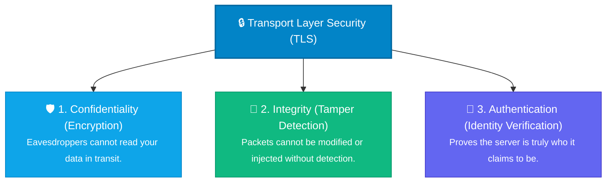
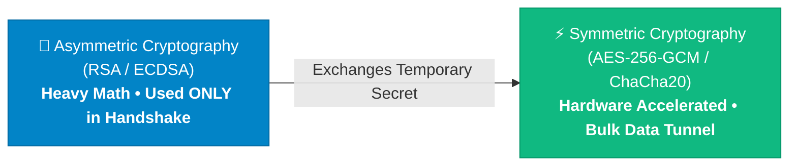
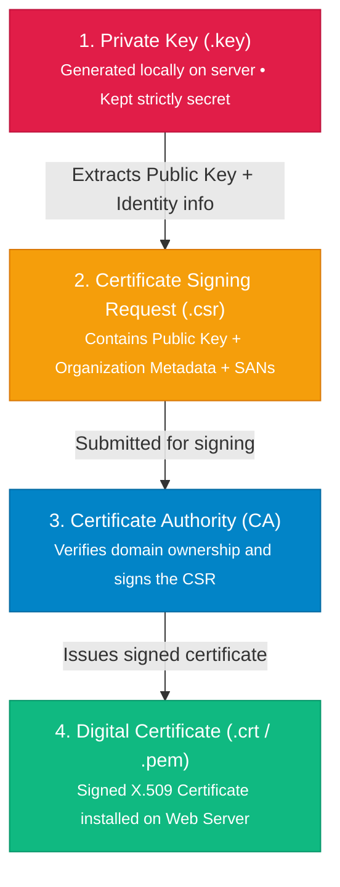
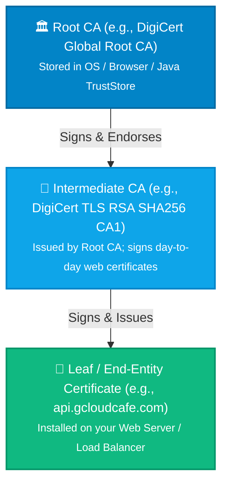
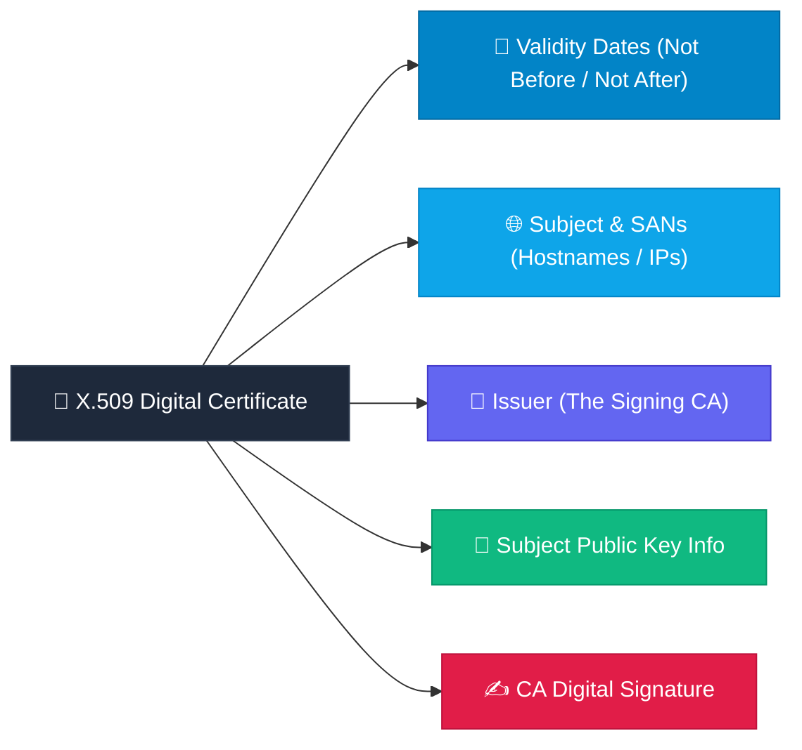

Whenever you browse a website with a green lock, connect to an API gateway, or execute `kubectl` commands against a remote Kubernetes cluster, an invisible cryptographic handshake takes place in milliseconds.

At the core of this trust model is **Transport Layer Security (TLS)**.

Yet for many software engineers, DevOps practitioners, and cloud architects, the mechanics behind TLS remain shrouded in a fog of confusing acronyms: **Asymmetric vs. Symmetric keys, CSRs, CAs, SANs, Root vs. Intermediate certificates, and X.509 chains**.

Welcome to **Part 1 of our 3-Part Deep Dive into TLS & mTLS Architecture**:

- **Part 1 (This Guide):** Cryptography Foundations, Keys, CSRs, and the Chain of Trust.
- **Part 2:** The Standard TLS Handshake, Cipher Negotiation, and Troubleshooting SSL.
- **Part 3:** Mutual TLS (mTLS), KeyStores vs. TrustStores, and Surviving Production Certificate Expirations.

Let's strip away the complexity and build our understanding from the ground up.

---

## 1. Why TLS Exists: The 3 Core Security Pillars

Before digging into cryptographic math, let's understand the core problem: **The Internet was designed as an open, untrusted network.** Any router, switch, or ISP between your computer and a server can inspect, copy, or alter your packets.

TLS solves this by enforcing three fundamental guarantees:



1. **Confidentiality:** If someone sniffs your WiFi traffic at a coffee shop, all they see is scrambled ciphertext.
2. **Integrity:** If an attacker tries to alter a bank account number in a POST request payload, the cryptographic checksum fails and the connection is terminated.
3. **Authentication:** When you connect to `https://mybank.com`, you have cryptographic proof that you are talking to the bank's genuine server, not a phishing proxy.

---

## 2. The Cryptographic Dual-Engine: Speed Meets Security

A common misconception is that TLS encrypts your entire HTTP payload using public and private keys. 

In reality, **public-key (asymmetric) cryptography involves heavy mathematics (modular exponentiation or elliptic curves)** that would overwhelm CPU resources if used for gigabytes of stream traffic.

To solve this, TLS employs a **hybrid architecture**:



### 2.1. Asymmetric Encryption (The Identity & Key Exchange Phase)
- **How it works:** Uses a mathematically linked pair: a **Private Key** (kept secret by the server) and a **Public Key** (distributed to the world).
- **Purpose:** Used *only* during the first few milliseconds of the TLS handshake to authenticate the server's identity and negotiate a temporary shared session secret.

### 2.2. Symmetric Encryption (The Data Transmission Phase)
- **How it works:** Uses a single, shared secret key generated specifically for that single session.
- **Purpose:** Once the handshake finishes, both client and server encrypt all HTTP request/response payloads using this shared symmetric key (like AES-GCM), which modern processors can encrypt at tens of gigabits per second using native CPU hardware instructions (AES-NI).

---

## 3. The Core TLS Glossary: Keys, CSRs, and Certificates

To understand how security is established, let's trace the lifecycle of how a server acquires its identity:



Let's break down each component in detail:

| Term | What It Is | Real-World Analogy | Is It Secret? |
| :--- | :--- | :--- | :--- |
| **Private Key** (`.key`) | The secret cryptographic key used to decrypt data and create digital signatures. | Your personal handwritten signature & bank PIN | **YES (Strictly Secret)** |
| **Public Key** (`.pub`) | The counterpart used by clients to verify your signatures and encrypt session secrets. | Your open physical mailbox slot | **No (Public)** |
| **CSR** (Certificate Signing Request) | A standardized application file containing your Public Key, Organization details, and domain names. | A passport application form | **No (Sent to CA)** |
| **CA** (Certificate Authority) | An accredited entity that signs CSRs to certify domain ownership (e.g., Let's Encrypt, DigiCert). | The official Government Passport Agency | Public Root CAs are pre-trusted |
| **Digital Certificate** (`.crt`, `.pem`) | An official X.509 document binding your Public Key to your domain, signed by a CA. | An official, tamper-proof Passport | **No (Sent during handshake)** |
| **SAN** (Subject Alternative Name) | The exact domain names, wildcards, or IP addresses the certificate is valid for. | Aliases and legal names on your ID | **No** |

---

## 4. Generating Keys & CSRs Hands-On with OpenSSL

Let's see how these concepts translate into real terminal commands:

### 4.1. Generating a Private Key
You can generate a traditional RSA key or a modern, high-performance Elliptic Curve (ECDSA) key:

```bash
# Option A: Modern ECDSA Private Key (Recommended: faster & smaller)
openssl ecparam -name prime256v1 -genkey -noout -out server.key

# Option B: Traditional RSA 2048-bit Private Key
openssl genrsa -out server.key 2048
```

> **Security Rule #1:** The `server.key` file must never leave your server, be checked into Git, or sent to a third party.

### 4.2. Creating a Certificate Signing Request (CSR)
When creating a CSR, you specify your domain name (Common Name) and Subject Alternative Names (SANs):

```bash
# Generate CSR from your Private Key
openssl req -new -key server.key -out server.csr \
  -subj "/C=US/ST=California/L=San Francisco/O=GCloudCafe/CN=api.gcloudcafe.com"
```

### What is Actually Inside a CSR?
You can inspect the generated CSR to verify what information it contains:

```bash
openssl req -in server.csr -noout -text
```

**Key Observation:** The CSR contains your **Public Key** and **Subject Information**, but **ZERO traces of your Private Key**. You can safely send this CSR to any public or private Certificate Authority.

---

## 5. The Chain of Trust: Root CAs vs. Intermediate CAs

When your browser connects to `https://api.gcloudcafe.com`, how does it know the certificate isn't fake?

Operating systems and browsers cannot hardcode millions of individual website certificates. Instead, trust is established through a **hierarchical Chain of Trust**:



### 5.1. Why Do Intermediate CAs Exist?
Why doesn't the Root CA sign your website certificate directly?

- **Risk Isolation:** A Root CA's private key is the crown jewel of digital security. If a Root CA is compromised, all certificates issued by it worldwide become invalid. Root CAs are kept completely **offline** in high-security physical vaults.
- **Operational Agility:** The Root CA issues an Intermediate CA certificate valid for 5–10 years. The Intermediate CA is kept online to sign daily customer certificates. If an intermediate key is ever compromised, only that intermediate certificate needs to be revoked—the Root CA remains secure.

### 5.2. How the Client Verifies the Chain
When your application or browser connects to a server:
1. The server presents its **Leaf Certificate** + **Intermediate CA Certificate**.
2. The client checks if the Leaf certificate was signed by the Intermediate CA.
3. The client checks if the Intermediate CA was signed by a trusted **Root CA** already present in its local trust store (e.g., Windows Certificate Store, macOS Keychain, Linux `/etc/ssl/certs`, or Java `cacerts`).
4. If every link in the chain is mathematically valid and unexpired, the connection is trusted!

---

## 6. Anatomy of an X.509 Certificate

Once issued, an X.509 certificate contains several critical fields:



### Inspecting a Live Certificate via OpenSSL
You can inspect any local certificate file with a single command:

```bash
# Check certificate subject, issuer, and validity dates
openssl x509 -in server.crt -noout -subject -issuer -dates

# Check Subject Alternative Names (SANs)
openssl x509 -in server.crt -noout -ext subjectAltName
```

### Checking if a Private Key Matches a Certificate
In production, a common misconfiguration occurs when updating certificates: uploading a new certificate while accidentally leaving an old private key in place.

You can verify whether a Private Key and Certificate are a matching pair by comparing their MD5 modulus hashes:

```bash
# Both hashes MUST be identical!
openssl x509 -noout -modulus -in server.crt | openssl md5
openssl rsa -noout -modulus -in server.key | openssl md5
```

---

## Summary & What's Next in Part 2

| Key Takeaway | Summary |
| :--- | :--- |
| **Why Hybrid Cryptography?** | Asymmetric encryption authenticates identity during the handshake; Symmetric encryption secures data transfer with minimal CPU overhead. |
| **What is a CSR?** | A request bundle containing your public key and metadata sent to a CA for signing. It **never** contains your private key. |
| **Why Intermediate CAs?** | To protect Root CAs by keeping them offline in secure vaults while intermediates handle daily signing. |
| **What is a SAN?** | Subject Alternative Name—the modern field that defines which hostnames/domains a certificate covers. |

Now that you have a rock-solid foundation on keys, CSRs, and CA chains, we are ready to explore how clients and servers talk to each other in real-time.

👉 **In [Part 2: The Standard TLS Handshake, Cipher Suites & SSL Troubleshooting](/blog/tls-handshake-part2-one-way-tls-and-diagnostics/)**, we break down:
- The step-by-step TLS 1.2 vs 1.3 handshake sequence.
- Why missing Intermediate CA bundles break Java/curl while browsers appear to work.
- Practical diagnostic tools including [SSL Shopper](https://www.sslshopper.com/ssl-checker.html), [Qualys SSL Labs](https://www.ssllabs.com/ssltest/), [BadSSL](https://badssl.com), and OpenSSL.
