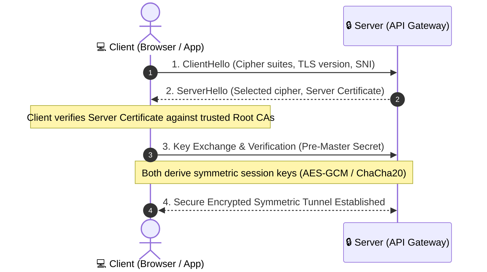
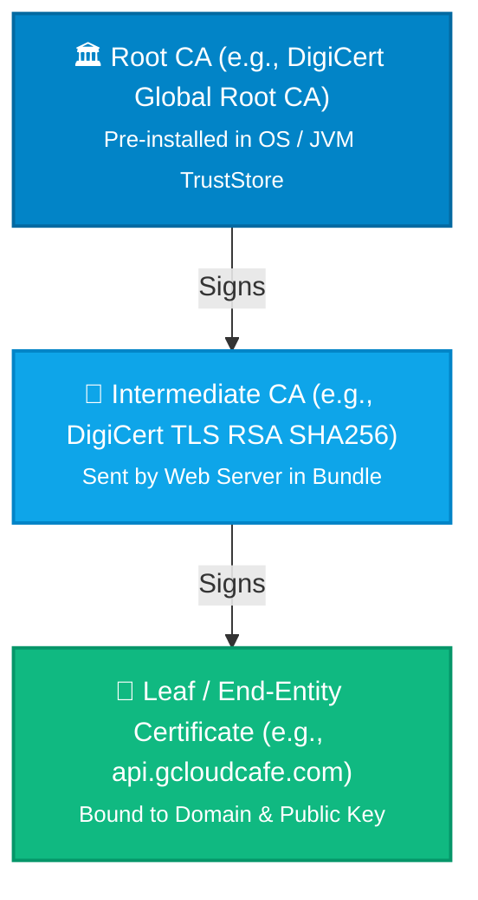
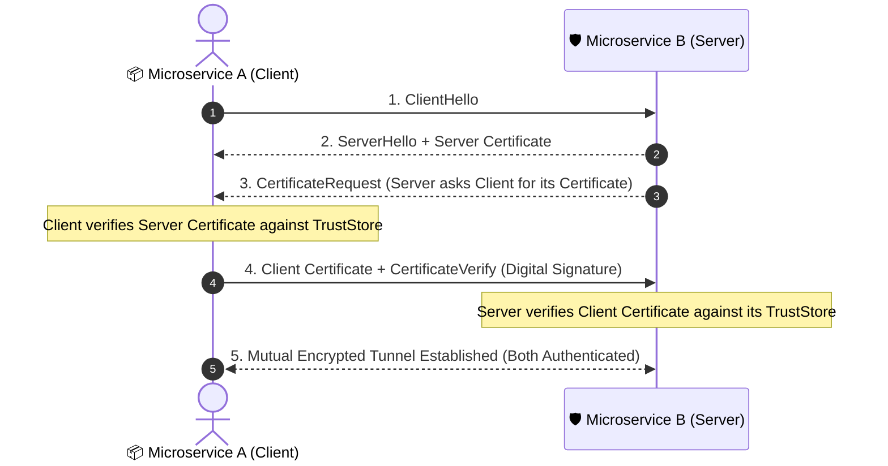

Few things strike fear into an on-call engineer’s heart quite like a 3:00 AM production alert where **every single microservice suddenly fails to talk to each other**, yet the servers, CPU, memory, and database are all completely healthy.

No HTTP 500 status codes. No database deadlocks. Just raw, abrupt connection resets and cryptographic errors:

```text
javax.net.ssl.SSLHandshakeException: Received fatal alert: certificate_expired
curl: (35) error:0A000086:SSL routines::certificate verify failed:certificate has expired
```

Welcome to a **Mutual TLS (mTLS) certificate expiry incident**.

Whether you're debugging an active outage, implementing zero-trust service meshes, or trying to demystify terms like **CSR, CA, SAN, KeyStore, and TrustStore**, this guide will walk you through the cryptographic fundamentals, real-world troubleshooting tools, and proactive monitoring strategies you need.

---

## 1. The Core Conceptual Foundation of TLS

Transport Layer Security (TLS) provides three fundamental guarantees across untrusted networks:
1. **Confidentiality (Encryption):** No eavesdropper can read the payload in transit.
2. **Integrity (Tamper-proofing):** Data cannot be altered or forged without detection.
3. **Authentication (Identity Verification):** You are guaranteed to be communicating with the exact server (or client) you intended.



### 1.1. Why TLS Uses Two Kinds of Cryptography

- **Asymmetric Cryptography (Slow, Heavy Math):** Uses a mathematically linked **Public Key** and **Private Key** pair (e.g., RSA 2048/4096-bit or ECDSA P-256). Used **only** during the initial TLS handshake to authenticate identities and safely negotiate a temporary session secret.
- **Symmetric Cryptography (Ultra-Fast, Hardware Accelerated):** Uses a single shared session key (e.g., AES-256-GCM or ChaCha20-Poly1305). Once the handshake finishes, all bulk payload traffic is encrypted using this ephemeral symmetric key.

---

## 2. The Cryptographic Glossary: Demystifying Key Terms

Understanding TLS requires mastering its foundational building blocks:

| Term | What It Is | Analogy | Is It Secret? |
| :--- | :--- | :--- | :--- |
| **Private Key** (`.key`) | Secret cryptographic key used to decrypt data and generate digital signatures. | Your physical house key | **YES!** Never share or commit. |
| **Public Key** (`.pub`) | Publicly shareable counterpart used to encrypt data and verify signatures. | Your padlock open to the world | **No** (Public) |
| **CSR** (Certificate Signing Request) | An application bundle containing your public key and organization metadata, sent to a CA for signing. | A passport application form | **No** (Safe to share) |
| **CA** (Certificate Authority) | A trusted entity that signs and issues digital certificates (e.g., DigiCert, Let's Encrypt, internal Vault). | The government passport office | Public root certificates |
| **X.509 Certificate** (`.crt`, `.pem`) | A signed public key bound to an identity (domain name, service name, organization) with validity timestamps. | An official government-issued Passport | **No** (Sent in the handshake) |
| **SAN** (Subject Alternative Name) | The list of exact hostnames or IP addresses the certificate is valid for (e.g., `api.example.com`, `*.internal.net`). | Aliases listed on your ID | **No** |

### 2.1. The Chain of Trust (Root CA vs. Intermediate CA)

A browser or client cannot hardcode millions of individual server certificates. Instead, it relies on a hierarchical **Chain of Trust**:



1. The **Leaf Certificate** is signed by an **Intermediate CA**.
2. The **Intermediate CA** is signed by the **Root CA**.
3. The client verifies the leaf against the intermediate, and the intermediate against its local, trusted **Root CA**.

> **Crucial Insight:** If your web server fails to send the Intermediate Certificate bundle and only sends the Leaf certificate, browsers might work (via cached intermediates or AIA fetching), but **backend services (Java, Python, Go, curl) will immediately fail with `SSLHandshakeException: PKIX path building failed`**.

---

## 3. One-Way TLS vs. Mutual TLS (mTLS)

Most web traffic uses **Standard (One-Way) TLS**:
- The client connects to `https://bank.com`.
- The server presents its certificate.
- The client validates the server's identity.
- The server does **not** know who the client is at the TLS layer (authentication happens later via cookies or JWT tokens).

### What is Mutual TLS (mTLS)?

In **mTLS**, **both** parties must present and validate certificates before a single byte of application data is exchanged:



### Why is mTLS Used?
- **Zero-Trust Architecture:** Internal microservices in Kubernetes (Istio, Linkerd) and service-to-service APIs do not trust the local network.
- **Strict B2B & Banking Integrations:** Financial APIs and payment gateways require mTLS so that only approved clients with pre-registered certificates can even complete a TCP/TLS handshake.

---

## 4. Post-Mortem of an mTLS Production Incident

### The Scenario
At 00:00 UTC, a critical payment processing service communicating with a core banking gateway began failing 100% of its transactions.

### The Symptoms
- Application logs were flooded with:
  `javax.net.ssl.SSLHandshakeException: Received fatal alert: certificate_unknown` or `bad_certificate`.
- No HTTP 401 or 403 status codes were returned because the connection was aborted at the transport layer before HTTP headers were sent.

### The Root Cause
1. The **client certificate** used by the payment service was issued with a 1-year validity period.
2. The certificate expired at 23:59:59 UTC.
3. No automated alert was configured for the internal client certificate (only public endpoints had monitoring).
4. When the client presented its expired certificate in Step 4 of the mTLS handshake, the banking server rejected it instantly with a `fatal alert`.

### Why mTLS Outages are Harder to Triage
In one-way TLS, you only check the server’s URL in your browser. In mTLS:
- The server certificate might be completely valid.
- The **client's certificate** or the **internal CA** bundled in the client application could be expired.
- The server's **TrustStore** might be missing the client's new Root/Intermediate CA.

---

## 5. Keystores vs. Truststores (The Java & Multi-Runtime Deep Dive)

In environments like Java (Spring Boot, Quarkus, Tomcat), TLS configuration is cleanly separated into two distinct stores:

| Store Type | Purpose | Contents | Typical Files |
| :--- | :--- | :--- | :--- |
| **KeyStore** | **"Who I Am" (Identity)**<br/>Used to prove your identity to the other party during handshake. | • My Private Key (`.key`)<br/>• My Public Certificate (`.crt`) signed by CA | `keystore.jks`, `keystore.p12` |
| **TrustStore** | **"Who I Trust" (Verification)**<br/>Used to validate and trust certificates presented by others. | • Trusted Root CAs<br/>• Trusted Intermediate CAs | `cacerts`, `truststore.jks` |

### 5.1. Java Default TrustStore Location
When a Java application makes an HTTPS request without custom SSL properties, it looks up trusted CAs in the JDK default truststore:

- **Path:** `$JAVA_HOME/lib/security/cacerts` (or `$JAVA_HOME/jre/lib/security/cacerts` on Java 8).
- **Default Master Password:** `changeit` (or `changeme` on macOS Apple JDK).

### 5.2. Essential Java `keytool` Commands

```bash
# 1. Inspect all certificates in the default Java TrustStore
keytool -list -v -keystore $JAVA_HOME/lib/security/cacerts -storepass changeit

# 2. Check the expiry date of a specific alias
keytool -list -v -keystore $JAVA_HOME/lib/security/cacerts -storepass changeit -alias my-company-ca

# 3. Import an internal enterprise Root CA into Java TrustStore
keytool -importcert -trustcacerts \
  -alias enterprise-root-ca \
  -file /path/to/enterprise-root-ca.crt \
  -keystore $JAVA_HOME/lib/security/cacerts \
  -storepass changeit \
  -noprompt

# 4. Convert OpenSSL PEM (cert + private key) into PKCS12 / JKS for Java KeyStore
openssl pkcs12 -export \
  -in client-identity.crt \
  -inkey client-identity.key \
  -certfile ca-chain.crt \
  -out client-keystore.p12 \
  -name client-cert \
  -password pass:MySecretPassword
```

### 5.3. How Other Languages Handle TrustStores

| Language / Runtime | TrustStore Location / Environment Variable | Custom Client Certs (mTLS) |
| :--- | :--- | :--- |
| **Java** | `$JAVA_HOME/lib/security/cacerts` or `-Djavax.net.ssl.trustStore` | `KeyManagerFactory` / `SSLContext` |
| **Node.js** | Built-in Mozilla CA list or `NODE_EXTRA_CA_CERTS=/path/ca.pem` | `https.Agent({ cert, key, ca })` |
| **Python** | `certifi` package or `REQUESTS_CA_BUNDLE=/path/ca.pem` | `requests.get(url, cert=('client.crt', 'client.key'), verify='ca.crt')` |
| **Go** | OS Root pool (`/etc/ssl/certs/ca-certificates.crt`) | `tls.Config{ Certificates: [cert], RootCAs: pool }` |

---

## 6. Diagnostic Toolkit: How to Test & Verify SSL/mTLS

### 6.1. Web-Based Diagnostic Tools
- **[SSL Shopper SSL Checker](https://www.sslshopper.com/ssl-checker.html):** Quick public tool to verify whether a public server is sending the full intermediate certificate chain, check validity dates, and ensure SAN hostnames match.
- **[Qualys SSL Labs Server Test](https://www.ssllabs.com/ssltest/):** The gold standard for auditing cipher suites, protocol versions (TLS 1.2 vs 1.3), revocation status (OCSP stapling), and security ratings.
- **[BadSSL.com](https://badssl.com):** A fantastic playground maintained by Chromium to test how your applications and HTTP clients handle expired, self-signed, wrong-host, and revoked certificates.

### 6.2. OpenSSL Command-Line Power Toolkit

```bash
# 1. Test standard TLS handshake and print full server certificate chain
openssl s_client -connect api.gcloudcafe.com:443 -servername api.gcloudcafe.com -showcerts

# 2. Test an mTLS endpoint (Passing client certificate, private key, and CA file)
openssl s_client -connect secure-service.internal:8443 \
  -cert client.crt \
  -key client.key \
  -CAfile internal-ca-chain.crt

# 3. Check exact validity start and expiry dates of a local certificate
openssl x509 -in certificate.crt -noout -dates -subject -issuer

# 4. Verify Subject Alternative Names (SANs)
openssl x509 -in certificate.crt -noout -ext subjectAltName

# 5. Check if a Private Key matches a Certificate (Their MD5 hashes must match)
openssl x509 -noout -modulus -in certificate.crt | openssl md5
openssl rsa -noout -modulus -in private.key | openssl md5
```

---

## 7. How to Never Suffer a Certificate Outage Again

A certificate expiry is a **predictable failure**. You know the exact second a certificate will die the moment it is issued.

### 1. Prometheus Blackbox Exporter
Monitor both internal and external endpoints. Alert when certificate expiration is less than 30 days:
```yaml
# Prometheus Alert Rule
- alert: TlsCertificateExpiringSoon
  expr: (probe_ssl_earliest_cert_expiry - time()) / 86400 < 30
  for: 10m
  labels:
    severity: warning
  annotations:
    summary: "Certificate on {{ $labels.instance }} expires in less than 30 days"
```

### 2. Kubernetes `cert-manager`
In Kubernetes, avoid manual certificate handling. Use `cert-manager` with automated Let's Encrypt or HashiCorp Vault issuers to automatically renew certificates 30 days before expiration.

### 3. Automated Bash CI / Cron Check
```bash
#!/usr/bin/env bash
# Quick expiry scanner for a list of endpoints
DOMAIN="api.example.com"
EXPIRY_DATE=$(openssl s_client -connect ${DOMAIN}:443 -servername ${DOMAIN} </dev/null 2>/dev/null | openssl x509 -noout -enddate | cut -d= -f2)
EXPIRY_EPOCH=$(date -d "${EXPIRY_DATE}" +%s)
NOW_EPOCH=$(date +%s)
DAYS_LEFT=$(( (EXPIRY_EPOCH - NOW_EPOCH) / 86400 ))

echo "Domain: ${DOMAIN} | Days Remaining: ${DAYS_LEFT}"
if [ ${DAYS_LEFT} -lt 30 ]; then
  echo "WARNING: Certificate for ${DOMAIN} expires in ${DAYS_LEFT} days!"
  exit 1
fi
```

---

## Conclusion & Summary Cheat Sheet

| Question | Short Answer |
| :--- | :--- |
| **What does a CSR contain?** | Public key + Subject Metadata. Never the private key. |
| **Why is my Java app failing with `PKIX path building failed`?** | The server is missing intermediate CA certs, or your Java truststore lacks the root CA. |
| **Where is the default Java truststore?** | `$JAVA_HOME/lib/security/cacerts` (password: `changeit`). |
| **What is the difference between KeyStore & TrustStore?** | KeyStore holds **your identity** (Private Key + Cert); TrustStore holds **trusted CAs**. |
| **How do I test mTLS via CLI?** | `openssl s_client -connect host:port -cert client.crt -key client.key -CAfile ca.crt`. |
| **Best practice to avoid outages?** | Automated ACME rotation (cert-manager), Prometheus Blackbox alerting at `< 30 days`, and short-lived certificates. |

Mastering these concepts transforms TLS from an unpredictable black box into a rock-solid, automated security layer for your architecture.
