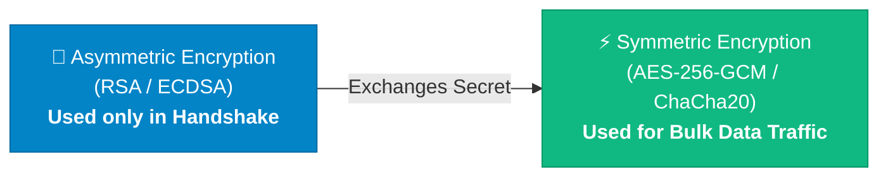
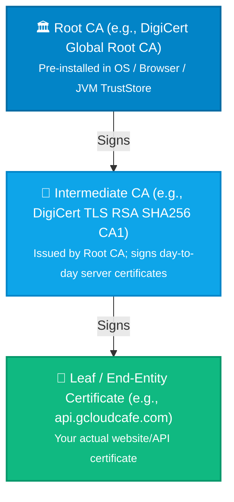
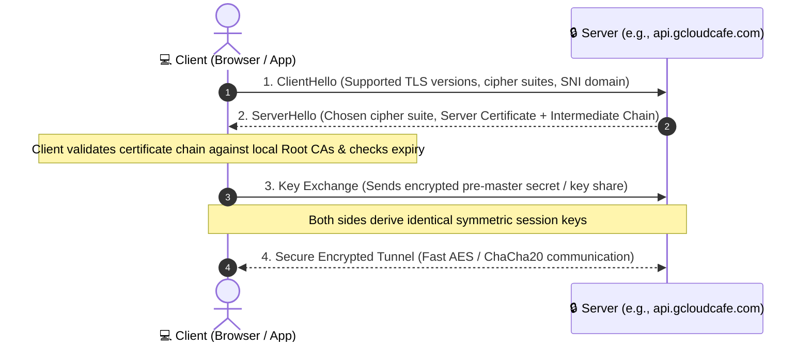
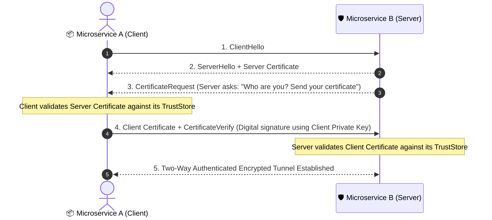

Whenever you browse the web, make a secure API call, or transfer funds online, an invisible cryptographic handshake takes place in milliseconds. 

At the center of this security architecture is **Transport Layer Security (TLS)**—and its bidirectional sibling, **Mutual TLS (mTLS)**.

While most engineers understand the high-level idea of "HTTPS encryption," the underlying mechanics—**how Public/Private keys relate to CSRs, how Certificate Authorities build chains of trust, the difference between KeyStores and TrustStores, and why mTLS certificate expirations cause silent, catastrophic outages**—remain a confusing maze of jargon.

In this guide, we build from the ground up: starting with the core concepts of TLS, progressing into Mutual TLS (mTLS), examining runtime keystores (with a focus on Java), breaking down a real-world production incident, and exploring testing and prevention strategies.

---

## 1. What is TLS? The Core Fundamentals

**TLS (Transport Layer Security)** is the industry-standard cryptographic protocol designed to provide secure communications over a computer network (like the Internet). It is the modern, secure successor to the deprecated **SSL (Secure Sockets Layer)** protocol.

TLS delivers three fundamental guarantees:

1. **Confidentiality (Encryption):** Ensures eavesdroppers cannot read traffic in transit.
2. **Integrity (Tamper Detection):** Guarantees data cannot be modified or corrupted in transit without detection.
3. **Authentication (Identity Verification):** Confirms that you are talking to the legitimate party you intended to reach (e.g., verifying `api.gcloudcafe.com` really belongs to GCloud Cafe).

---

## 2. The Cryptographic Engine: How TLS Balances Speed & Security

A common misconception is that TLS encrypts all your web traffic using public and private keys. In reality, public-key mathematics is computationally expensive. 

To achieve optimal performance, TLS uses a **hybrid cryptographic architecture**:



### 2.1. Asymmetric Cryptography (The Handshake)
- **Keys Involved:** A mathematically linked **Public Key** and **Private Key** pair.
- **Role:** The server shares its Public Key, keeping its Private Key strictly confidential. The client uses this pair to verify the server's identity and securely negotiate a temporary shared secret without anyone on the network intercepting it.

### 2.2. Symmetric Cryptography (The Data Tunnel)
- **Keys Involved:** A single, temporary **Shared Session Key**.
- **Role:** Once the handshake finishes, both parties derive the exact same session key. All subsequent application traffic (HTTP requests/responses) is encrypted and decrypted using this single key, which modern CPUs can process at multi-gigabit speeds with minimal overhead.

---

## 3. The TLS Glossary: Keys, CSRs, Certificates & CAs

To understand how certificates are created and trusted, let's break down the essential terms in order:

```
[ Private Key ] (Generated locally, kept secret)
       │
       ▼ (Extract Public Key + Metadata)
[ CSR (Certificate Signing Request) ] (Sent to Certificate Authority)
       │
       ▼ (Signed by CA)
[ Digital Certificate (X.509) ] (Installed on Server)
```

| Term | What It Is | Real-World Analogy | Is It Secret? |
| :--- | :--- | :--- | :--- |
| **Private Key** (`.key`) | The secret cryptographic key used to decrypt data and generate digital signatures. | Your physical signature & private seal | **YES.** Never share or commit. |
| **Public Key** (`.pub`) | The mathematically linked counterpart used to encrypt data and verify signatures. | Your public mailbox slot | **No** (Public) |
| **CSR** (Certificate Signing Request) | A standardized application file containing your public key and domain metadata (Organization, Common Name, SANs). | A passport application form | **No** (Sent to CA) |
| **CA** (Certificate Authority) | A trusted third-party organization that verifies your identity and signs your CSR (e.g., Let's Encrypt, DigiCert, HashiCorp Vault). | The government passport agency | Root CAs are public & pre-trusted |
| **Digital Certificate** (`.crt`, `.pem`) | An official X.509 data structure binding your public key to your verified identity, signed with the CA's private key. | An official issued Passport | **No** (Sent to clients during handshake) |
| **SAN** (Subject Alternative Name) | The specific domain names, wildcards, or IP addresses the certificate is authorized to protect (e.g., `*.gcloudcafe.com`). | Aliases listed on your ID | **No** |

### 3.1. The Chain of Trust (Root CA vs. Intermediate CA)

How does your computer trust a certificate from a website it has never seen before? Through a hierarchical **Chain of Trust**:



1. **Root CAs** are kept in ultra-secure, offline hardware security modules (HSMs). Operating systems and browsers ship with a pre-installed bundle of trusted Root CAs.
2. Root CAs delegate signing power to **Intermediate CAs**.
3. Intermediate CAs sign your **Leaf Certificate**.
4. When a client connects, the server sends its **Leaf Certificate + Intermediate CA Bundle**. The client walks up the chain until it matches a Root CA in its local store.

> **Common Pitfall:** If your server is configured without the Intermediate Certificate bundle, desktop browsers might still resolve the site (via cached certificates), but **Java, Python, Go, and backend microservices will immediately fail with `PKIX path building failed`**.

---

## 4. How Standard (One-Way) TLS Works

In Standard TLS, **the client authenticates the server**, but the server does not verify who the client is at the transport layer:



In this model, your client is completely anonymous during the TLS handshake. Authentication (like username/password or JWT tokens) only happens later inside application-layer HTTP requests.

---

## 5. Transitioning to Mutual TLS (mTLS)

While Standard TLS is great for public websites, modern enterprise systems face a different challenge: **microservices, Kubernetes pods, and banking APIs communicating across Zero-Trust networks**.

In these environments, having the client verify the server is only half the equation. **The server must also cryptographically verify the client's identity before accepting a single byte of data.**

This is **Mutual TLS (mTLS)**.



### 5.1. Why Use mTLS?
- **Zero-Trust Networking:** Eliminates reliance on network perimeter security or IP whitelisting (which can be spoofed).
- **Service Mesh Security:** Mesh platforms (Istio, Linkerd, Consul) automatically inject mTLS sidecars to encrypt and authenticate all pod-to-pod communication.
- **Financial & B2B Gateways:** Core banking and payment processors mandate mTLS so unauthorized clients cannot even establish a TCP/TLS connection.

---

## 6. KeyStores vs. TrustStores: The Application Identity Model

When configuring TLS and mTLS in application runtimes (especially in Java / Spring Boot / Quarkus), you will encounter two distinct files:

| Concept | Purpose | Analogy | What It Contains | Typical File Names |
| :--- | :--- | :--- | :--- | :--- |
| **KeyStore** | **"Who I Am"** (Identity) | Your Passport / Driver's License | • Your Private Key (`.key`)<br/>• Your Public Certificate (`.crt`) | `keystore.jks`, `keystore.p12` |
| **TrustStore** | **"Who I Trust"** (Verification) | The Border Agent's list of valid issuing countries | • Trusted Root CA Certificates<br/>• Trusted Intermediate CAs | `cacerts`, `truststore.jks`, `truststore.p12` |

### 6.1. The Java TrustStore Deep Dive
By default, any Java application making HTTPS requests verifies remote certificates against the JDK's built-in truststore:

- **Default Location:** `$JAVA_HOME/lib/security/cacerts` (or `jre/lib/security/cacerts` on older Java versions).
- **Default Master Password:** `changeit` (or `changeme` on Apple JDK).

### 6.2. Essential Java `keytool` CLI Commands

```bash
# 1. List certificates inside Java TrustStore
keytool -list -v -keystore $JAVA_HOME/lib/security/cacerts -storepass changeit

# 2. Check the expiry date of a specific CA certificate
keytool -list -v -keystore $JAVA_HOME/lib/security/cacerts -storepass changeit -alias my-company-ca

# 3. Import an internal corporate Root CA into the Java TrustStore
keytool -importcert -trustcacerts \
  -alias enterprise-root-ca \
  -file /path/to/enterprise-root-ca.crt \
  -keystore $JAVA_HOME/lib/security/cacerts \
  -storepass changeit \
  -noprompt

# 4. Convert OpenSSL PEM (Client Cert + Private Key) into PKCS12 for Java KeyStore
openssl pkcs12 -export \
  -in client-identity.crt \
  -inkey client-identity.key \
  -certfile ca-chain.crt \
  -out client-keystore.p12 \
  -name client-cert \
  -password pass:MySecretPassword
```

### 6.3. How Other Runtimes Handle TrustStores

- **Node.js:** Uses built-in Mozilla CA roots. Custom internal CAs are added via `NODE_EXTRA_CA_CERTS=/path/to/ca.pem`.
- **Python:** Uses the `certifi` package or `REQUESTS_CA_BUNDLE=/path/to/ca.pem`.
- **Go:** Reads the operating system certificate pool (`/etc/ssl/certs/ca-certificates.crt` on Linux) or uses explicit `tls.Config{RootCAs: pool}`.

---

## 7. Anatomy of a Real-World Production Incident: mTLS Expiry

To understand why this theory matters, let's analyze a real-world production post-mortem.

### The Incident
At midnight UTC, a core payment orchestration service suddenly experienced a **100% outage** on all outbound API calls to an external banking gateway.

### The Error Logs
Application logs erupted with cryptic TLS handshake failures:
```text
javax.net.ssl.SSLHandshakeException: Received fatal alert: certificate_unknown
curl: (35) error:0A000086:SSL routines::certificate verify failed:certificate has expired
```

### Why mTLS Incidents are Confusing & Dangerous
1. **No HTTP Status Codes:** Because the failure happens during Step 4 of the TLS handshake, the connection drops at Layer 4 (Transport). No HTTP 401, 403, or 500 status codes are ever returned.
2. **The Server is Healthy:** Checking the banking gateway URL in a browser returns a completely valid, green-padlock certificate!
3. **The Silent Culprit:** The **client certificate** embedded in the application's KeyStore had reached its 1-year expiration timestamp. The server rejected the client before any payload could be sent.

---

## 8. Diagnostic Toolkit: How to Inspect & Troubleshoot Certificates

When an incident strikes, use these tools to isolate the exact point of failure:

### 8.1. Web-Based Inspection Tools
- **[SSL Shopper SSL Checker](https://www.sslshopper.com/ssl-checker.html):** Quickly validates whether a public endpoint is correctly serving its intermediate certificate chain and highlights expiration countdowns.
- **[Qualys SSL Labs](https://www.ssllabs.com/ssltest/):** Comprehensive audit tool analyzing cipher suites, protocol versions (TLS 1.2 vs 1.3), and revocation mechanisms.
- **[BadSSL.com](https://badssl.com):** An invaluable testing sandbox maintained by Chromium to test how your client applications handle expired, wrong-host, self-signed, and untrusted root certificates.

### 8.2. OpenSSL Command-Line Power Commands

```bash
# 1. Inspect full remote certificate chain and expiry date
openssl s_client -connect api.gcloudcafe.com:443 -servername api.gcloudcafe.com -showcerts

# 2. Simulate an mTLS connection from the CLI
openssl s_client -connect secure-api.internal:8443 \
  -cert client.crt \
  -key client.key \
  -CAfile ca-chain.crt

# 3. Read the exact validity dates of a local certificate
openssl x509 -in cert.pem -noout -dates -subject -issuer

# 4. Verify that a Private Key matches a Certificate (Their MD5 checksums must match)
openssl x509 -noout -modulus -in cert.crt | openssl md5
openssl rsa -noout -modulus -in private.key | openssl md5
```

---

## 9. Proactive Monitoring: Preventing Certificate Outages

Certificate expirations are **100% predictable**. You know the exact second a certificate will expire the moment it is generated.

### 1. Prometheus Blackbox Exporter
Set up alerts that notify your team well before expiration:
```yaml
- alert: TlsCertificateExpiringSoon
  expr: (probe_ssl_earliest_cert_expiry - time()) / 86400 < 30
  for: 15m
  labels:
    severity: warning
  annotations:
    summary: "Certificate on {{ $labels.instance }} expires in less than 30 days"
```

### 2. Kubernetes `cert-manager`
In Kubernetes, automate certificate lifecycles using `cert-manager`. It connects to Let's Encrypt or HashiCorp Vault to automatically renew and reload certificates 30 days before expiration without manual intervention.

### 3. Automated Shell Expiry Scanner
```bash
#!/usr/bin/env bash
ENDPOINT="api.gcloudcafe.com:443"
EXPIRY_DATE=$(openssl s_client -connect ${ENDPOINT} -servername ${ENDPOINT%:*} </dev/null 2>/dev/null | openssl x509 -noout -enddate | cut -d= -f2)
EXPIRY_EPOCH=$(date -d "${EXPIRY_DATE}" +%s)
DAYS_LEFT=$(( (EXPIRY_EPOCH - $(date +%s)) / 86400 ))

echo "Endpoint: ${ENDPOINT} | Days Left: ${DAYS_LEFT}"
if [ ${DAYS_LEFT} -lt 30 ]; then
  echo "CRITICAL: Certificate for ${ENDPOINT} expires in ${DAYS_LEFT} days!"
  exit 1
fi
```

---

## Summary Cheat Sheet

| Question | Answer |
| :--- | :--- |
| **What is the difference between TLS and mTLS?** | Standard TLS validates the server identity; mTLS validates **both** server and client identities. |
| **What is a CSR?** | A Certificate Signing Request containing your Public Key + Domain Metadata. It **never** contains your Private Key. |
| **Why does a Java client fail with `PKIX path building failed`?** | The server is not sending intermediate certificates, or the Java TrustStore (`cacerts`) lacks the Root CA. |
| **What is a KeyStore vs TrustStore?** | **KeyStore** holds your identity (Private Key + Certificate). **TrustStore** holds trusted CAs. |
| **Where is the default Java TrustStore located?** | `$JAVA_HOME/lib/security/cacerts` (Default password: `changeit`). |
| **How can I test an mTLS endpoint locally?** | `openssl s_client -connect host:port -cert client.crt -key client.key -CAfile ca.crt`. |

By understanding each building block—from public/private keys and CSRs to CA chains, keystores, and proactive monitoring—you can architect robust, zero-trust systems and eliminate certificate-related downtime across your infrastructure.
