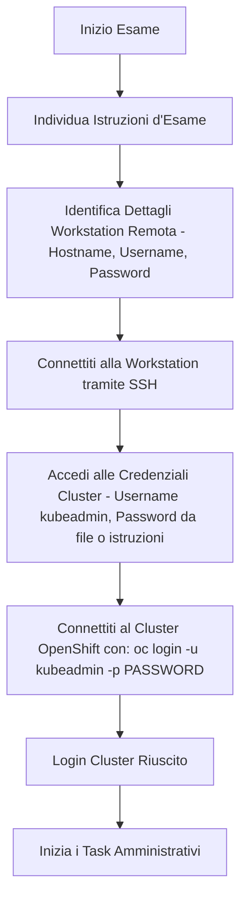

Benvenuti alla prima parte della mia mini-serie **EX280 – Suggerimenti e Trucchi per l'Amministratore OpenShift**!  
In questa serie condividerò articoli brevi e mirati per aiutarti ad affinare le tue competenze di amministrazione OpenShift: il tipo di consigli pratici che rendono più scorrevoli sia l'**esame EX280** sia il **lavoro quotidiano sul cluster**.

L'obiettivo di questo articolo è aiutarti a completare entrambi questi compiti — connettersi al cluster e configurare l'identity provider HTPasswd — in meno di 20 minuti. Se riesci a farlo, hai già vinto metà della battaglia. Padroneggiare questi elementi fondamentali all'inizio ti farà risparmiare tempo prezioso durante l'esame, consentendoti di concentrarti su attività più complesse con serenità.

Questa efficienza si ottiene solo con una pratica costante. Esegui la configurazione di HTPasswd più volte finché non diventa una seconda natura. In effetti, ti consiglio vivamente di rivedere ed esercitarti su questo compito specifico la mattina dell'esame: è una di quelle procedure che premiano la memoria muscolare e la precisione.

---

## 🌐 Connessione al Cluster: comprendere le istruzioni dell'ambiente

Prima di configurare qualsiasi elemento in OpenShift, assicurati di poterti **connettere in modo affidabile al cluster** — è la base di ogni attività amministrativa.  
Sia che tu stia utilizzando la **web console** o la **CLI `oc`**, inizia sempre verificando che la sessione e il contesto siano corretti.

### 🔗 Connessione alla Workstation Remota

Quando inizi l'**esame EX280**, il cluster OpenShift non è accessibile direttamente dalla tua macchina host.  
L'accesso viene fornito tramite un **server workstation remoto**, come descritto nelle istruzioni dell'esame.

Per connetterti correttamente, avrai bisogno dei seguenti dettagli:

1. **Hostname della workstation remota**  
2. **Username della workstation**  
3. **Password della workstation**

Tipicamente, sia l'hostname sia l'username sono chiaramente indicati nei dettagli dell'ambiente di esame.  
La password, tuttavia, a volte può creare confusione — nella maggior parte dei casi:

- Una password specifica sarà indicata direttamente nelle istruzioni, oppure  
- Ti verrà richiesto di utilizzare una **password generica** fornita altrove nella documentazione dell'esame.

Leggi attentamente queste istruzioni per evitare problemi di accesso: è una trappola iniziale comune per i candidati alla prima esperienza.

Una volta ottenute tutte le credenziali necessarie, connettiti alla workstation tramite SSH:

```bash
ssh username@workstation-hostname
```

### 🌐 Connessione al Cluster OpenShift

Dopo esserti connesso alla workstation remota, il passo successivo è accedere al tuo **cluster OpenShift**.  
Per farlo, avrai bisogno di credenziali di accesso al cluster valide — in particolare un **username** e una **password**.

Nella maggior parte degli ambienti di esame EX280:

- L'**username** è tipicamente `kubeadmin`.  
- La **password** è fornita nelle istruzioni dell'esame. A volte è mostrata direttamente, altre volte può trovarsi in un file di testo sulla workstation remota.

Se la password è memorizzata in un file, puoi visualizzarla usando:

```bash
cat <filename>
```

Una volta ottenute le credenziali, connettiti al cluster con il seguente comando:

```bash
oc login -u kubeadmin -p <password>
```

Quindi esegui:

```bash
oc whoami --show-console
```

Ottieni l'URL della console web, accedi tramite browser e inizia ad affrontare i task assegnati.



---

## 🔐 Configurazione dell'Identity Provider HTPasswd

Uno dei primi compiti che ogni amministratore OpenShift deve padroneggiare è la configurazione di un **identity provider HTPasswd** — un sistema di autenticazione leggero basato su file, essenziale per l'esame e pratico negli ambienti di laboratorio. Può essere configurato facilmente seguendo i passaggi sottostanti:

### 🧩 Passo 1: Creare il File HTPasswd
Usa il comando `htpasswd` per creare un nuovo file utente. Il flag `-B` garantisce la crittografia sicura bcrypt (obbligatoria nelle versioni moderne di OpenShift).

```bash
htpasswd -c -B -b users.htpasswd admin redhat123 # Comando con flag -c per creare il file
htpasswd -B -b users.htpasswd user user123       # Comando per aggiornare il file esistente
```

### 🧩 Passo 2: Creare il Secret
Salva questo file come Secret nel namespace `openshift-config` in modo che OpenShift possa accedervi.

```bash
oc create secret generic htpass-secret --from-file=htpasswd=users.htpasswd -n openshift-config
```

### 🧩 Passo 3: Modificare la Configurazione OAuth
Ora integra il secret nella configurazione OAuth del cluster.

Tramite CLI:
```bash
oc edit oauth cluster
```

Tramite Console Web:
```text
Administration -> Cluster Settings -> Configuration -> OAuth
Identity providers -> Add -> HTPasswd
```

Aggiungi il blocco del provider nella specifica:
```yaml
- htpasswd:
    fileData:
      name: htpass-secret
  mappingMethod: claim
  name: Ex280-htpasswd
  type: HTPasswd
```

### 🧩 Passo 4: Verificare il Login
Una volta configurato, puoi verificare il riavvio dei pod di autenticazione:

```bash
watch oc get pods -n openshift-authentication
```

Non appena i pod tornano nello stato `Running`, testa il login con gli utenti creati e le rispettive password.

---

## 💡 Suggerimenti per il Mondo Reale

- Esegui sempre un **backup** del file `htpasswd` e mantienilo sotto controllo versione.  
- Evita di sovrascrivere secret esistenti — usa prima `oc get secret -n openshift-config` per verificare.  
- Dopo la configurazione, **testa il login** sia da CLI che da web console.   
- Negli ambienti aziendali di produzione si preferisce l'**autenticazione centralizzata** (LDAP, OIDC, SSO) — ma `htpasswd` è perfetto per lab ed esami.

---

## 🚀 Conclusioni

Questo è tutto per la Parte 1 di questa mini-serie! Ora sai come connetterti con sicurezza al cluster e configurare uno dei meccanismi di autenticazione fondamentali: il provider HTPasswd.

Nella **Parte 2** esploreremo le **Network Policies**: come comprenderle, crearle ed effettuarne il debug in modo efficace.

Buono studio e buona amministrazione! 🎓
