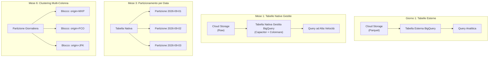
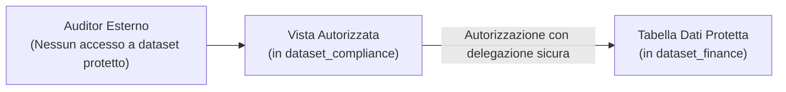

# Data Engineering su GCP: I Blocchi Costruttivi di Storage e Accesso Spiegati Chiaramente

Quando gli ingegneri del software costruiscono un'applicazione transazionale, il successo ha una definizione molto chiara:
L'API riceve una richiesta, addebita una carta di credito, prenota un posto in un database operativo, invia un'email di conferma in formato PDF al cliente e genera una ricevuta contabile. Codice di stato HTTP: `200 OK`. Latenza: 42 millisecondi. Gli sviluppatori festeggiano: il lavoro è terminato.

Poi arriva il lunedì mattina.

Il CEO e il responsabile finanziario entrano nella stanza ponendo tre domande apparentemente semplici:
- *Quali rotte aeree hanno generato il margine di profitto più elevato durante il fine settimana?*
- *Si sono verificate autorizzazioni di pagamento fallite silenziosamente dopo che i posti erano stati bloccati?*
- *Quali aeroporti registrano un picco anomalo di cancellazioni rispetto allo stesso periodo dell'anno scorso?*

Improvvisamente, il database di produzione è inutilizzabile per questo scopo. Eseguire pesanti query di aggregazione su milioni di record blocca le transazioni attive dei clienti, satura i pool di connessione e rischia di far collassare l'intero motore di prenotazione. Il sistema transazionale ottimizzato per processare un singolo acquisto in millisecondi è del tutto inadeguato a spiegare cosa stia accadendo complessivamente al business.

**È esattamente a questo punto di rottura che nasce il Data Engineering.**

Non inizia con un intimidatorio diagramma architetturale infarcito di venti icone di Google Cloud. Inizia quando un'azienda supera la capacità del proprio database transazionale e deve rispondere a interrogazioni analitiche complesse senza compromettere l'operatività di produzione.

Per capire come questi blocchi costruttivi si incastrino nella realtà, seguiamo l'evoluzione di **Offvia**, una piattaforma di prenotazione voli regionali. Ciascun componente dell'architettura non è nato da un disegno teorico astratto, ma come risposta diretta a un problema operativo concreto: da una dashboard lenta a una fattura cloud fuori controllo, fino a un disallineamento contabile e a una corruzione accidentale nel cuore della notte.

---



---

## 1. Giorno 1: Perché i File Evento in Cloud Storage? (Tabelle Esterne)

All'avvio delle attività, gli ingegneri di Offvia sapevano di non poter eseguire query analitiche direttamente sul database PostgreSQL di produzione.  
La prima decisione architetturale consistette nel fare in modo che il servizio di prenotazione esportasse ogni evento di prenotazione completato come file immutabile in formato **Apache Parquet** all'interno di un bucket **Google Cloud Storage (GCS)**:

```text
gs://offvia-raw-events/bookings/dt=2026-09-01/part-001.parquet
gs://offvia-raw-events/bookings/dt=2026-09-01/part-002.parquet
```

### Perché Non Eseguire il SQL sul Database Operativo?
I database relazionali operativi (come PostgreSQL o MySQL) sono orientati alle righe (**OLTP**). Sono ottimizzati per inserire, aggiornare e bloccare singole tuple con garanzie ACID.  
Al contrario, i carichi analitici (**OLAP**) necessitano di scansionare miliardi di righe aggregando solo 3 o 4 colonne (es. `SUM(fare_amount)`, `AVG(seat_price)`). Eseguire queste query su OLTP esaurisce la memoria buffer, impone lock sulle tabelle e degrada la User Experience dei clienti che stanno acquistando un biglietto sul sito.

### Perché Cloud Storage e Parquet?
- **Cloud Storage** offre una durabilità dell'11 volte 9 (99.999999999%) con costi di archiviazione minimi ($0.02 per GB/mese in Standard Storage).
- **Apache Parquet** è un formato colonnare binario compresso con compressione Snappy/ZSTD e statistiche integrate (min/max per row-group).

### La Soluzione Iniziale: Tabelle Esterne di BigQuery
Per consentire agli analisti di interrogare i file senza dover orchestrare pipeline di caricamento, Offvia ha creato una **Tabella Esterna BigQuery** puntando direttamente al bucket Cloud Storage:

```sql
CREATE OR REPLACE EXTERNAL TABLE `offvia_dw.ext_bookings`
OPTIONS (
  format = 'PARQUET',
  uris = ['gs://offvia-raw-events/bookings/*.parquet']
);
```

```sql
SELECT 
  origin_airport, 
  destination_airport, 
  COUNT(1) AS total_flights,
  SUM(total_amount_usd) AS total_revenue
FROM `offvia_dw.ext_bookings`
WHERE booking_status = 'CONFIRMED'
GROUP BY 1, 2
ORDER BY total_revenue DESC;
```

Funziona all'istante: nessun job di caricamento da gestire, nessun server da manutenere. Gli analisti hanno iniziato subito a estrarre metriche.

---

## 2. Mese 1: Il Caricamento di 45 Secondi della Dashboard (Tabelle Native Gestite)

Quattro settimane dopo, il volume di Offvia è cresciuto a 2.500 file Parquet al giorno. La dashboard esecutiva di Looker Studio è diventata frustrantemente lenta: ogni aggiornamento impiegava **45 secondi**.

### Perché la Tabella Esterna si è Dimostrata Inadeguata
1. **Latenza di List degli Oggetti:** BigQuery doveva effettuare chiamate all'API di Cloud Storage per enumerare migliaia di prefissi di oggetti prima di iniziare a leggere i dati.
2. **Attraversamento della Rete:** I dati dovevano viaggiare dalla rete di Cloud Storage ai compute slot di BigQuery tramite lo strato di rete Jupiter.
3. **Mancanza di Statistiche Ottimizzate:** BigQuery non poteva sfruttare appieno l'architettura di indicizzazione interna Capacitor.

### La Soluzione: Tabelle Native Gestite di BigQuery
Offvia è passata alle **Tabelle Native Gestite di BigQuery**. Invece di interrogare file sparsi in Cloud Storage, i dati vengono caricati nello storage gestito di BigQuery:

```sql
CREATE OR REPLACE TABLE `offvia_dw.bookings_managed` AS
SELECT * FROM `offvia_dw.ext_bookings`;
```

Nello storage nativo di BigQuery:
- I dati sono memorizzati nel formato proprietario ultra-ottimizzato **Capacitor**
- I metadati delle colonne e i range min/max sono indicizzati a livello di slot
- La separazione tra storage (Colossus) e compute (Borg) sfrutta una banda di rete terabit con shuffle in memoria

**Risultato Operativo:** La query della dashboard è passata da 45 secondi a **1,8 secondi**.

---

## 3. Mese 3: La Query Giornaliera che Scansionava Due Anni (Partizionamento per Data)

Al terzo mese la piattaforma contava centinaia di milioni di prenotazioni storiche accumulate. Un analista ha eseguito una query per verificare le vendite di ieri:

```sql
SELECT SUM(total_amount_usd)
FROM `offvia_dw.bookings_managed`
WHERE booking_date = '2026-09-25';
```

BigQuery ha completato la query in 2 secondi, ma il conteggio dei byte scansionati ha mostrato: **Scansionati 480 GB** per estrarre 200 MB di vendite giornaliere!  
Poiché BigQuery on-demand fattura $6.25 per TB scansionato, eseguire query del genere 100 volte al giorno ha fatto lievitare la fattura cloud senza motivo.

### Perché la Tabella Non Partizionata Spreca Risorse
In una tabella colonnare convenzionale priva di partizioni, BigQuery deve leggere l'intera colonna `booking_date` su tutti i record per verificare quali corrispondano al valore `2026-09-25`.

### La Soluzione: Partizionamento per Data
Offvia ha ricreato la tabella partizionandola sulla colonna temporale `booking_date`:

```sql
CREATE OR REPLACE TABLE `offvia_dw.bookings_partitioned`
PARTITION BY DATE(booking_timestamp)
OPTIONS (
  require_partition_filter = true
) AS
SELECT * FROM `offvia_dw.bookings_managed`;
```

Con il partizionamento:
- BigQuery memorizza i blocchi fisici di dati suddivisi in "cassetti" per singola data.
- Quando la query include `WHERE booking_timestamp >= '2026-09-25 00:00:00'`, il query engine applica il **Partition Pruning**: apre solo il cassetto del 25 settembre e ignora totalmente tutti i 730 giorni precedenti.
- **Dati scansionati:** passati da 480 GB a **420 MB** (riduzione del 99,9%).

### Il Guardrail di Produzione: `require_partition_filter = true`
Impostando l'opzione `require_partition_filter = true`, BigQuery rifiuta categoricamente qualsiasi query che non includa un filtro esplicito sulla colonna di partizione nella clausola `WHERE`. Questo impedisce a script non ottimizzati o utenti inesperti di lanciare scansioni integrali accidentali.

---

## 4. Mese 6: Pruning all'Interno dei Cassetti Temporali (Clustering Multi-Colonna)

Entrati nel sesto mese, ogni singola partizione giornaliera conteneva oltre 15 milioni di righe di voli globali. La query giornaliera per il monitoraggio della rotta Milano Malpensa - Roma Fiumicino scansionava comunque l'intera giornata:

```sql
SELECT flight_number, COUNT(1)
FROM `offvia_dw.bookings_partitioned`
WHERE DATE(booking_timestamp) = '2026-09-25'
  AND origin_airport = 'MXP'
  AND destination_airport = 'FCO'
GROUP BY 1;
```

Anche se il partizionamento isolava la singola giornata, all'interno di quella data BigQuery doveva comunque scansionare tutti i voli per tutti gli aeroporti del mondo.

### La Soluzione: Clustering Multi-Colonna
Offvia ha applicato il **Clustering** ordinando fisicamente i record all'interno di ciascuna partizione in base alle colonne più frequentemente utilizzate nei filtri e nei raggruppamenti:

```sql
CREATE OR REPLACE TABLE `offvia_dw.bookings_clustered`
PARTITION BY DATE(booking_timestamp)
CLUSTER BY origin_airport, destination_airport, booking_status
OPTIONS (
  require_partition_filter = true
) AS
SELECT * FROM `offvia_dw.bookings_partitioned`;
```

### Come Funziona il Clustering
All'interno di ciascuna partizione giornaliera, BigQuery raggruppa le righe in blocchi fisici ordinati per `origin_airport`, poi `destination_airport`, poi `booking_status`.  
Quando viene eseguita la query con `origin_airport = 'MXP'`, il motore esamina l'indice min/max dei blocchi ed evita di leggere i blocchi contenenti aeroporti differenti (come JFK, LHR, HND).

### Importanza dell'Ordine delle Colonne nel Clustering
L'ordine specificato nella clausola `CLUSTER BY` è fondamentale:
1. `origin_airport` (alta cardinalità, primario)
2. `destination_airport` (alta cardinalità, secondario)
3. `booking_status` (bassa cardinalità, filtro di stato)

Filtrare per `origin_airport` o per `origin_airport AND destination_airport` sfrutta il pruning al massimo.

---

## 5. Mese 9: La Prenotazione Arrivata con un Giorno di Ritardo (Modellazione a Doppio Timestamp)

Al nono mese si è verificato un disallineamento contabile critico:
Un passeggero ha effettuato una prenotazione su un volo transatlantico alle 23:58 del 2 settembre. A causa di una coda di riconciliazione del gateway di pagamento, l'evento è stato confermato e ingerito nel Data Warehouse alle 00:05 del 3 settembre.

La pipeline batch incrementale girava ogni notte con la logica:
```sql
WHERE DATE(booking_timestamp) = CURRENT_DATE() - 1
```
Risultato:
- Il report finanziario del 2 settembre era già stato chiuso.
- Il report del 3 settembre ha ignorato la prenotazione perché il suo `booking_timestamp` indicava il 2 settembre.
- **La transazione è svanita dai bilanci analitici.**

### La Soluzione: Modellazione a Doppio Timestamp
Per garantire sia la correttezza del bilancio storico sia l'idempotenza delle pipeline ETL/ELT incrementali, l'architettura è stata aggiornata per tracciare due timestamp distinti:

1. **Event Time (`booking_timestamp`):** Quando l'utente ha effettivamente cliccato e prenotato il volo nel mondo reale.
2. **Ingestion Time (`ingested_at`):** Quando il record è stato effettivamente scritto e reso visibile nel Data Warehouse.

```sql
CREATE OR REPLACE TABLE `offvia_dw.bookings_dual_timestamp` (
  booking_id STRING,
  customer_id STRING,
  flight_number STRING,
  origin_airport STRING,
  destination_airport STRING,
  fare_amount NUMERIC,
  booking_timestamp TIMESTAMP, -- Event Time
  ingested_at TIMESTAMP        -- Ingestion Time
)
PARTITION BY DATE(ingested_at)
CLUSTER BY origin_airport, destination_airport;
```

### Regole Operative di Utilizzo
- **I Report Finanziari e di Business** filtrano sempre su **Event Time** (`booking_timestamp`), per rispecchiare fedelmente l'andamento delle vendite.
- **Le Pipeline Dati Incrementali (dbt, Dataform, Cloud Run)** filtrano sempre su **Ingestion Time** (`ingested_at`), garantendo che nessun record in ritardo venga saltato.

---

## 6. Mese 12: La Tempesta Esecutiva del Lunedì alle 9:00 (Viste Materializzate)

Al dodicesimo mese, ogni lunedì mattina alle 9:00 accadeva la stessa cosa: decine di manager, dirigenti regionali e team operativi aprivano contemporaneamente la dashboard di riepilogo commerciale.  
Ciascuna dashboard eseguiva query con `SUM`, `COUNT(DISTINCT)` e raggruppamenti su decine di milioni di righe.

I compute slot allocati a BigQuery andavano in saturazione, le code di scheduling superavano i 25 secondi e i costi orari salivano drasticamente.

### La Soluzione: Viste Materializzate con Smart Tuning
Invece di ricalcolare le aggregazioni da zero a ogni visualizzazione o dipendere da rigide tabelle batch notturne che rischiavano di mostrare dati stantii, Offvia ha implementato una **Materialized View** in BigQuery:

```sql
CREATE MATERIALIZED VIEW `offvia_dw.mv_daily_airport_metrics`
OPTIONS (
  enable_refresh = true,
  refresh_interval_minutes = 30
) AS
SELECT
  DATE(booking_timestamp) AS flight_date,
  origin_airport,
  destination_airport,
  COUNT(1) AS total_bookings,
  SUM(fare_amount) AS total_revenue,
  AVG(fare_amount) AS avg_fare
FROM `offvia_dw.bookings_dual_timestamp`
GROUP BY 1, 2, 3;
```

### I Vantaggi Chiave delle Viste Materializzate
1. **Smart Query Rewrite:** Anche se un utente scrive una query puntando alla tabella di base `bookings_dual_timestamp`, l'ottimizzatore di BigQuery intercetta la richiesta e la devia automaticamente sulla vista materializzata pre-calcolata senza richiedere modifiche al codice SQL client.
2. **Aggiornamento Incrementale:** Quando nuovi dati vengono inseriti nella tabella di base, BigQuery aggiorna solo il delta all'interno della vista materializzata.
3. **Consumo di Slot Quasi Nullo:** La dashboard risponde in **180 millisecondi** leggendo poche migliaia di righe aggregate invece di decine di milioni di record grezzi.

---

## 7. Mese 15: La Corruzione dell'Intera Tabella di Domenica alle 2:15 (Time Travel e Snapshot)

Domenica notte alle 2:15, durante una manutenzione automatizzata, uno script Python privo della clausola `WHERE` corretta ha eseguito un `UPDATE` massivo sovrascrivendo l'intero campo `booking_status` con il valore `'CANCELLED'` su oltre 40 milioni di righe di produzione.

Negli ambienti tradizionali, un simile disastro avrebbe comportato ore di downtime, il ripristino di backup da nastri o dump pesanti e la perdita di tutte le transazioni avvenute nelle ore successive.

### La Soluzione: BigQuery Time Travel e Table Snapshot
Grazie alla funzionalità nativa di **Time Travel**, BigQuery conserva automaticamente la cronologia delle modifiche per un periodo configurabile (da 2 a 7 giorni).

### Runbook di Ripristino Immediato in Produzione

#### Passo 1: Rimozione Temporanea del Vincolo di Partizione
```sql
ALTER TABLE `offvia_dw.bookings_dual_timestamp`
SET OPTIONS (require_partition_filter = false);
```

#### Passo 2: Estrazione dello Stato Storico a 15 Minuti Prima dell'Incidente
```sql
CREATE OR REPLACE TABLE `offvia_dw.bookings_recovered` AS
SELECT * 
FROM `offvia_dw.bookings_dual_timestamp`
FOR SYSTEM_TIME AS OF TIMESTAMP_SUB(CURRENT_TIMESTAMP(), INTERVAL 30 MINUTE);
```

#### Passo 3: Verifica e Controllo delle Transazioni Intermedie
```sql
SELECT booking_status, COUNT(1)
FROM `offvia_dw.bookings_recovered`
GROUP BY 1;
```

#### Passo 4: Cutover e Congelamento dello Snapshot Immutabile
```sql
CREATE SNAPSHOT TABLE `offvia_dw.snapshot_bookings_safe_checkpoint`
CLONE `offvia_dw.bookings_recovered`
OPTIONS (
  expiration_timestamp = TIMESTAMP_ADD(CURRENT_TIMESTAMP(), INTERVAL 14 DAY)
);
```

I **Table Snapshot** sono cloni istantanei con storage copy-on-write a costo zero finché i dati non divergono, ideali per salvaguardare checkpoint critici prima di rilasci rischiosi.  
In meno di 10 minuti, la tabella di produzione è stata ripristinata allo stato corretto con **zero perdite di dati**.

---

## 8. Mese 18: L'Audit Normativo dell'Aviazione Civile (Viste Autorizzate)

Al diciottesimo mese, l'autorità di regolamentazione dell'aviazione civile (ENAC / FAA) ha richiesto l'accesso di verifica per monitorare la puntualità e i tassi di riempimento dei voli.  
Tuttavia, le normative sulla privacy (GDPR) vietano severamente di esporre all'ente esterno i codici identificativi dei clienti, i numeri di carta di credito e i dettagli sensibili dei passeggeri presenti nella tabella principale `bookings`.

Se concedi all'ispettore il ruolo `roles/bigquery.dataViewer` sulla tabella `bookings`, potrà visualizzare anche i dati sensibili. Se rimuovi i permessi, non potrà eseguire alcuna query.

### La Soluzione: Viste Autorizzate (Authorized Views) di BigQuery
Una **Authorized View** consente di condividere i risultati aggregati o mascherati di una query con utenti o gruppi specifici **senza concedere loro alcun accesso diretto alle tabelle sottostanti**.



### Implementazione in 2 Passaggi:

#### Passo 1: Creare la Vista nel Dataset di Compliance
```sql
CREATE OR REPLACE VIEW `offvia_compliance.authorized_flight_metrics` AS
SELECT
  flight_number,
  origin_airport,
  destination_airport,
  DATE(booking_timestamp) AS departure_date,
  COUNT(1) AS passenger_count
FROM `offvia_finance.bookings_dual_timestamp`
GROUP BY 1, 2, 3, 4;
```

#### Passo 2: Autorizzare la Vista ad Accedere al Dataset Finanziario
Nella console di BigQuery (o via Terraform / `bq update`):
1. Apri i permessi del dataset protetto `offvia_finance`.
2. Seleziona **Authorized Views**.
3. Aggiungi la vista `offvia_compliance.authorized_flight_metrics`.

A questo punto assegni all'ispettore solo il permesso di lettura sul dataset `offvia_compliance`. L'ispettore può interrogare la vista senza poter mai visualizzare le colonne PII o la tabella grezza originale.

---

## Quadro Decisionale: Quando Usare Ciascun Blocco

| Esigenza Architetturale | Soluzione Raccomandata | Motivazione |
|---|---|---|
| **Dati non strutturati / Cold Storage economico** | **Cloud Storage (GCS)** | Durabilità 11 9, costi bassissimi, formato Parquet aperto |
| **Ingestion rapida ed esplorazione ad-hoc** | **Tabelle Esterne BigQuery** | Zero pipeline da creare, query immediate sui file |
| **Analitica interattiva ad alte prestazioni** | **Tabelle Native Gestite BigQuery** | Storage colonnare Capacitor, cache in memoria, latenza sub-secondo |
| **Ottimizzazione costi su tabelle temporali** | **Partizionamento per Data** | Riduzione fino al 99% dei byte scansionati, Partition Pruning |
| **Filtri frequenti su colonne ad alta cardinalità** | **Clustering Multi-Colonna** | Ordinamento fisico dei blocchi, riduzione drastica delle letture |
| **Accuratezza finanziaria e pipeline affidabili** | **Doppio Timestamp (Event vs Ingestion)** | Riconciliazione corretta dei dati arrivati in ritardo |
| **Dashboard frequenti e query ripetitive pesanti** | **Viste Materializzate (MV)** | Pre-aggregazione incrementale automatica, Smart Query Rewrite |
| **Ripristino da errori umani e rollback rapidi** | **Time Travel e Table Snapshot** | Recupero istantaneo senza ripristino di backup lenti, storage copy-on-write |
| **Condivisione sicura e conformità privacy / GDPR** | **Viste Autorizzate** | Accesso selettivo senza delegare la lettura delle tabelle sensibili |

---

## Conclusioni

Costruire un'architettura di dati su Google Cloud non significa accumulare tutti i servizi del catalogo fin dal primo giorno: significa comprendere la funzione specifica di ciascun blocco costruttivo e integrarlo nel momento in cui il business o l'infrastruttura lo richiedono.

Adottando questo approccio incrementale, il Data Warehouse di Offvia ha scalato da pochi megabyte di file sparsi su Cloud Storage a una piattaforma enterprise capace di elaborare miliardi di record con tempi di risposta di pochi secondi, costi prevedibili e conformità normativa garantita. ☁️🚀
