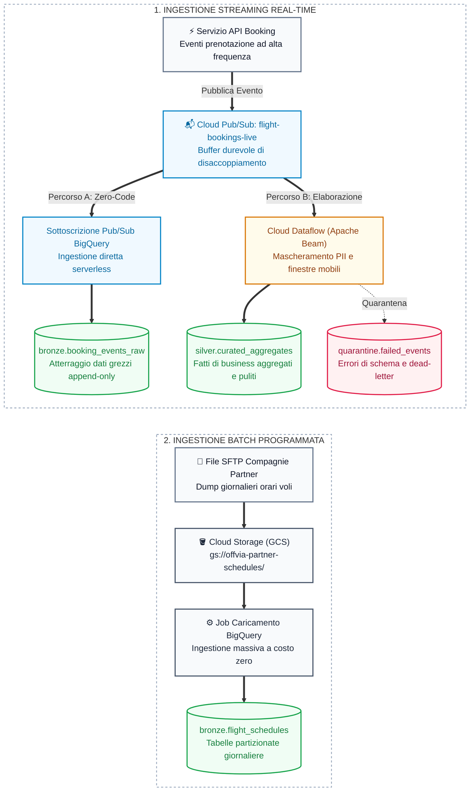

Nella [Parte 1](/it/blog/gcp-data-engineering-storage-building-blocks/), abbiamo progettato le fondamenta di storage analitico per Offvia. Nella [Parte 2](/it/blog/gcp-data-engineering-hands-on-storage-pipeline-lab/), le abbiamo realizzate concretamente con Cloud Storage, BigLake e BigQuery.

Ora arriviamo al capitolo che stabilisce se la tua piattaforma resterà serena durante un picco di traffico o genererà un incidente Sev-1 nel cuore della notte: **come devono arrivare esattamente i dati dentro BigQuery?**

Immagina questo scenario: sono le 2:15 del mattino durante i saldi estivi lampo di Offvia. Il servizio di prenotazione sta gestendo un picco violento di ricerche, blocchi dei posti e pagamenti. Il percorso critico di checkout sta scalando normalmente. Ma all'improvviso, i thread dell'applicazione si bloccano e le transazioni iniziano a fallire.

Perché? Perché qualcuno ha collegato il servizio di checkout a invocare in modo sincrono il vecchio endpoint di streaming di BigQuery per le metriche analitiche. BigQuery ha avuto una minima esitazione temporanea, i retry si sono accumulati e, all'improvviso, una dipendenza analitica non critica stava bloccando il flusso di pagamento dei clienti.

Il problema non era che BigQuery fosse lento. Il problema è che abbiamo violato un principio ingegneristico cardine:

> **L'unico compito di un produttore è pubblicare un evento il più rapidamente possibile.** Una pipeline di ingestion separata e disaccoppiata deve assorbire, validare, trasformare e persistere quell'evento al proprio ritmo.

Per Offvia, questo significa scegliere consapevolmente tra quattro strumenti: Pub/Sub, le subscription dirette di Pub/Sub su BigQuery, Dataflow e la BigQuery Storage Write API. Si sovrappongono in parte, ma non sono intercambiabili.

## Il Modello Mentale

Pensa al sistema di gestione bagagli di un aeroporto:

- **Pub/Sub è il nastro trasportatore.** Il banco di check-in vi appoggia sopra una valigia e si gira subito per servire il passeggero successivo. Il nastro garantisce un buffer altamente resistente tra chi produce e chi consuma.
- **Dataflow è l'impianto di smistamento.** Ispeziona la valigia, la indirizza al volo giusto, isola i bagagli senza etichetta e li raggruppa. È qui che risiede la logica complessa basata sull'event-time.
- **La Storage Write API è il portellone di carico della stiva.** È il protocollo ad alta efficienza utilizzato per caricare fisicamente i container sull'aereo (BigQuery). Non è un motore generico di elaborazione streaming.
- **BigQuery è il magazzino di destinazione.** È dove gli eventi grezzi, le tabelle curate e gli aggregati diventano effettivamente utili per il reporting.

**Il punto chiave:** Una subscription BigQuery di Pub/Sub usa già la Storage Write API sotto il cofano. Non hai bisogno di creare un microservizio custom solo per questo. Allo stesso modo, una pipeline Dataflow scrive direttamente in BigQuery utilizzando un sink nativo.

## Scegli il Percorso Più Piccolo ed Efficace

Parti dal requisito di business, non dal nome del prodotto cloud più appariscente. Evita la sovra-ingegnerizzazione.

| Esigenza di Business | Miglior Punto di Partenza | Perché Funziona |
|---|---|---|
| Riversare eventi grezzi validati a zero manutenzione | **Subscription Pub/Sub su BigQuery** | Esportazione serverless diretta da un topic a una tabella BQ. Perfetta per il layer Bronze grezzo. |
| Arricchimento dati, rimozione PII, finestre o routing complesso | **Dataflow / Apache Beam** | Fornisce stato, timer, finestre su event-time e scala senza sforzo. |
| Applicazione custom che scrive direttamente a bassa latenza | **BigQuery Storage Write API** | Connessioni gRPC persistenti, batching efficiente e controllo semantico exactly-once. |
| Caricamenti massivi di file, backfill o dati storici | **Cloud Storage + Job di Caricamento BigQuery** | Economico, semplice e pressoché impossibile da rompere quando la latenza batch è accettabile. |

Per Offvia, un'architettura realistica e collaudata in produzione si presenta così:



Usa il ramo della subscription BigQuery per archiviare in sicurezza l'evento grezzo originale. Usa il ramo Dataflow *solo* quando c'è un'elaborazione reale da compiere: mascheramento dei dati delle carte di credito, aggregazioni a finestra o arricchimento dei payload. **Non avviare Dataflow solo perché i dati arrivano in streaming.**

## La Consegna Non Equivale alla Deduplicazione

Questa confusione rovina più dashboard analitiche di qualsiasi altra cosa.

Pub/Sub garantisce la consegna at-least-once di default. Questo significa che **riceverai duplicati**. Ogni evento di produzione deve includere un identificatore di business stabile (es. `event_id`), oltre agli identificatori di dominio come `booking_id`, `event_type` ed `event_timestamp`.

Poiché anche la subscription BigQuery di Pub/Sub è at-least-once, la tabella di destinazione deve tollerare i duplicati. Il pattern standard? Riversa tutto in una tabella Bronze grezza, poi crea una vista o tabella Silver che deduplica con `ROW_NUMBER() OVER (PARTITION BY event_id ORDER BY event_timestamp DESC)`.

Se scrivi codice personalizzato usando la BigQuery Storage Write API, hai a disposizione più scelte:
- **Default Stream:** Immediatamente interrogabile, at-least-once. Ottimo se la deduplicazione è delegata al layer SQL a valle.
- **Committed Stream:** Scritture exactly-once, a patto che il tuo client gestisca e persista con precisione gli offset di riga.

Ricorda sempre: **Nessuna garanzia infrastrutturale di trasporto può salvarti dalla mancanza di idempotenza applicativa.** Se il gateway di pagamento va in timeout e la tua app genera un evento completamente nuovo con un nuovo ID, l'infrastruttura vedrà semplicemente due eventi validi e distinti.

### Un Contratto Pratico per Eventi Grezzi

```json
{
  "event_id": "01J9...",
  "event_type": "booking.reserved",
  "event_version": 1,
  "booking_id": "BK-9042",
  "passenger_id": "PAX-88219",
  "carrier_code": "BA",
  "fare_amount_cents": 64500,
  "event_timestamp": "2026-10-04T14:02:15Z",
  "published_at": "2026-10-04T14:02:16Z"
}
```

*Suggerimento architetturale:* Salva gli importi monetari come numeri interi in unità minime (centesimi), mai come floating-point. Mantieni distinti `event_timestamp` (quando l'evento è accaduto) e `published_at` (quando è stato inviato sul bus). Questo ti permetterà di distinguere i ritardi di rete dai problemi di logica applicativa.

## Ordinamento: Usalo Solo Quando Davvero Necessario

Pub/Sub non offre un ordinamento FIFO globale. Anche abilitando l'ordinamento, garantisce l'ordine solo per i messaggi che condividono la stessa ordering key all'interno di una specifica regione. E ha un costo: un messaggio problematico può bloccare l'intera coda per quella chiave.

Nel nostro caso di prenotazione, `booking_id` è un'ottima ordering key. Ma non fare affidamento sull'ordinamento di Pub/Sub come unica linea di difesa. Inserisci un numero di versione nel payload e scarta a valle le transizioni di stato obsolete.

Inoltre, evita di dare per scontato l'ordine dei messaggi dentro una pipeline Dataflow: le trasformazioni di Apache Beam non garantiscono il mantenimento dell'ordine di input. Modella esplicitamente la macchina a stati nel tuo codice.

## L'Event Time è un Contratto Dati

Una prenotazione effettuata alle 14:02 potrebbe giungere alle 14:18 perché il cellulare del passeggero ha perso il segnale o un pod è ripartito. Se la tua dashboard di fatturato orario raggruppa in base all'ora di arrivo sul server (`published_at`), stai misurando le fluttuazioni della rete, non le vendite effettive.

Dataflow ti obbliga a considerare questa distinzione:
- **Event time:** Quando il cliente ha effettivamente cliccato su "Prenota".
- **Processing time:** Quando la CPU del worker ha processato il payload.
- **Watermark:** La stima calcolata della pipeline su quanto sia "completa" una specifica finestra temporale.
- **Allowed lateness:** Per quanto tempo la finestra rimane aperta ad accogliere eventi ritardatari.

Avere semplicemente `event_timestamp` nel JSON non basta: devi istruire Beam a utilizzarlo come asse temporale.

```python
import json
import apache_beam as beam
from apache_beam.transforms.window import SlidingWindows
from apache_beam.transforms.trigger import AfterWatermark, AccumulationMode
from apache_beam.utils.timestamp import Timestamp

def to_timestamped_booking(payload: bytes):
    event = json.loads(payload)
    event_time = Timestamp.from_rfc3339(event["event_timestamp"])
    # Notifica a Beam che questo è l'orario effettivo dell'evento
    return beam.window.TimestampedValue(event, event_time)

windowed = (
    events
    | "AssignEventTime" >> beam.Map(to_timestamped_booking)
    | "FiveMinuteWindows" >> beam.WindowInto(
        SlidingWindows(size=5 * 60, period=60),
        # Emette il risultato quando si presume che tutti i dati siano arrivati
        trigger=AfterWatermark(),
        # Ma attende 15 minuti per gli utenti che attraversano gallerie o perdono connettività
        allowed_lateness=15 * 60,
        # Aggiorna i totali esistenti senza scartarli
        accumulation_mode=AccumulationMode.ACCUMULATING,
    )
)
```

## Gestione dei Fallimenti (Perché Qualcosa Andrà Storto)

Una Dead-Letter Queue (DLQ) è uno strumento fondamentale, ma non è il cestino dei rifiuti in cui nascondere il codice difettoso.

**Per una subscription BigQuery:** Assegna al service account di Pub/Sub i permessi IAM corretti e monitora attentamente il topic DLQ. I fallimenti di compatibilità dello schema atterreranno qui.

**Per Dataflow:** Non limitarti a collegare una DLQ generica su Pub/Sub sperando che intercetti magicamente le eccezioni del tuo codice Python. Scrivi invece un percorso di quarantena esplicito: cattura gli errori di parsing, impacchetta il payload grezzo insieme al messaggio di errore, alla versione della pipeline e al timestamp, e scrivilo in una tabella BigQuery partizionata denominata `quarantine`.

Correggi il parser, quindi riesegui il replay del set delimitato di righe in quarantena.

## Scritture su BigQuery Senza Tempeste di Retry

Se stai usando la BigQuery Storage Write API direttamente da un microservizio custom, rispetta queste quattro regole:

1. **Riusa le connessioni:** Mantieni la stessa istanza di `BigQueryWriteClient` per l'intero ciclo di vita del worker. Non inizializzare un client gRPC per ogni singola richiesta HTTP.
2. **Backpressure:** Esegui micro-batch contenuti e limita il numero di richieste simultanee in volo.
3. **Retry Intelligenti:** Riprova solo gli errori di rete transitori applicando backoff esponenziale con jitter. *Non* riprovare gli errori di schema: inviali subito in quarantena.
4. **Outbox Pattern:** Non inserire mai una chiamata di scrittura diretta a BigQuery nel percorso sincrono di una richiesta utente. Salva l'evento transazionalmente nel database locale o nella coda prima di confermare la risposta al cliente.

## La Checklist Pre-Volo

Prima di considerare "pronta per la produzione" una pipeline di ingestion, rispondi a queste domande:

1. Qual è l'identificatore univoco canonico dell'evento (`event_id`) e come vengono neutralizzati i duplicati?
2. Quale timestamp rappresenta la realtà di business e quale rappresenta la rete?
3. Cosa accade in presenza di un JSON malformato? Chi è responsabile del runbook di replay?
4. Stai tentando di fare archiviazione grezza, trasformazioni complesse e serving in un'unica gigantesca pipeline? (Suggerimento: non farlo).

## Cosa Costruiremo nel Prossimo Capitolo

Nel laboratorio pratico della **Parte 4**, implementeremo una porzione concreta e resiliente di questa architettura:

1. Pubblicazione di eventi di prenotazione versionati con identificatori stabili.
2. Creazione di una subscription Pub/Sub diretta su BigQuery per lo strato Bronze.
3. Esecuzione di una pipeline Dataflow con gestione dell'event-time, gestione della quarantena per record anomali e scrittura nello strato Silver.
4. Iniezione controllata di eventi duplicati e in ritardo per verificare in tempo reale i meccanismi di deduplicazione e ricalcolo dei trigger.

L'obiettivo non è costruire la pipeline più complessa possibile. L'obiettivo è costruire un'architettura che ti permetta di dormire sonni tranquilli durante la prossima Flash Sale.

***

**Riferimenti Ufficiali:**
- [Subscription BigQuery di Pub/Sub](https://cloud.google.com/pubsub/docs/bigquery)
- [Ordinamento dei messaggi in Pub/Sub](https://cloud.google.com/pubsub/docs/ordering)
- [Dataflow: lettura da Pub/Sub](https://cloud.google.com/dataflow/docs/concepts/streaming-with-cloud-pubsub)
- [BigQuery Storage Write API streaming](https://cloud.google.com/bigquery/docs/write-api-streaming)
- [Guida alla programmazione Apache Beam](https://beam.apache.org/documentation/programming-guide/)
