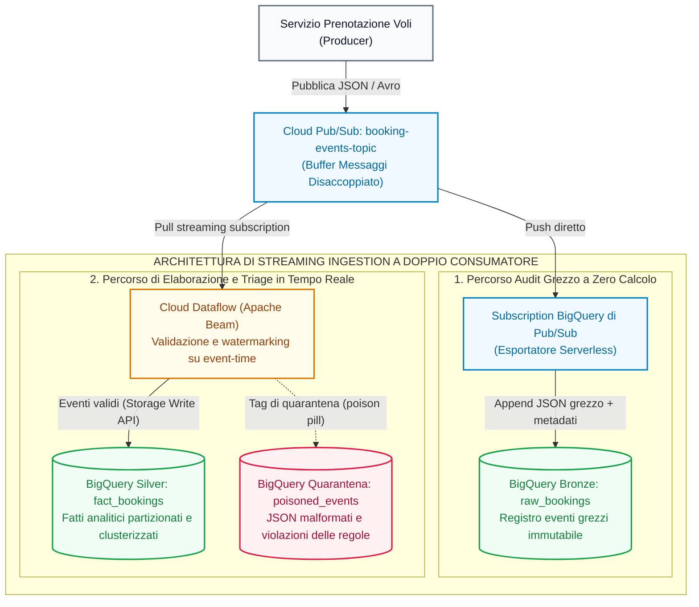

# Data Engineering su GCP (Parte 4): Costruire una Pipeline di Streaming in Tempo Reale Pronta per la Produzione

Nella [Parte 3 di questa serie](/it/blog/gcp-data-engineering-streaming-batch-ingestion-pubsub-dataflow/), abbiamo confrontato i principali approcci all'ingestion in tempo reale. Questo lab trasforma quell'architettura in una pipeline pienamente funzionante per **Offvia**, una piattaforma regionale di prenotazione voli.

L'obiettivo è pratico: mantenere il checkout completamente indipendente dalle analisi, conservare una copia grezza immutabile di ogni evento, validare i record in sicurezza, isolare i payload malformati in quarantena e trasmettere dati puliti in streaming dentro BigQuery.

## Cosa Stiamo Costruendo



Questo design adotta un'architettura **a doppio consumatore** (*dual-consumer*).

La subscription Bronze diretta offre ai team operativi e di data engineering un log grezzo e indipendente di ogni singolo evento pubblicato. Dataflow, al contempo, si occupa della validazione del dominio di business, della gestione dell'event-time e della scrittura della rappresentazione analitica pulita.

## Perché la Separazione è Fondamentale

Una richiesta di prenotazione deve completarsi non appena la sua transazione operativa e la pubblicazione dell'evento vanno a buon fine. Non deve mai attendere la scrittura sincrona in un data warehouse analitico.

Pub/Sub assorbe i picchi improvvisi di traffico e consente a ciascun consumatore a valle di scalare in modo indipendente. Questo design previene tre incidenti tipici:

- **Contesa sul database operativo:** i carichi di lavoro di reporting non condividono il pool di connessioni del database di prenotazione.
- **Dipendenze analitiche sincrone:** rallentamenti temporanei di BigQuery non bloccano i thread di checkout degli utenti.
- **Loop di riavvio da poison-pill:** i record malformati vengono dirottati in quarantena anziché mandare in crash continuo i worker di Dataflow.

## Prima di Iniziare

Configura il progetto di destinazione e la regione. Mantieni i dataset BigQuery, Dataflow e le risorse di staging su Cloud Storage in aree geografiche compatibili.

```bash
gcloud auth login
gcloud auth application-default login

export PROJECT_ID="IL_TUO_PROJECT_ID"
export REGION="us-central1"

gcloud config set project "${PROJECT_ID}"

gcloud services enable   pubsub.googleapis.com   dataflow.googleapis.com   bigquery.googleapis.com   bigquerystorage.googleapis.com   storage.googleapis.com
```

Installa Apache Beam con le dipendenze per Google Cloud:

```bash
python3 -m pip install --upgrade "apache-beam[gcp]"
```

## Creazione di Dataset e Tabelle

Separare i dataset Bronze, Silver e Quarantena semplifica la gestione delle policy di conservazione (*retention*), della governance e dei permessi di accesso.

```bash
bq --location="${REGION}" mk --dataset "${PROJECT_ID}:offvia_bronze"
bq --location="${REGION}" mk --dataset "${PROJECT_ID}:offvia_silver"
bq --location="${REGION}" mk --dataset "${PROJECT_ID}:offvia_quarantine"
```

Crea le tabelle di destinazione. La tabella Silver è partizionata per data dell'evento di business e clusterizzata sui campi più comunemente usati nei filtri delle rotte aeree.

```sql
CREATE TABLE IF NOT EXISTS `IL_TUO_PROJECT_ID.offvia_silver.fact_bookings` (
  booking_id STRING NOT NULL,
  passenger_id STRING NOT NULL,
  flight_number STRING NOT NULL,
  origin_airport STRING NOT NULL,
  destination_airport STRING NOT NULL,
  fare_amount NUMERIC NOT NULL,
  currency STRING NOT NULL,
  booking_status STRING NOT NULL,
  event_timestamp TIMESTAMP NOT NULL,
  ingestion_timestamp TIMESTAMP NOT NULL,
  source_message_id STRING NOT NULL
)
PARTITION BY DATE(event_timestamp)
CLUSTER BY origin_airport, destination_airport
OPTIONS (
  description = "Eventi di prenotazione validati in tempo reale"
);

CREATE TABLE IF NOT EXISTS `IL_TUO_PROJECT_ID.offvia_quarantine.poisoned_events` (
  raw_payload STRING NOT NULL,
  error_reason STRING NOT NULL,
  error_stage STRING NOT NULL,
  received_timestamp TIMESTAMP NOT NULL,
  source_message_id STRING
)
PARTITION BY DATE(received_timestamp)
OPTIONS (
  description = "Eventi rifiutati dal parsing o dalla validazione"
);

CREATE TABLE IF NOT EXISTS `IL_TUO_PROJECT_ID.offvia_bronze.raw_bookings` (
  subscription_name STRING,
  message_id STRING,
  publish_time TIMESTAMP,
  data STRING,
  attributes JSON
)
OPTIONS (
  description = "Tabella di landing immutabile degli eventi grezzi Pub/Sub"
);
```

Sostituisci `IL_TUO_PROJECT_ID` prima di eseguire il codice SQL.

## Configurazione dei Percorsi Pub/Sub

Crea un topic e due subscription. Ciascuna subscription mantiene il proprio cursore di consegna, in modo che il consumatore Bronze e il job Dataflow non entrino mai in competizione per i messaggi.

```bash
gcloud pubsub topics create booking-events-topic

gcloud pubsub subscriptions create booking-events-dataflow-sub   --topic=booking-events-topic   --ack-deadline=60
```

Per il sink Bronze, assegna al service agent di Pub/Sub i permessi di scrittura sul dataset Bronze.

```bash
export PROJECT_NUMBER="$(gcloud projects describe "${PROJECT_ID}" --format='value(projectNumber)')"
export PUBSUB_SERVICE_AGENT="service-${PROJECT_NUMBER}@gcp-sa-pubsub.iam.gserviceaccount.com"

bq add-iam-policy-binding   --member="serviceAccount:${PUBSUB_SERVICE_AGENT}"   --role="roles/bigquery.dataEditor"   "${PROJECT_ID}:offvia_bronze"
```

Ora crea la subscription diretta verso BigQuery:

```bash
gcloud pubsub subscriptions create booking-events-bronze-sub   --topic=booking-events-topic   --bigquery-table="${PROJECT_ID}.offvia_bronze.raw_bookings"   --write-metadata
```

L'opzione `--write-metadata` salva il nome della subscription, il message ID, il timestamp di pubblicazione e gli attributi insieme al payload originario. Questo rende la riconciliazione e l'analisi degli incidenti notevolmente più semplici.

## La Pipeline Beam

Salva il seguente codice come `stream_bookings_pipeline.py`.

La pipeline gestisce gli input non validi come dati anziché sollevare eccezioni non gestite. Salva inoltre il message ID di Pub/Sub sia nei record Silver che in quelli di quarantena, garantendo tracciabilità e semplificando i replay.

```python
import argparse
import json
import logging
from datetime import datetime, timezone
from decimal import Decimal, InvalidOperation

import apache_beam as beam
from apache_beam import pvalue
from apache_beam.options.pipeline_options import PipelineOptions, StandardOptions
from apache_beam.transforms.window import FixedWindows


class ValidateAndEnrichBookingFn(beam.DoFn):
    QUARANTINE = "quarantine"

    def process(self, message):
        raw_payload = message.data.decode("utf-8", errors="replace")
        received_at = datetime.now(timezone.utc).isoformat()
        message_id = message.message_id

        def reject(stage, reason):
            return pvalue.TaggedOutput(
                self.QUARANTINE,
                {
                    "raw_payload": raw_payload,
                    "error_reason": reason,
                    "error_stage": stage,
                    "received_timestamp": received_at,
                    "source_message_id": message_id,
                },
            )

        try:
            payload = json.loads(raw_payload)
        except json.JSONDecodeError as exc:
            yield reject("PARSE_JSON", str(exc))
            return

        required = {
            "booking_id",
            "passenger_id",
            "flight_number",
            "origin",
            "destination",
            "fare",
            "event_time",
        }

        missing = sorted(required - payload.keys())

        if missing:
            yield reject(
                "SCHEMA_VALIDATION",
                f"Missing required fields: {', '.join(missing)}",
            )
            return

        try:
            fare = Decimal(str(payload["fare"]))

            if fare <= Decimal("0"):
                raise ValueError("fare must be greater than zero")

        except (InvalidOperation, ValueError, TypeError) as exc:
            yield reject(
                "BUSINESS_RULE_VALIDATION",
                f"Invalid fare: {exc}",
            )
            return

        try:
            event_time = datetime.fromisoformat(
                str(payload["event_time"]).replace("Z", "+00:00")
            )

            if event_time.tzinfo is None:
                raise ValueError("event_time must include an offset or Z")

        except (ValueError, TypeError) as exc:
            yield reject(
                "EVENT_TIME_VALIDATION",
                f"Invalid event_time: {exc}",
            )
            return

        record = {
            "booking_id": str(payload["booking_id"]),
            "passenger_id": str(payload["passenger_id"]),
            "flight_number": str(payload["flight_number"]),
            "origin_airport": str(payload["origin"]),
            "destination_airport": str(payload["destination"]),
            "fare_amount": str(fare),
            "currency": str(payload.get("currency", "USD")),
            "booking_status": str(payload.get("status", "CONFIRMED")),
            "event_timestamp": event_time.isoformat(),
            "ingestion_timestamp": received_at,
            "source_message_id": message_id,
        }

        yield beam.window.TimestampedValue(
            record,
            event_time.timestamp(),
        )


def run():
    parser = argparse.ArgumentParser()

    parser.add_argument("--subscription", required=True)
    parser.add_argument("--silver_table", required=True)
    parser.add_argument("--quarantine_table", required=True)

    known_args, pipeline_args = parser.parse_known_args()

    options = PipelineOptions(pipeline_args)
    options.view_as(StandardOptions).streaming = True

    with beam.Pipeline(options=options) as pipeline:
        messages = (
            pipeline
            | "Read Pub/Sub"
            >> beam.io.ReadFromPubSub(
                subscription=known_args.subscription,
                with_attributes=True,
            )
        )

        outputs = (
            messages
            | "Validate booking"
            >> beam.ParDo(
                ValidateAndEnrichBookingFn()
            ).with_outputs(
                ValidateAndEnrichBookingFn.QUARANTINE,
                main="valid",
            )
        )

        windowed = (
            outputs.valid
            | "One-minute event-time windows"
            >> beam.WindowInto(
                FixedWindows(60),
                allowed_lateness=300,
            )
        )

        windowed | "Write silver" >> beam.io.WriteToBigQuery(
            table=known_args.silver_table,
            method=beam.io.WriteToBigQuery.Method.STORAGE_WRITE_API,
            create_disposition=beam.io.BigQueryDisposition.CREATE_NEVER,
            write_disposition=beam.io.BigQueryDisposition.WRITE_APPEND,
            triggering_frequency=5,
        )

        outputs.quarantine | "Write quarantine" >> beam.io.WriteToBigQuery(
            table=known_args.quarantine_table,
            method=beam.io.WriteToBigQuery.Method.STORAGE_WRITE_API,
            create_disposition=beam.io.BigQueryDisposition.CREATE_NEVER,
            write_disposition=beam.io.BigQueryDisposition.WRITE_APPEND,
            triggering_frequency=5,
        )


if __name__ == "__main__":
    logging.getLogger().setLevel(logging.INFO)
    run()
```

## Una Nota sulle Finestre Temporali (Event-Time Windows)

La trasformazione `WindowInto` assegna metadati di finestra temporale basati sull'event-time ai record. Non modifica di per sé le singole righe scritte in BigQuery.

Le finestre diventano rilevanti quando una trasformazione successiva aggrega, unisce o genera risultati in base all'event-time. La configurazione di tolleranza al ritardo (*allowed lateness*) impostata a 5 minuti (300 secondi) significa che un evento può ancora essere accettato ed elaborato fino a 5 minuti dopo che il watermark ha superato la fine della sua finestra.

Questa soglia deve essere calibrata in base ai ritardi riscontrati nei produttori, al comportamento della rete mobile e all'impatto economico o operativo della correzione di risultati analitici tardivi.

## Invio del Job Dataflow

Crea un bucket di staging su Cloud Storage:

```bash
gcloud storage buckets create "gs://${PROJECT_ID}-dataflow-staging"   --location="${REGION}"
```

Invia la pipeline di streaming in esecuzione:

```bash
python3 stream_bookings_pipeline.py   --runner=DataflowRunner   --project="${PROJECT_ID}"   --region="${REGION}"   --temp_location="gs://${PROJECT_ID}-dataflow-staging/temp"   --staging_location="gs://${PROJECT_ID}-dataflow-staging/staging"   --subscription="projects/${PROJECT_ID}/subscriptions/booking-events-dataflow-sub"   --silver_table="${PROJECT_ID}:offvia_silver.fact_bookings"   --quarantine_table="${PROJECT_ID}:offvia_quarantine.poisoned_events"   --job_name="offvia-streaming-ingestion-v1"   --max_num_workers=3   --enable_streaming_engine
```

Lo Streaming Engine sposta parte dell'elaborazione di streaming dalle VM worker verso il backend gestito di Dataflow. Questo può alleggerire la pressione sulle risorse dei worker, ma non rappresenta un risparmio automatico garantito sui costi. Esegui sempre test con volumi di traffico realistici e analizza le metriche di fatturazione prima di fare assunzioni definitive per la produzione.

## Test con Eventi Validi e Non Validi

Pubblica una prenotazione valida, una che viola una regola di business e un payload JSON malformato.

```bash
gcloud pubsub topics publish booking-events-topic --message='{
  "booking_id": "BK-90210",
  "passenger_id": "PAX-4821",
  "flight_number": "OF-104",
  "origin": "JFK",
  "destination": "LHR",
  "fare": "749.50",
  "currency": "USD",
  "status": "CONFIRMED",
  "event_time": "2026-10-07T14:10:00Z"
}'
```

```bash
gcloud pubsub topics publish booking-events-topic --message='{
  "booking_id": "BK-90211",
  "passenger_id": "PAX-7712",
  "flight_number": "OF-208",
  "origin": "SFO",
  "destination": "HND",
  "fare": "-50.00",
  "event_time": "2026-10-07T14:10:05Z"
}'
```

```bash
gcloud pubsub topics publish booking-events-topic   --message='{"booking_id":"BK-90212", "unclosed_json...'
```

## Verifica di Ciascun Livello

```sql
SELECT
  message_id,
  publish_time,
  SUBSTR(data, 1, 100) AS raw_preview
FROM `IL_TUO_PROJECT_ID.offvia_bronze.raw_bookings`
ORDER BY publish_time DESC
LIMIT 10;
```

```sql
SELECT
  booking_id,
  flight_number,
  origin_airport,
  destination_airport,
  fare_amount,
  event_timestamp,
  source_message_id
FROM `IL_TUO_PROJECT_ID.offvia_silver.fact_bookings`
WHERE booking_id = 'BK-90210';
```

```sql
SELECT
  error_stage,
  error_reason,
  raw_payload,
  received_timestamp,
  source_message_id
FROM `IL_TUO_PROJECT_ID.offvia_quarantine.poisoned_events`
ORDER BY received_timestamp DESC
LIMIT 10;
```

Comportamento atteso:

- Il layer Bronze riceve tutti e tre i messaggi grezzi.
- Il layer Silver contiene unicamente `BK-90210`.
- Il layer Quarantena contiene il record con tariffa negativa e il JSON malformato.
- Il job Dataflow rimane perfettamente operativo e stabile, poiché gli errori fisiologici dei dati vengono isolati invece di innescare eccezioni fatali sui worker.

Considera sempre la normale latenza di propagazione asincrona attraverso i servizi cloud prima di considerare un test fallito.

## Decisioni di Produzione da Rendere Esplicite

- **Semantica di consegna:** Pub/Sub e le pipeline di streaming operano comunemente in modalità *at-least-once* ai confini del sistema. Progetta le tabelle a valle e i consumatori per tollerare eventi duplicati.
- **Semantica della Storage Write API:** L'API supporta scritture *exactly-once* quando si utilizzano flussi vincolati (*committed streams*) e offset espliciti. Non considerare l'intera architettura end-to-end come exactly-once semplicemente perché un sink Beam sfrutta la Storage Write API.
- **Strategia di replay:** Mantieni i dati Bronze abbastanza a lungo per supportare rielaborazioni e backfill. Definisci in anticipo se gli eventi Silver rielaborati debbano essere deduplicati, fusi tramite merge o scritti in un percorso di recupero dedicato.
- **Evoluzione dello schema:** Versiona i contratti degli eventi. L'aggiunta di campi facoltativi è notevolmente più sicura rispetto alla modifica di tipi di dati o alla variazione del loro significato di business.
- **Ownership della quarantena:** Configura alert sulla frequenza degli errori in quarantena e classifica i problemi per `error_stage`. Una tabella di quarantena ha valore solo se un team specifico è responsabile della sua analisi, correzione e rielaborazione.
- **Principio del privilegio minimo:** Utilizza un service account dedicato per i worker Dataflow in produzione. Privilegia autorizzazioni a livello di dataset o tabella anziché ruoli ampi sull'intero progetto.
- **Osservabilità:** Monitora l'età del messaggio non confermato più vecchio su Pub/Sub, il ritardo di sistema (*system lag*) di Dataflow, l'avanzamento del watermark, i fallimenti di scrittura in BigQuery e il volume della quarantena.

## Falsi Miti Comuni

### "Pub/Sub garantisce un ordinamento FIFO globale"

Pub/Sub non offre un ordinamento globale su tutti i messaggi indistintamente. Le chiavi di ordinamento (*ordering keys*) assicurano la consegna sequenziale unicamente per i messaggi che condividono la medesima chiave e la configurazione di ordinamento attiva.

### "Un dead-letter topic di Pub/Sub cattura gli errori di validazione"

Un dead-letter topic di Pub/Sub è progettato per gestire fallimenti di consegna all'endpoint. Gli errori di parsing e le violazioni delle regole di dominio devono essere intercettati all'interno della pipeline Beam e instradati verso una tabella di quarantena specifica.

### "Aggiungere finestre temporali rende un sink corretto per l'event-time"

Le sole finestre temporali non alterano i record scritti in BigQuery. La correttezza rispetto all'event-time nelle aggregazioni dipende da timestamp, watermark, tolleranza al ritardo (*allowed lateness*), trigger e da una politica esplicita per i dati in ritardo.

### "Storage Write API implica sempre exactly-once"

Il comportamento exactly-once richiede una progettazione rigorosa basata su stream vincolati e tracciamento degli offset. La deduplicazione end-to-end rimane sempre una responsabilità architetturale.

## I Prossimi Passi della Serie

Ora che la nostra pipeline di streaming ingestion deposita eventi grezzi e in quarantena dentro BigQuery, come trasformiamo questi payload grezzi in data mart analitici puliti, deduplicati e pronti per il business?

Continua con la [Parte 5: Architettura Medallion e Trasformazioni con Dataform e dbt](/it/blog/gcp-data-engineering-transformations-dataform-dbt/) per progettare il layer di trasformazione del data warehouse.

## Riferimenti Ufficiali

- [Creare subscription BigQuery su Pub/Sub](https://cloud.google.com/pubsub/docs/create-bigquery-subscription)
- [Ordinamento dei messaggi in Pub/Sub](https://cloud.google.com/pubsub/docs/ordering)
- [Dead-letter topic in Pub/Sub](https://cloud.google.com/pubsub/docs/dead-letter-topics)
- [Windowing e trigger in Apache Beam](https://beam.apache.org/documentation/programming-guide/#windowing)
- [Connettore Apache Beam BigQuery I/O](https://beam.apache.org/documentation/io/built-in/google-bigquery/)
- [BigQuery Storage Write API](https://cloud.google.com/bigquery/docs/write-api)
- [Dataflow Streaming Engine](https://cloud.google.com/dataflow/docs/streaming-engine)
