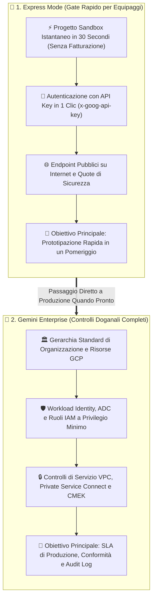
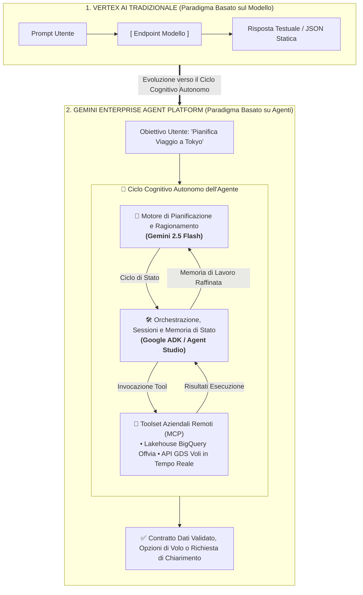
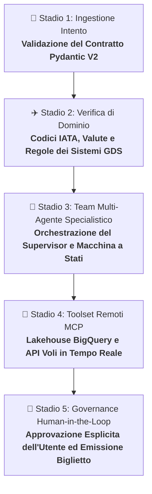

Il 22 aprile 2026, Google Cloud ha annunciato **Gemini Enterprise Agent Platform (precedentemente nota come Vertex AI)**: l'evoluzione strategica della piattaforma verso un ambiente unificato per sviluppare, scalare, governare e ottimizzare agenti di intelligenza artificiale di livello enterprise.

Nello stesso momento, il team di prodotto ha introdotto **Express Mode**: un percorso rapido e leggero per la prototipazione. Express Mode consente agli sviluppatori di testare modelli all'avanguardia (come Gemini 2.5 Flash) e costruire catene di agenti utilizzando semplici chiavi API (`x-goog-api-key`), senza dover configurare preventivamente account di fatturazione, complesse gerarchie GCP o autorizzazioni IAM restrittive.

Per gli sviluppatori che hanno affrontato l'onboarding tradizionale su Google Cloud, il contrasto è evidente:

> **Un tempo:** Apri la console, crea un progetto, collega la carta di credito per la fatturazione, attendi la propagazione dell'account, abilita le API di Vertex AI, installa la `gcloud` CLI, configura l'autenticazione Application Default Credentials (ADC) e risolvi i permessi IAM prima di inviare una singola chiamata di test.
>
> **Oggi con Express Mode:** Fai clic su un pulsante nella console, generi una chiave API dedicata al progetto in 30 secondi, esegui `pip install google-genai` e metti in funzione il tuo primo agente cognitivo prima ancora che la pausa caffè sia finita.

In questa prima guida della nostra serie, supereremo la burocrazia cloud, analizzeremo il passaggio da modelli statici ad agenti cognitivi e realizzeremo il primo componente concreto del nostro caso studio reale: **il parser di intenti di viaggio di Offvia**.

---

## ✈️ Il Modello Mentale: Fast-Track Gate vs Controlli Doganali Completi

Per capire esattamente dove si colloca Express Mode nell'architettura Google Cloud, immaginiamo un grande aeroporto internazionale:



| Dimensione Architetturale | 🏃 Express Mode | 🛂 Gemini Enterprise (Produzione Completa) |
| :--- | :--- | :--- |
| **Metodo di Autenticazione** | Singola intestazione `x-goog-api-key` | Token OAuth2, Workload Identity Federation, Service Account ADC |
| **Isolamento di Rete** | Endpoint HTTPS pubblici su Internet | VPC Service Controls (VPC-SC), Private Service Connect (PSC), IP privati |
| **Governo della Sicurezza** | Controlli di sicurezza a livello di chiave API | IAM granulare a privilegio minimo, audit logging Cloud Audit, chiavi CMEK |
| **Integrazione Dati Aziendale** | Context caching e tool calling locali | Integrazioni dirette BigQuery, Google Drive, repository interni, Grounding aziendale |
| **Contratti di Servizio (SLA)** | Quota 'Best-effort' e rate limit di livello sandbox | SLA enterprise con garanzia di uptime al 99,95% e supporto enterprise 24/7 |
| **Costi & Fatturazione** | Livello gratuito di valutazione (fino a 90 giorni) | Fatturazione consolidata sul Cloud Billing Account aziendale |

---

## 🧭 Il Cambio di Paradigma: Dal Modello Statico al Ciclo Cognitivo

Per oltre quattro anni, Vertex AI ha operato secondo un paradigma **incentrato sul modello**: si inviavano token, si ricevevano indietro stringhe di testo o JSON statici. Il modello non possedeva memoria di sessione, non disponeva di strumenti ed era privo di consapevolezza operativa.

Le moderne applicazioni su **Gemini Enterprise Agent Platform** spostano l'intero baricentro verso **cicli cognitivi autonomi**:



Invece di invocare il modello isolatamente, l'agente coordina tre livelli fondamentali:
1. **Motore di Ragionamento (`gemini-2.5-flash`):** Analizza le intenzioni dell'utente, formula ipotesi e scompone i problemi in sotto-task.
2. **Orchestrazione & Memoria (Google Agent Development Kit / Agent Studio):** Mantiene lo stato di sessione multi-turno e seleziona i tool necessari.
3. **Toolset Remoti (Protocollo MCP):** Si collega a sistemi esterni come data warehouse BigQuery o API GDS per voli e hotel.

---

## 🛠️ Laboratorio Pratico: Il Parser di Intenti di Offvia

Costruiamo ora il componente d'ingresso di **Offvia**: un concierge di viaggio intelligente.

Quando un viaggiatore digita una richiesta spontanea e destrutturata come:
> *"Voglio andare a sciare a Hokkaido con 3 amici a metà gennaio per una settimana con un budget di 4000 EUR in totale, preferibilmente con voli diretti da Milano"*

L'agente deve estrarre un contratto dati fortemente tipizzato, convalidando date, passeggeri, valute e aeroporti di partenza.

### 1. Inizializzazione dell'Ambiente

Crea un ambiente virtuale isolato e installa l'SDK ufficiale unificato:

```bash
python3 -m venv .venv
source .venv/bin/activate
pip install google-genai pydantic
export GEMINI_API_KEY="AIzaSyYourExpressModeApiKeyHere"
```

### 2. Definizione del Contratto Dati (Pydantic V2)

Definiamo i modelli fortemente tipizzati per rappresentare l'intenzione del viaggiatore:

```python
"""
Offvia Travel Intent Parser - Step 1: Data Contracts
"""
from enum import Enum
from typing import Optional, List
from pydantic import BaseModel, Field

class CabinClass(str, Enum):
    ECONOMY = "ECONOMY"
    PREMIUM_ECONOMY = "PREMIUM_ECONOMY"
    BUSINESS = "BUSINESS"
    FIRST = "FIRST"

class ActivityType(str, Enum):
    SKIING = "SKIING"
    BEACH = "BEACH"
    CULTURE = "CULTURE"
    FOOD = "FOOD"
    ADVENTURE = "ADVENTURE"

class TripIntent(BaseModel):
    origin_airport: Optional[str] = Field(
        None, 
        description="Codice aeroportuale IATA a 3 lettere di origine, es. MXP, FCO o LIN."
    )
    destination: str = Field(
        ..., 
        description="Destinazione esplicita o regione target richiesta dall'utente, es. Hokkaido, Giappone."
    )
    departure_window: str = Field(
        ..., 
        description="Finestra temporale o date di partenza espresse dal viaggiatore, es. 'metà gennaio 2027'."
    )
    duration_days: Optional[int] = Field(
        None, 
        description="Durata stimata del viaggio in giorni interi. Default 7 se viene specificata una settimana."
    )
    total_travelers: int = Field(
        1, 
        ge=1, 
        description="Numero totale di passeggeri/viaggiatori. Ad esempio: utente + 3 amici = 4."
    )
    total_budget: Optional[float] = Field(
        None, 
        description="Budget complessivo per l'intero viaggio."
    )
    budget_currency: str = Field(
        "EUR", 
        description="Valuta ISO a 3 lettere del budget (EUR, USD, JPY, GBP)."
    )
    preferred_cabin: CabinClass = Field(
        CabinClass.ECONOMY, 
        description="Classe di volo richiesta o desunta."
    )
    direct_flights_preferred: bool = Field(
        False, 
        description="True se l'utente richiede o preferisce voli diretti senza scali."
    )
    activities: List[ActivityType] = Field(
        default_factory=list, 
        description="Attività e interessi specifici identificati nella richiesta del viaggiatore."
    )
```

### 3. Invocazione con Output Strutturato su Gemini 2.5 Flash

Utilizziamo il client `google-genai` configurando `gemini-2.5-flash` con vincoli di schema rigidamente controllati:

```python
import os
import json
from google import genai
from google.genai import types

def parse_travel_intent(user_prompt: str) -> TripIntent:
    """
    Invia la richiesta dell'utente a Gemini Enterprise Agent Platform
    tramite Express Mode garantendo la conformità allo schema Pydantic.
    """
    api_key = os.getenv("GEMINI_API_KEY")
    if not api_key:
        raise ValueError("Variabile d'ambiente GEMINI_API_KEY non impostata.")

    client = genai.Client(api_key=api_key)

    response = client.models.generate_content(
        model="gemini-2.5-flash",
        contents=[
            types.Content(
                role="user",
                parts=[
                    types.Part.from_text(
                        text=f"Analizza ed estrai le intenzioni di viaggio da questa richiesta del cliente: '{user_prompt}'"
                    )
                ]
            )
        ],
        config=types.GenerateContentConfig(
            system_instruction=(
                "Sei il parser d'intenti principale di Offvia. Estrai i dettagli del viaggio "
                "con assoluta precisione. Se l'origine aeroportuale menziona Milano, converti nel codice "
                "IATA più opportuno (MXP). Calcola sempre correttamente il numero totale di passeggeri (es. 'io + 3 amici' = 4)."
            ),
            response_mime_type="application/json",
            response_schema=TripIntent,
            temperature=0.1,  # Temperatura vicina a zero per massima stabilità
        )
    )

    validated_intent = TripIntent.model_validate_json(response.text)
    return validated_intent

if __name__ == "__main__":
    prompt = "Voglio andare a sciare a Hokkaido con 3 amici a metà gennaio per una settimana con un budget di 4000 EUR in totale, preferibilmente con voli diretti da Milano"
    intent = parse_travel_intent(prompt)
    print(json.dumps(intent.model_dump(), indent=2))
```

### 4. Risultato Validato in Esecuzione

Eseguendo lo script, l'agente restituisce un oggetto JSON conforme al 100% allo schema definito:

```json
{
  "origin_airport": "MXP",
  "destination": "Hokkaido, Giappone",
  "departure_window": "metà gennaio",
  "duration_days": 7,
  "total_travelers": 4,
  "total_budget": 4000.0,
  "budget_currency": "EUR",
  "preferred_cabin": "ECONOMY",
  "direct_flights_preferred": true,
  "activities": [
    "SKIING"
  ]
}
```

> [!NOTE]
> Nota come `gemini-2.5-flash` abbia identificato automaticamente che l'utente insieme a 3 amici corrisponde esattamente a `total_travelers: 4`, abbia associato *"Milano"* al codice aeroportuale `MXP` e abbia impostato `direct_flights_preferred: true`.

---

## 🛡️ Roadmap di Produzione: Cosa Succede Ora?

Ottenere un oggetto `TripIntent` validato rappresenta il primo passo. In un'architettura di produzione completa, il ciclo di vita dell'agente si espande in cinque stadi governati:



Nella **Parte 2** di questa serie, collegheremo il nostro parser a un server remoto con protocollo **Model Context Protocol (MCP)** collegato al data warehouse BigQuery di Offvia, consentendo all'agente di interrogare disponibilità di inventario e storico prezzi in tempo reale.

---

### Risorse & Documentazione Ufficiale

- [Google Cloud: Informazioni su Gemini Enterprise Agent Platform](https://cloud.google.com/vertex-ai/docs)
- [Documentazione Ufficiale di Express Mode su Google Cloud](https://cloud.google.com/vertex-ai/generative-ai/docs/multimodal-token)
- [Documentazione Ufficiale di Gemini 2.5 Flash](https://cloud.google.com/vertex-ai/generative-ai/docs/models/gemini)
- [SDK Ufficiale google-genai su GitHub](https://github.com/googleapis/python-genai)
- [Pydantic V2: Documentazione Ufficiale sugli Schemi JSON](https://docs.pydantic.dev/latest/concepts/json_schema/)
