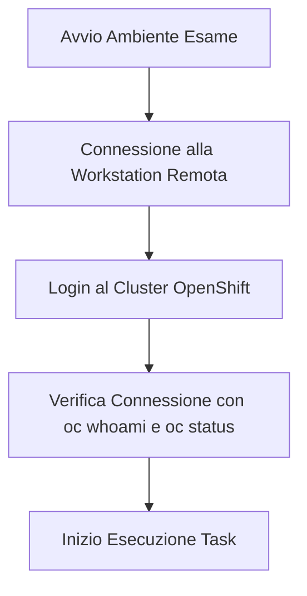

## Introduzione
Nella [Parte 1](/blog/passing-openshift-administartor-exam-part-1/) ho descritto gli aspetti *non tecnici* dell'esame Red Hat OpenShift Administrator (EX280): predisposizione dell'ambiente, fotocamera esterna e gestione degli imprevisti.

Questa seconda parte si concentra sul **lato tecnico**: le competenze pratiche che applicherai direttamente sui nodi del cluster OpenShift. Se la Parte 1 riguardava la *preparazione dell'ambiente*, questa riguarda l'**esecuzione impeccabile dei task**.

Prima di tentare l'esame, assicurati di aver completato e compreso a fondo i due corsi Red Hat ufficiali:
- **DO180 – OpenShift I: Containers, Kubernetes, and Red Hat OpenShift**
- **DO280 – OpenShift Administration II: Configuring a Production Cluster**

Il corso **DO180** consolida i fondamenti dei container, lo storage e le probe di salute. Il **DO280** approfondisce la gestione del cluster, il networking e il troubleshooting avanzato.

---

## Struttura dell'Esame
L'esame **EX280** dura **3 ore**, prevede un punteggio massimo di **300 punti** e richiede il **70%** (210 punti) per essere superato.  
Aspettati tra i **21 e i 23 compiti pratici** da svolgere direttamente sul cluster OpenShift.

### Aree di Valutazione Principali
- Gestire OpenShift Container Platform  
- Rilasciare e gestire applicazioni  
- Configurare lo storage per applicazioni e dati  
- Garantire l'affidabilità e l'alta disponibilità  
- Gestire autenticazione e autorizzazioni (RBAC)  
- Configurare la sicurezza di rete  
- Abilitare il Developer Self-Service  
- Gestire gli OpenShift Operator  
- Applicare controlli di sicurezza applicativa  

---

## Gestione Intelligente del Tempo
Tre ore sembrano tante finché non si inizia a digitare:

- Con circa **22 domande**, la media è di **7–8 compiti all'ora**.  
- L'obiettivo ideale è completare il **90% dei task entro le prime 2 ore**, tenendo l'ultima ora per verificare e testare ogni soluzione.

### La mia strategia personale
1. **Dai priorità alla configurazione dell'identity provider (`htpasswd`)** all'inizio.  
2. **Lascia i Project Template verso la fine**, per evitare che configurazioni errate impattino gli altri esercizi.  
3. **Salta i compiti dubbi e torna indietro più tardi**: non rimanere bloccato su un singolo task per più di 10 minuti.  
4. **Usa la console web per la visibilità d'insieme e la CLI per la precisione di esecuzione.**

---

## Connessione al Cluster
All'avvio della prova, connettiti al cluster OpenShift utilizzando le credenziali visualizzate nella schermata dei dettagli dell'ambiente.  
Una volta stabilita la sessione, esegui sempre i controlli preliminari:

```bash
oc whoami
oc status
```



---

## I Cinque Macro-Domini dell'Esame

### 1. Autenticazione, Autorizzazioni e RBAC
Dominio critico e fondamentale:
- Configurare l'identity provider `htpasswd`  
- Creare utenti, gruppi e associazioni di ruoli  
- Assegnare permessi a livello di cluster e di progetto con `oc adm policy`  

Esempio pratico:
```bash
oc create secret generic htpasswd-secret --from-file=htpasswd=/root/users.htpasswd -n openshift-config
oc patch oauth cluster --type=merge -p '{"spec":{"identityProviders":[{"name":"local","mappingMethod":"claim","type":"HTPasswd","htpasswd":{"fileData":{"name":"htpasswd-secret"}}}]}}'
oc adm groups new dev-team
oc adm groups add-users dev-team user1
```

> 🧩 **Suggerimento Pro:** Approfondisci questo argomento nella nostra guida dedicata: [EX280 Exam Tips – Parte 1: HTPasswd](/blog/ex280-tips-part1-htpasswd/)

---

### 2. Sicurezza di Rete e Route
- Creare **NetworkPolicy** per regolare il traffico pod-to-pod e tra namespace  
- Configurare route sicure (`edge`, `reencrypt`, `passthrough`)  
- Limitare l'esposizione dei servizi con selettori ed etichette puntuali  

> 🔐 **Suggerimento Pro:** Approfondisci questo argomento nella guida: [EX280 Exam Tips – Parte 2: Network Policies ed Edge Routes](/blog/ex280-tips-part2/)

---

### 3. Storage, ConfigMap e Secret
- Creare e agganciare coppie PersistentVolume e PersistentVolumeClaim  
- Montare volumi in container applicativi con percorsi corretti  
- Iniettare variabili d'ambiente da ConfigMap e Secret  
- Interagire con le StorageClass  

> 🗂️ **Suggerimento Pro:** Approfondisci questo argomento nella guida: [EX280 Exam Tips – Parte 3: Storage](/blog/ex280-tips-part3/)

---

### 4. Deployment e Affidabilità
- Distribuire applicazioni e gestirne gli aggiornamenti  
- Configurare probe di salute (`readinessProbe`, `livenessProbe`, `startupProbe`)  
- Impostare scalabilità manuale e autoscaling con HPA  
- Assegnare ServiceAccount e vincoli SCC (`anyuid`)  

> ⚙️ **Suggerimento Pro:** Approfondisci questo argomento nella guida: [EX280 Exam Tips – Parte 4: Deployment e Affidabilità](/blog/ex280-tips-part4/)

---

### 5. Developer Self-Service e Template di Progetto
- Configurare quote risorse (`ResourceQuota`) e limiti di container (`LimitRange`)  
- Generare e personalizzare template di bootstrap per nuovi progetti  
- Gestire OpenShift Operator da OperatorHub  

> 🚨 **Suggerimento Pro:** Approfondisci questo argomento nella guida: [EX280 Exam Tips – Parte 5: Developer Self Service](/blog/ex280-tips-part5/)

---

## Gestione degli OpenShift Operator
Gli Operator automatizzano la gestione del ciclo di vita dei servizi:
- Installazione da OperatorHub nel namespace dedicato (es. `openshift-operators`)  
- Verifica dello stato dei ClusterServiceVersion (CSV):
```bash
oc get csv -n openshift-operators
```
- Creazione di istanze applicative tramite Custom Resource Definitions (CRD)

> 📦 **Nota Bene:** Non creare manualmente namespace con il prefisso `openshift-`: sono riservati ai componenti interni della piattaforma. Se un task richiede di installare un Operator in `openshift-operators`, quel namespace è già presente nel cluster.

---

## Riepilogo Rapido
✅ Padroneggia i concetti pratici di DO180 e DO280  
✅ Connettiti al cluster in modo pulito e rapido  
✅ Configura `htpasswd` e RBAC con sicurezza  
✅ Crea coppie PV/PVC, ConfigMap e Secret verificate  
✅ Definisci probe di liveness e readiness per i deployment  
✅ Applica NetworkPolicy e genera certificati per route Edge  
✅ Controlla quote e limiti  
✅ Riserva il task del Project Template per la fase conclusiva  

L'esame EX280 certifica la tua capacità di amministrare un cluster OpenShift reale in scenari operativi concreti. Con una preparazione metodica e una buona gestione del tempo, il successo è alla tua portata! 🎓
