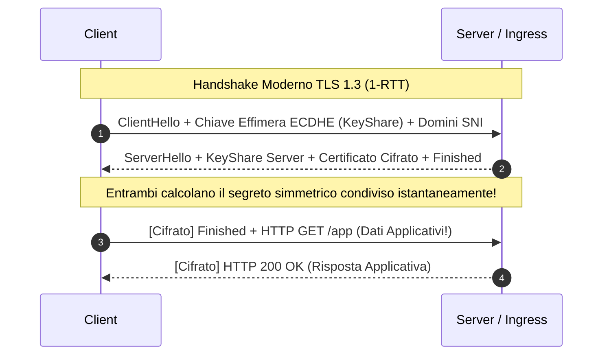

Nella [Parte 1: Chiavi, CSR, CA e la Catena di Fiducia](/it/blog/tls-demystified-part1-cryptography-keys-csr-ca-explained/), abbiamo esaminato come le coppie di chiavi asimmetriche e le autorità di certificazione consentano a due parti su Internet di fidarsi reciprocamente dell'identità dell'altro.

Ora affrontiamo il momento della verità: cosa accade esattamente a livello di pacchetti di rete nei primi millisecondi in cui un client stabilisce una sessione TLS con il tuo Ingress Controller o Reverse Proxy?

Comprendere a fondo l'**Handshake TLS** è ciò che separa un ingegnere che prova configurazioni a caso da un professionista che sa diagnosticare all'istante handshake timeout, errori di negoziazione ciphersuite e anomalie SNI.

Benvenuto nella **Parte 2 del nostro Deep Dive sull'Architettura TLS per Ingegneri DevOps**:

---

## 1. L'Analogia del Controllo Passaporti: Come Funziona Davvero l'Handshake

Immagina di arrivare al controllo di frontiera in un aeroporto internazionale:

1. **Il Saluto Iniziale:** Ti avvicini al bancone e dici: *"Buongiorno, parlo italiano e inglese, e desidero entrare"* (il messaggio `ClientHello` con l'elenco dei protocolli e cifrari supportati).
2. **La Risposta della Frontiera:** L'ufficiale risponde: *"Parliamo in italiano. Ecco il mio distintivo e le mie credenziali ufficiali per dimostrarti chi sono"* (il messaggio `ServerHello` + Certificato del Server).
3. **La Verifica e il Segreto:** Esamini il distintivo dell'ufficiale, verifichi che il timbro di stato sia autentico e concordate una parola d'ordine temporanea per il resto del controllo (Verifica della Catena CA e Scambio Chiavi ECDHE).
4. **Il Canale Protetto:** Da quel momento in poi, comunicate in totale riservatezza usando la parola d'ordine concordata (Traffico Applicativo Cifrato Simmetricamente).

---

## 2. La Meccanica dell'Handshake: TLS 1.2 vs. TLS 1.3

### Cos'è un RTT (Round Trip Time)?

Un **RTT (Round Trip Time)** è il tempo impiegato da un pacchetto di rete per viaggiare dal client al server e tornare indietro.
- Su una rete locale (LAN): ~1 ms.
- Tra due regioni cloud vicine: ~15-30 ms.
- Da un client mobile transatlantico (es. Roma a San Francisco): ~120-180 ms.

Se un handshake richiede più passaggi di rete prima di inviare anche un singolo byte di richiesta HTTP, ogni RTT aggiuntivo raddoppia o triplica la latenza percepita dall'utente.

### Il Vecchio Handshake TLS 1.2 (2 Round Trip Completi)

Nel protocollo TLS 1.2 (definito nel 2008), la negoziazione richiedeva **2 RTT completi** (più l'RTT iniziale del 3-way handshake TCP) prima che il client potesse inviare la prima richiesta HTTP GET o POST:

```
[Client]                                                     [Server]
   │ ────────────── TCP SYN (1/2 RTT) ────────────────────────▶ │
   │ ◀───────────── TCP SYN-ACK (1/2 RTT) ────────────────────  │  (1 RTT TCP)
   │ ────────────── TCP ACK + ClientHello (1/2 RTT) ──────────▶ │
   │ ◀───────────── ServerHello + Certificate + ServerKeyEx───  │  (2 RTT Handshake TLS)
   │ ────────────── ClientKeyEx + Finished (1/2 RTT) ────────▶ │
   │ ◀───────────── Finished (1/2 RTT) ───────────────────────  │  (Connessione Pronta!)
   │ ────────────── HTTP GET /api/v1/data ────────────────────▶ │
```

### Perché TLS 1.3 Ha Rivoluzionato le Prestazioni

Rilasciato nel 2018 con la RFC 8446, **TLS 1.3 ha dimezzato la latenza dell'handshake**, riducendola a un singolo **1-RTT** (e abilitando persino **0-RTT** per connessioni riprese):

1. **Scambio Chiavi Ipotesi (Optimistic Key Agreement):** Il client presuppone che il server supporti i gruppi di curve ellittiche più comuni (es. X25519 o P-256) e invia già nel `ClientHello` la propria parte della chiave pubblica effimera.
2. **Rimozione del Debito Tecnico Legacy:** Rimossi algoritmi obsoleti e vulnerabili: RSA key exchange, CBC ciphers, SHA-1, RC4, compressione TLS (responsabile dell'attacco CRIME).
3. **Cifratura Estesa:** Persino i certificati del server e le estensioni dell'handshake viaggiano ora cifrati sul cavo, proteggendo la privacy dell'utente dagli sniffer intermedi.

---

## 3. 🗺️ Confronto Visivo dell'Architettura: TLS 1.2 vs. TLS 1.3



In TLS 1.3, il client invia il primo payload applicativo cifrato già al secondo pacchetto, eliminando un intero ciclo di andata e ritorno rispetto a TLS 1.2.

---

## 4. 🚨 5 Falsi Miti sull'Handshake TLS per Ingegneri DevOps

### Falso Mito 1: "Lo scambio di chiavi RSA è sicuro se uso chiavi da 4096 bit"
> **Realtà:** Lo scambio di chiavi basato sulla cifratura diretta con chiave pubblica RSA è stato completamente **bandito e rimosso in TLS 1.3** perché non offre **Forward Secrecy (PFS)**. Se un attaccante registra anni di traffico cifrato e in futuro ruba o ottiene la chiave privata del server, può decifrare retroattivamente tutte le sessioni passate. ECDHE genera chiavi temporanee (effimere) per ogni singola sessione: anche rubando la chiave del server, il traffico passato rimane indecifrabile.

### Falso Mito 2: "SNI (Server Name Indication) invia il nome del dominio sempre in forma cifrata"
> **Realtà:** Nell'attuale standard TLS 1.3, l'estensione SNI è ancora inviata in chiaro all'interno del `ClientHello`. Chiunque intercetti i pacchetti (l'ISP, il firewall aziendale o il Wi-Fi pubblico) può vedere a quale dominio ti stai connettendo (es. `bancadiroma.it`), anche se non può leggere i percorsi URL (`/conto/saldo`) o i dati scambiati. Lo standard **ECH (Encrypted Client Hello)** sta venendo implementato gradualmente proprio per risolvere questa falla.

### Falso Mito 3: "La sessione 0-RTT Pre-Shared Key (PSK) è sicura per qualsiasi tipo di richiesta HTTP"
> **Realtà:** I dati inviati durante un handshake 0-RTT sono intrinsecamente vulnerabili agli **attacchi di replay (Replay Attacks)**. Un attaccante di rete può intercettare il pacchetto 0-RTT e reinviarlo 100 volte al server. Per questa ragione, 0-RTT deve essere abilitato solo per richieste idempotenti (es. `GET /status`), mai per operazioni con effetti collaterali (es. `POST /api/pagamento`).

### Falso Mito 4: "Le Cipher Suite di TLS 1.3 sono intercambiabili con quelle di TLS 1.2"
> **Realtà:** Le cipher suite di TLS 1.3 hanno una struttura completamente nuova e incompatibile. In TLS 1.2 specificavano quattro componenti (`TLS_ECDHE_RSA_WITH_AES_128_GCM_SHA256`), mentre in TLS 1.3 specificano solo l'algoritmo di cifratura simmetrica e la funzione di hash (`TLS_AES_256_GCM_SHA384`), separando completamente il meccanismo di scambio chiavi.

### Falso Mito 5: "Gli errori di handshake dipendono sempre dal certificato scaduto"
> **Realtà:** Oltre il 40% dei fallimenti di handshake in produzione sono causati da discrepanze di versione TLS (es. client legacy che supporta solo TLS 1.0/1.1 disabilitati sul server), incompatibilità di curve ellittiche supportate o mancata corrispondenza dell'estensione SNI sui VirtualHost del proxy.

---

## 5. Anatomia delle Cipher Suite: TLS 1.2 vs. TLS 1.3

Esaminiamo la decodifica delle stringhe di configurazione:

### Formato Complesso TLS 1.2
`TLS_ECDHE_RSA_WITH_AES_128_GCM_SHA256`
1. **Scambio Chiavi:** `ECDHE` (Elliptic Curve Diffie-Hellman Ephemeral)
2. **Autenticazione:** `RSA` (Certificato firmato con chiave RSA)
3. **Cifrario Simmetrico:** `AES_128_GCM` (Galois/Counter Mode con chiave a 128 bit)
4. **Funzione Hash / MAC:** `SHA256` (Pseudo-Random Function e integrità)

### Formato Pulito TLS 1.3
`TLS_AES_256_GCM_SHA384`
1. **Cifrario Simmetrico AEAD:** `AES_256_GCM`
2. **Funzione Hash:** `SHA384`

In TLS 1.3 rimangono solo 5 cifrari standard approvati a livello globale:
- `TLS_AES_128_GCM_SHA256` (Predefinito ad alte prestazioni, con accelerazione hardware AES-NI)
- `TLS_AES_256_GCM_SHA384` (Massima sicurezza per standard governativi e bancari)
- `TLS_CHACHA20_POLY1305_SHA256` (Ideale per smartphone e dispositivi IoT privi di istruzioni hardware AES)
- `TLS_AES_128_CCM_SHA256`
- `TLS_AES_128_CCM_8_SHA256`

---

## 6. Ripristino della Sessione: Session ID, Ticket e Pre-Shared Key (0-RTT)

Stabilire da zero una sessione crittografica costa CPU e latenza di rete. Quando un utente naviga tra le pagine di un portale o un'app mobile compie decine di chiamate API al minuto, ristabilire l'handshake completo per ogni singola connessione TCP sarebbe inefficiente.

Esistono tre generazioni di tecnologie per riprendere una sessione già autenticata:

| Metodo | Meccanismo | Limitazione / Rischio |
| :--- | :--- | :--- |
| **Session ID (Stateful)** | Il server memorizza in RAM o Redis un ID numerico della sessione e lo invia al client | Richiede sincronizzazione di memoria centralizzata tra istanze di backend dietro a un Load Balancer |
| **Session Ticket (Stateless)** | Il server cifra i parametri della sessione usando una chiave segreta (STEK) e li invia al client | Se la chiave STEK non viene ruotata o sincronizzata tra i pod, la ripresa fallisce quando il client colpisce un pod differente |
| **0-RTT PSK (TLS 1.3)** | Il client invia direttamente i dati con la chiave derivata dalla sessione precedente | Rischio di replay attack su chiamate POST non idempotenti |

### Attenzione in Produzione: Le Chiavi STEK (Session Ticket Encryption Keys)

Se gestisci un cluster di Ingress Controller (Nginx, Envoy o Traefik) con più repliche, ogni replica deve condividere la medesima chiave **STEK**. Altrimenti:
1. Il client si connette al Pod A ed è emesso un Session Ticket firmato dal Pod A.
2. La connessione successiva finisce sul Pod B tramite il Round Robin del Load Balancer.
3. Il Pod B non riesce a decifrare il ticket emesso dal Pod A e rigetta la ripresa, costringendo il client a un handshake 1-RTT completo (sprecando latenza).

---

## 7. ALPN (Application-Layer Protocol Negotiation)

Nel mondo moderno coesistono più versioni del protocollo HTTP: **HTTP/1.1**, **HTTP/2** (multiplexing binario su singola connessione TCP) e **HTTP/3** (su QUIC/UDP).

Come decidono client e server quale protocollo applicativo usare senza aggiungere un ulteriore scambio di messaggi preliminare?

Tramite l'estensione TLS **ALPN (Application-Layer Protocol Negotiation, RFC 7301)**:
- All'interno del `ClientHello`, il browser include l'elenco dei protocolli supportati: `h2`, `http/1.1`.
- Nel `ServerHello`, il server seleziona immediatamente il protocollo preferito comune (es. `h2`).
- Quando l'handshake TLS si conclude, il canale è già pronto per iniziare a trasmettere frame HTTP/2 senza nessuna negoziazione successiva!

---

## 8. ⚠️ Casi Reali in Produzione: Perché gli Handshake TLS Falliscono

### 1. La Trappola del Routing SNI (Server Name Indication)

**Scenario:** Un singolo reverse proxy ospita 5 domini diversi (`api.gcloudcafe.com`, `admin.gcloudcafe.com`, `shop.otherdomain.com`) sullo stesso indirizzo IP e porta 443.

Se un client obsoleto o uno script curl mal configurato effettua una richiesta specificando solo l'IP invece del nome a dominio (oppure omette l'header SNI), il server non sa quale certificato presentare e restituisce il certificato di fallback predefinito, generando l'errore:

```
curl: (60) SSL: certificate subject name (default-fallback.example.com) does not match target host name 'api.gcloudcafe.com'
```

### 2. Discrepanza tra Porte HTTP in Chiaro e HTTPS Cifrato

Uno dei classici errori che intasano i log di Envoy o Nginx:

```
http: TLS handshake error from 10.244.1.1:45322: client sent an HTTP request to an HTTPS server
```

Questo accade quando un health check Kubernetes (es. `livenessProbe` su `port: 8443`) invia una richiesta HTTP in chiaro a un pod che ascolta esclusivamente in HTTPS nativo, provocando un immediato `Connection reset by peer`.

---

## 9. Laboratorio Pratico OpenSSL: Ispezionare Handshake e Risolvere Incidenti

### 9.1. Tracciare l'Handshake TLS 1.3 Pacchetto per Pacchetto

Esegui questo comando per seguire nel dettaglio tutti i pacchetti scambiati durante la negoziazione:

```bash
openssl s_client -connect google.com:443 -tls1_3 -trace
```

Se vuoi visualizzare la catena di certificati completa inviata dal server remoto:

```bash
openssl s_client -connect gcloudcafe.com:443 -showcerts -servername gcloudcafe.com < /dev/null
```

### 9.2. Verificare la Selezione del Protocollo ALPN

Per testare se il tuo Ingress Controller supporta correttamente la negoziazione HTTP/2:

```bash
openssl s_client -connect gcloudcafe.com:443 -alpn h2,http/1.1 -servername gcloudcafe.com < /dev/null | grep -i "ALPN protocol"
```

Output atteso:
```
ALPN protocol: h2
```

### 9.3. Profilare la Latenza dell'Handshake TLS con cURL

Vuoi misurare esattamente quanti millisecondi sono spesi per risolvere il DNS, stabilire la connessione TCP ed eseguire l'handshake TLS?

Crea un file di formato `curl-format.txt`:

```text
    time_namelookup:  %{time_namelookup}s

       time_connect:  %{time_connect}s

    time_appconnect:  %{time_appconnect}s

   time_pretransfer:  %{time_pretransfer}s

 time_starttransfer:  %{time_starttransfer}s

                    ----------

         time_total:  %{time_total}s

```

Esegui il test:

```bash
curl -w "@curl-format.txt" -o /dev/null -s https://gcloudcafe.com
```

- La differenza tra `time_appconnect` e `time_connect` rappresenta **la durata esatta dell'handshake TLS**.

### 9.4. Verificare le Cipher Suite Supportate con testssl.sh

Nelle verifiche di conformità PCI-DSS o ISO 27001, è obbligatorio disabilitare cipher suite deboli o protocolli legacy (TLS 1.0 e 1.1). Usa il container ufficiale `testssl.sh`:

```bash
docker run --rm -ti drwetter/testssl.sh https://gcloudcafe.com:443
```

---

## 📚 Standard Autorevoli e Riferimenti Ufficiali

- [RFC 8446: The Transport Layer Security (TLS) Protocol Version 1.3](https://datatracker.ietf.org/doc/html/rfc8446)
- [RFC 7301: Transport Layer Security (TLS) Application-Layer Protocol Negotiation Extension](https://datatracker.ietf.org/doc/html/rfc7301)
- [Cloudflare Learning: What is a TLS Handshake?](https://www.cloudflare.com/learning/ssl/what-happens-in-a-tls-handshake/)
- [Mozilla SSL Configuration Generator](https://ssl-config.mozilla.org/)

---

## Riepilogo e Cosa Troverai nella Parte 3

Abbiamo svelato la meccanica interna dell'handshake TLS:
- Come TLS 1.3 ha dimezzato la latenza passando da 2-RTT a 1-RTT eliminando la crittografia insicura.
- L'importanza di Perfect Forward Secrecy (PFS) e dello scambio effimero ECDHE.
- Il funzionamento di ALPN e della negoziazione session ticket in cluster distribuiti.
- Come isolare anomalie SNI e handshake timeout con comandi OpenSSL e profiling cURL.

👉 **Prossimo Step — [TLS per Ingegneri DevOps (Parte 3): Architettura mTLS, Java KeyStore e Automazione con Cert-Manager](/it/blog/tls-demystified-part3-mtls-keystores-and-cert-manager/)**: entreremo nel mondo Zero-Trust con Mutual TLS bidirezionale (mTLS), risolveremo il famigerato errore `PKIX path building failed` su JVM, e costruiremo una pipeline Kubernetes con cert-manager e playbook per incidenti notturni!\n