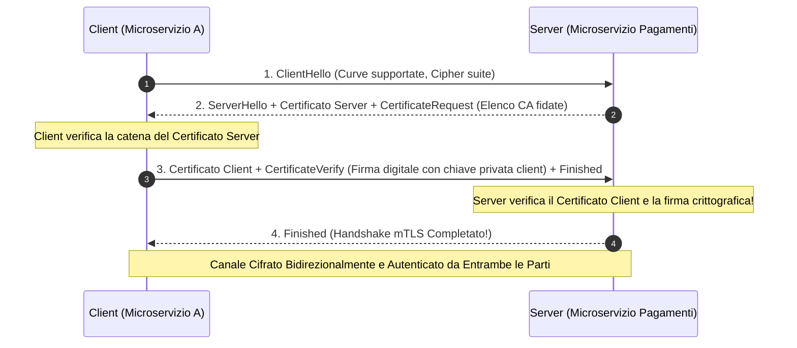
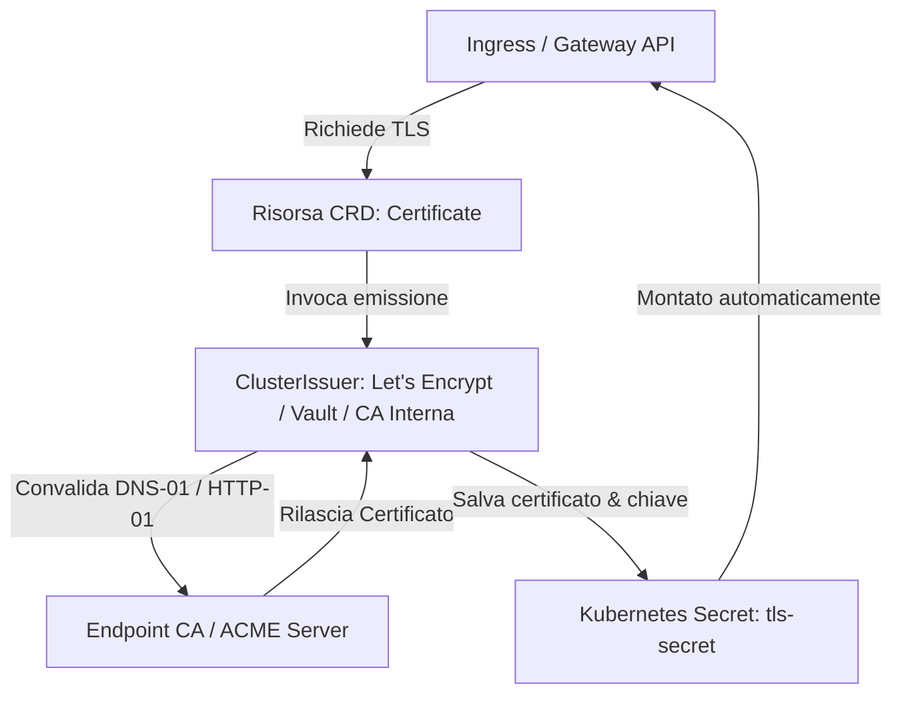

Nelle prime due parti della nostra serie abbiamo esplorato le fondamenta di TLS:
- [Parte 1: Chiavi, CSR, CA e la Catena di Fiducia](/it/blog/tls-demystified-part1-cryptography-keys-csr-ca-explained/) ha illustrato l'architettura crittografica a chiave pubblica e il modello di validazione X.509.
- [Parte 2: L'Handshake Moderno, Cipher Suite e Debugging](/it/blog/tls-demystified-part2-handshake-ciphers-and-troubleshooting/) ha analizzato pacchetto per pacchetto la negoziazione 1-RTT di TLS 1.3 e la diagnostica degli errori in produzione.

Nel TLS tradizionale a senso unico (*One-Way TLS*), solo il server dimostra la propria identità al client (il browser verifica il sito web). Ma cosa accade nelle moderne architetture a microservizi basate sul paradigma **Zero-Trust**, dove il perimetro di rete non è più affidabile e ogni singolo servizio deve dimostrare crittograficamente chi sia prima di accedere a un'API critica?

Qui entra in gioco **Mutual TLS (mTLS)**.

Benvenuto nell'ultimo capitolo del nostro viaggio: **mTLS, Java KeyStore/TrustStore, Automazione con cert-manager in Kubernetes e Playbook di Risoluzione Incidenti alle 3 di Notte**.

---

## 1. Il Dilemma Cardinale: Perché il TLS Tradizionale Fallisce nello Zero-Trust

Nel modello classico di sicurezza perimetrale ("castello e fossato"), una volta superato l'Ingress o il firewall aziendale, tutto il traffico interno da servizio a servizio scorreva spesso in chiaro o senza alcuna autenticazione del chiamante. Se un attaccante comprometteva un singolo container esposto, poteva muoversi lateralmente e interrogare indisturbato il microservizio dei pagamenti o il database.

Nel modello **Zero-Trust ("Never Trust, Always Verify")**:
1. La rete è considerata ostile per definizione.
2. Non basta che il client sappia con chi sta parlando: **anche il server deve esigere una prova crittografica inoppugnabile dell'identità del client**.

### L'Analogia del Mondo Reale: Il Caveau ad Alta Sicurezza con Doppio Badge

- **One-Way TLS:** Ti rechi allo sportello della banca. Guardi il cartellino dell'impiegato per accertarti che sia un dipendente legittimo prima di consegnargli i tuoi soldi. Ma l'impiegato non ti chiede alcun documento.
- **Mutual TLS (mTLS):** Ti rechi davanti alla porta blindata di un caveau di massima sicurezza. Prima di aprire, il custode ti mostra il proprio badge governativo (il server prova la sua identità al client), e simultaneamente esige che tu inserisca il tuo badge biometrico criptato nel lettore (il client prova la propria identità al server). Se uno dei due badge manca o è non valido, la porta resta sigillata.

---

## 2. Come Funziona Mutual TLS (mTLS) sul Cavo

A livello di protocollo, mTLS sfrutta estensioni native dell'handshake TLS senza richiedere modifiche alle applicazioni applicative HTTP/gRPC.



### I 3 Elementi Cardine dell'Autenticazione del Client:

1. **`CertificateRequest` (Inviato dal Server):** Il server comunica al client: *"Accetto connessioni solo se possiedi un certificato client firmato da una di queste CA"* (fornisce l'elenco dei Distinguished Names delle CA ammesse).
2. **`Client Certificate` (Inviato dal Client):** Il client trasmette la propria catena di certificati X.509 contenente la propria chiave pubblica e il nome identificativo del microservizio.
3. **`CertificateVerify` (Inviato dal Client):** Il client calcola una firma crittografica su tutti i messaggi dell'handshake scambiati fino a quel momento usando la propria **chiave privata**. Questo dimostra matematicamente al server che il client possiede realmente la chiave privata e non sta semplicemente replicando un certificato pubblico altrui!

---

## 3. 5 Falsi Miti su mTLS che Causano Incidenti in Produzione

### Falso Mito 1: "mTLS sostituisce completamente i token di autorizzazione JWT o OAuth"
> **Realtà:** mTLS opera a **Livello 4 (Autenticazione della Macchina/Servizio)**: certifica che la richiesta proviene dal Pod del Servizio Ordini. Non dice nulla sull'utente umano che ha originato l'azione (es. l'utente Mario Rossi con ruolo di sola lettura). In architetture solide, mTLS garantisce l'identità del canale tra i servizi, mentre i Bearer Token JWT veicolano il contesto utente a Livello 7.

### Falso Mito 2: "Posso usare certificati con scadenza a 5 anni per evitare la fatica dei rinnovi"
> **Realtà:** In un'architettura microservizi distribuita con centinaia di pod effimeri, i certificati a lunga scadenza rappresentano una bomba a orologeria: non possono essere revocati efficacemente tramite CRL o OCSP in tempo reale. I moderni service mesh (Istio, Linkerd) utilizzano certificati client con durata di **24 ore** o perfino **12 ore**, ruotati continuamente in background in memoria.

### Falso Mito 3: "Se il server riceve un certificato client valido, il client è automaticamente autorizzato"
> **Realtà:** La validazione crittografica prova solo che il certificato è integro e firmato da una CA fidata. Il server deve comunque implementare l'**Autorizzazione**: verificare che il Subject o SAN (es. `spiffe://cluster.local/ns/prod/sa/order-service`) sia espressamente abilitato ad accedere alla risorsa richiesta.

### Falso Mito 4: "Abilitare mTLS rallenta drammaticamente il throughput delle chiamate REST"
> **Realtà:** L'overhead crittografico è concentrato unicamente nell'handshake iniziale (~1 RTT aggiuntivo per scambiare i certificati). Una volta stabilita la connessione TCP e negoziata la sessione, il traffico cifrato simmetricamente con istruzioni hardware AES-NI viaggia a velocità di linea senza apprezzabile degrado di throughput o CPU.

### Falso Mito 5: "In Java, inserire il certificato nel KeyStore risolve tutti gli errori di connessione"
> **Realtà:** Nel modello Java, **KeyStore** e **TrustStore** sono due entità concettualmente opposte. Mettere un certificato CA nel KeyStore o una chiave privata nel TrustStore causerà invariabilmente fallimenti di connessione al runtime.

---

## 4. KeyStore vs TrustStore: Il Modello di Riferimento per Ingegneri DevOps

Nel mondo Java/JVM (Spring Boot, Kafka, Quarkus, Elasticsearch, Cassandra), la gestione dei certificati genera spesso enorme frustrazione a causa della rigida separazione tra due archivi:

| Parametro | `KeyStore` (`javax.net.ssl.keyStore`) | `TrustStore` (`javax.net.ssl.trustStore`) |
| :--- | :--- | :--- |
| **Scopo Architetturale** | Conserva **le tue credenziali private** (Chi sono io) | Conserva **i certificati di terze parti fidati** (Di chi mi fido) |
| **Contenuto Tipico** | La tua Chiave Privata + Il tuo Certificato Firmato | Certificati Root CA e Intermediate CA pubblici |
| **Obbligatorio in One-Way TLS?** | Solo sul Server | Solo sul Client |
| **Obbligatorio in mTLS?** | **Sia sul Client che sul Server** | **Sia sul Client che sul Server** |
| **Estensioni Tipiche** | `.p12`, `.pfx`, `.jks` | `cacerts`, `.jks`, `.truststore` |

### Demistificare l'Errore `PKIX path building failed`

L'eccezione Java più celebre e temuta nei log:

```text
javax.net.ssl.SSLHandshakeException: PKIX path building failed: 
sun.security.provider.certpath.SunCertPathBuilderException: unable to find valid certification path to requested target
```

**Cosa significa esattamente?**
Il runtime Java ha interrogato il server remoto, ha ricevuto il suo certificato, ma quando ha cercato di verificare la firma risalendo la catena nel file `cacerts` locale del JVM, **non ha trovato alcuna Root CA fidata** corrispondente all'emittente del certificato.

#### Le 6 Cause Principali di Fallimento PKIX:
1. Il server remoto utilizza una **CA interna aziendale** non presente nel bundle standard Java.
2. Il server non ha inviato i **certificati intermedi**, e Java (a differenza di Chrome) non esegue il download automatico AIA.
3. Il certificato del server è **scaduto** o non ancora valido.
4. L'applicazione punta a un file `trustStore` errato tramite property di avvio non caricate.
5. Il certificato è stato importato nel TrustStore errato (es. JRE differente rispetto a quello usato dal container).
6. Discrepanza sul nome host (mancata corrispondenza tra URL invocato e SAN presenti nel certificato).

#### Risolvere una CA Mancante nel TrustStore Java:

```bash
# 1. Scarica la catena di certificati dal server remoto
openssl s_client -connect internal-vault.corp.local:8200 -showcerts < /dev/null 2>/dev/null | \
  openssl x509 -outform PEM > corporate-ca.pem

# 2. Importa il certificato CA nel TrustStore JVM (password di default: changeit)
keytool -importcert -alias corporate-root-ca \
  -file corporate-ca.pem \
  -keystore $JAVA_HOME/lib/security/cacerts \
  -storepass changeit -noprompt

# 3. Verifica che il certificato sia stato registrato con successo
keytool -list -keystore $JAVA_HOME/lib/security/cacerts -storepass changeit -alias corporate-root-ca
```

### Strumenti Visivi e Diagnostici per Ispezionare la Catena

Per analizzare la catena completa da riga di comando:

```bash
keytool -list -v -keystore client-keystore.p12 -storetype PKCS12 -storepass secret123
```

Nei dettagli dell'output, verifica la presenza di:
```text
Certificate chain length: 2 (o 3 per gerarchie multi-livello)
Certificate[1]: Subject: CN=client-payment-worker, OU=PaymentService...
Certificate[2]: Subject: CN=GCloudCafe Internal Intermediate CA...
```

Per abilitare il debug granulare dell'handshake al runtime in qualsiasi applicazione Java:

```bash
java -Djavax.net.debug=ssl:handshake:verbose -jar my-microservice.jar
```

---

## 5. Automazione PKI in Kubernetes: Cert-Manager e Ingress

Configurare a mano chiavi e certificati su decine di cluster porta inevitabilmente a dimenticanze e disservizi notturni. Nello stack Kubernetes di produzione, lo standard de facto per automatizzare il ciclo di vita TLS è **cert-manager**.



### Manifest di Produzione `ClusterIssuer` e `Certificate`:

```yaml
# 1. Configurazione del ClusterIssuer con Let's Encrypt Production
apiVersion: cert-manager.io/v1
kind: ClusterIssuer
metadata:
  name: letsencrypt-prod
spec:
  acme:
    server: https://acme-v02.api.letsencrypt.org/directory
    email: devops@gcloudcafe.com
    privateKeySecretRef:
      name: letsencrypt-prod-account-key
    solvers:
    - http01:
        ingress:
          class: nginx
---
# 2. Richiesta del Certificato per l'applicazione
apiVersion: cert-manager.io/v1
kind: Certificate
metadata:
  name: gcloudcafe-tls-cert
  namespace: production
spec:
  secretName: gcloudcafe-production-tls
  issuerRef:
    name: letsencrypt-prod
    kind: ClusterIssuer
  dnsNames:
  - gcloudcafe.com
  - www.gcloudcafe.com
  renewBefore: 720h # Rinnova automaticamente 30 giorni prima della scadenza
```

---

## 6. ⚠️ 3 Casi Critici in Produzione su mTLS e PKI

### 1. Il Ciclo di Rinnovo che Riavvia i Pod ma non i Connettori Database
Quando cert-manager aggiorna il Secret Kubernetes, il volume proiettato nel pod viene aggiornato sul file system del container in pochi secondi. Tuttavia, **molti driver JDBC Java o client Node.js caricano il KeyStore/TrustStore solo una volta all'avvio** e mantengono la vecchia catena memorizzata in RAM finché il pod non viene riavviato forzatamente!

### 2. Dimensioni Eccessive della Catena e Buffer Nginx / Envoy
Se utilizzi una gerarchia PKI a 4 livelli o certificati con centinaia di domini SAN, la dimensione dell'handshake supera i normali buffer HTTP. In Nginx, omettere o sottodimensionare `ssl_buffer_size` o il buffer dei client header può provocare misteriosi errori HTTP 400 (`Client Sent Too Large Request`) durante l'handshake mTLS.

### 3. Mancata Sincronizzazione dell'Orologio NTP
I certificati definiscono rigidamente le finestre di validità (`Not Before` e `Not After`). Se i nodi worker del cluster Kubernetes soffrono di un clock drift anche di soli 90 secondi rispetto al server CA, i certificati appena emessi verranno rifiutati come *"non ancora validi"*!

---

## 7. Laboratorio Pratico da Terminale: Creare un'Architettura mTLS End-to-End

Costruiremo da zero una CA privata, genereremo certificati per server e client, avvieremo un server Python con mTLS nativo e testeremo le risposte con cURL.

### Step 1: Creare una Certificate Authority (CA) Privata

```bash
# 1. Genera la chiave privata della Root CA (RSA a 4096 bit)
openssl genrsa -out rootCA.key 4096

# 2. Emetti il certificato auto-firmato della Root CA (valido 10 anni)
openssl req -x509 -new -nodes -key rootCA.key -sha256 -days 3650   -subj "/C=IT/ST=Lombardia/O=GCloudCafe Lab/CN=GCloudCafe Root CA"   -out rootCA.crt
```

### Step 2: Generare il Certificato Server con SAN

```bash
# 1. Genera la chiave privata del server
openssl ecparam -name prime256v1 -genkey -noout -out server.key

# 2. Configura i SAN per il server
cat <<EOF > server_ext.cnf
authorityKeyIdentifier=keyid,issuer
basicConstraints=CA:FALSE
keyUsage = digitalSignature, keyEncipherment
extendedKeyUsage = serverAuth
subjectAltName = @alt_names

[alt_names]
DNS.1 = localhost
IP.1 = 127.0.0.1
EOF

# 3. Crea il CSR e firma il certificato server con la Root CA
openssl req -new -key server.key -out server.csr -subj "/CN=localhost"
openssl x509 -req -in server.csr -CA rootCA.crt -CAkey rootCA.key   -CAcreateserial -out server.crt -days 365 -sha256 -extfile server_ext.cnf
```

### Step 3: Generare il Certificato Client per mTLS

```bash
# 1. Genera la chiave del client
openssl ecparam -name prime256v1 -genkey -noout -out client.key

# 2. Configura estensione per autenticazione client
cat <<EOF > client_ext.cnf
authorityKeyIdentifier=keyid,issuer
basicConstraints=CA:FALSE
keyUsage = digitalSignature
extendedKeyUsage = clientAuth
EOF

# 3. Crea il CSR e firma il certificato client
openssl req -new -key client.key -out client.csr -subj "/CN=payment-microservice-client"
openssl x509 -req -in client.csr -CA rootCA.crt -CAkey rootCA.key   -CAcreateserial -out client.crt -days 365 -sha256 -extfile client_ext.cnf
```

### Step 4: Verifica Pratica con Server Python e cURL

Crea un server minimal in Python che richiede rigorosamente il certificato client:

```python
# server.py - Server HTTPS mTLS minimale
import http.server
import ssl

server_address = ('127.0.0.1', 8443)
httpd = http.server.HTTPServer(server_address, http.server.SimpleHTTPRequestHandler)

context = ssl.create_default_context(ssl.Purpose.CLIENT_AUTH)
context.load_cert_chain(certfile="server.crt", keyfile="server.key")
context.load_verify_locations(cafile="rootCA.crt")
context.verify_mode = ssl.CERT_REQUIRED  # Impone mTLS obbligatorio!

httpd.socket = context.wrap_socket(httpd.socket, server_side=True)
print("Server mTLS in ascolto su https://127.0.0.1:8443...")
httpd.serve_forever()
```

#### ❌ Test 1: Richiesta SENZA Certificato Client (Rifiutata dal server)

```bash
curl --cacert rootCA.crt https://127.0.0.1:8443
```

Output atteso (Connessione rigettata all'handshake):
```text
curl: (35) OpenSSL/3.0.2: error:0A000412:SSL routines::sslv3 alert bad certificate
```

#### ✅ Test 2: Richiesta CON Certificato Client Valido (Autenticata con successo)

```bash
curl --cacert rootCA.crt --cert client.crt --key client.key https://127.0.0.1:8443
```

Output atteso:
```text
< HTTP/1.0 200 OK
< Server: SimpleHTTP/0.6 Python/3.10
...
```

### Step 5: Convertire Certificati PEM in Formato Java KeyStore (`.p12` / `.jks`)

```bash
# 1. Raggruppa chiave e certificato client in formato standard PKCS#12 (.p12)
openssl pkcs12 -export -in client.crt -inkey client.key   -out client-keystore.p12 -name "payment-client"   -passout pass:secret123

# 2. Converti in Java KeyStore (JKS) se richiesto da applicazioni legacy
keytool -importkeystore   -srckeystore client-keystore.p12 -srcstoretype PKCS12 -srcstorepass secret123   -destkeystore client-keystore.jks -deststoretype JKS -deststorepass secret123
```

---

## 8. Il Playbook delle 3 del Mattino: Risoluzione Incidenti da Certificato Scaduto

Quando suona l'allarme PagerDuty nel cuore della notte per un'interruzione di servizio su un Ingress o un'API critica, segui questa procedura in 3 passi:

### Step 1: Identificare Immediatamente il Certificato Compromesso o Scaduto

```bash
# Verifica scadenza, emittente e SAN dell'endpoint in 1 secondo esatto:
echo | openssl s_client -connect api.gcloudcafe.com:443 -servername api.gcloudcafe.com 2>/dev/null | \
  openssl x509 -noout -dates -issuer -subject
```

### Step 2: Forzare il Rinnovo Immediato in Kubernetes con Cert-Manager

```bash
# Controlla lo stato delle sfide e degli ordini ACME
kubectl get certificate,certificaterequest,order,challenges -n production

# Forza la riemissione istantanea tramite cmctl o annotazione standard:
kubectl annotate certificate gcloudcafe-tls-cert -n production \
  cert-manager.io/reissue-at="$(date -u +"%Y-%m-%dT%H:%M:%SZ")" --overwrite
```

### Step 3: Riconciliazione Zero-Downtime dei Reverse Proxy

Se il segreto Kubernetes è aggiornato ma il pod Ingress continua a servire la vecchia versione in cache:

```bash
# Esegui un rollout restart progressivo dei pod Ingress Controller
kubectl rollout restart deployment/ingress-nginx-controller -n ingress-nginx
```

---

## 9. Matrice Architetturale Completa TLS & mTLS

| Proprietà | One-Way TLS | Mutual TLS (mTLS) |
| :--- | :--- | :--- |
| **Identità Verificata** | Solo il Server | Sia il Client che il Server |
| **Casi d'Uso Tipici** | Siti Web Pubblici, E-commerce, Browser | Microservizi, B2B Banking API, Service Mesh, Kafka |
| **Complessità Operativa** | Bassa (Gestita da CA pubbliche via ACME) | Alta (Richiede automazione PKI interna, rotazione continua) |
| **Requisiti TrustStore Client** | CA Pubbliche preinstallate nel SO | Certificato Root CA interna proprietaria |
| **Resistenza al Movimento Laterale** | Nulla all'interno del perimetro | Massima (Ogni hop applicativo verifica il chiamante) |

---

## 📚 Standard Autorevoli e Riferimenti Ufficiali

- [RFC 8446: The Transport Layer Security (TLS) Protocol Version 1.3](https://datatracker.ietf.org/doc/html/rfc8446)
- [Cert-Manager Official Documentation](https://cert-manager.io/docs/)
- [SPIFFE: Secure Production Identity Framework for Everyone](https://spiffe.io/)
- [Oracle Java PKI Programmer's Guide](https://docs.oracle.com/en/java/javase/17/security/java-pki-programmers-guide.html)

---

## Conclusione della Serie

Congratulazioni per aver completato l'intera trilogia sull'Architettura TLS e mTLS per Ingegneri DevOps!

Dalle fondamenta della crittografia asimmetrica nella **Parte 1**, passando per la micro-latenza 1-RTT dell'handshake nella **Parte 2**, fino all'automazione Zero-Trust con mTLS e cert-manager nella **Parte 3**, ora possiedi le competenze architetturali e pratiche per progettare sistemi distribuiti resilienti, conformi e a prova di incidenti.\n